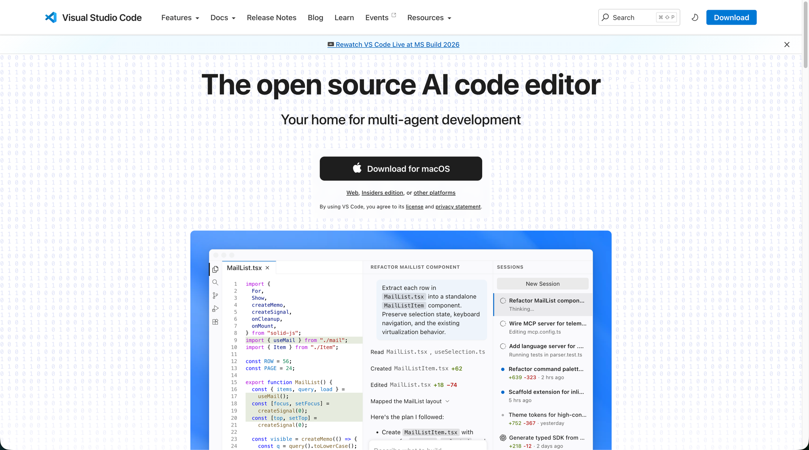
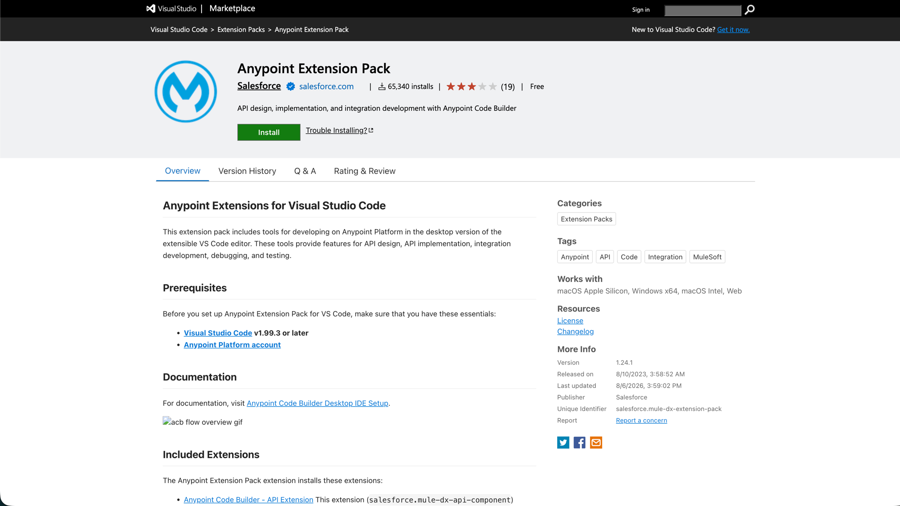
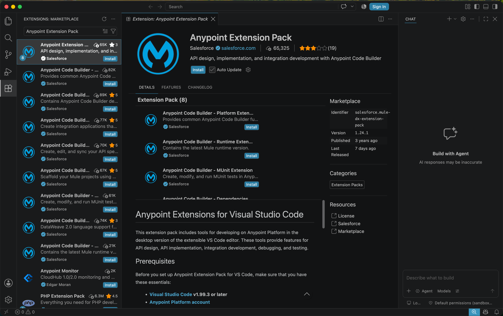
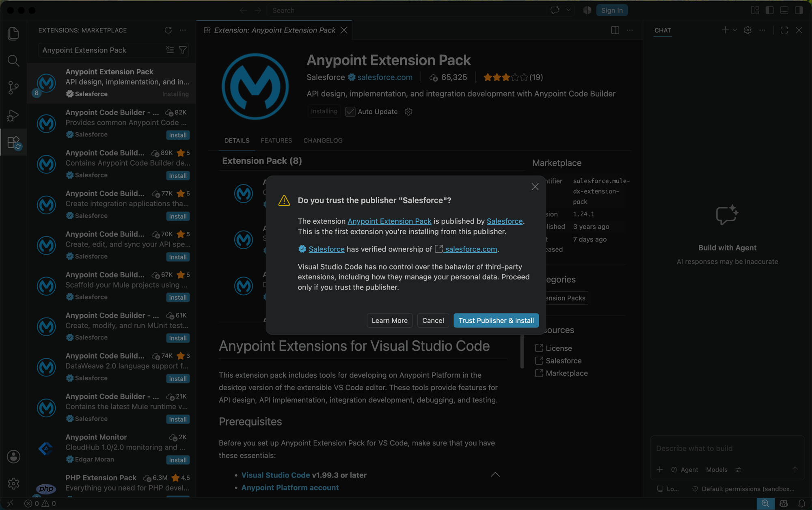

# Phase 0 — Prerequisites

Before signing up or building anything, install the local tooling: VS Code
and the Anypoint Extension Pack.

## Contents

- [1. Visual Studio Code](#1-visual-studio-code)
- [2. Anypoint Extension Pack](#2-anypoint-extension-pack)

## 1. Visual Studio Code

Install VS Code, "the open source AI code editor" — MuleSoft's Anypoint
tooling for agent networks runs as extensions inside it.

1. Go to https://code.visualstudio.com/
2. Click **Download for macOS** (or use the Web, Insiders, or other-platform
   links for a different OS).

## 2. Anypoint Extension Pack

Install the **Anypoint Extension Pack** (publisher: Salesforce, id
`salesforce.mule-dx-extension-pack`) from the VS Code Marketplace. It bundles
the tools needed for API design, integration development, debugging, and
testing on Anypoint Platform (Anypoint Code Builder).

1. Open https://marketplace.visualstudio.com/items?itemName=salesforce.mule-dx-extension-pack
   and click **Install** — or search **"Anypoint Extension Pack"** in the VS
   Code Extensions view and click **Install** there.
2. Requires **VS Code v1.99.3+** and an **Anypoint Platform account** (see
   [Phase 1 — Account Setup](01-account-setup.md) to create one).
3. Supported platforms: macOS (Apple Silicon & Intel), Windows x64, Web.

The pack installs 8 sub-extensions, including Anypoint Code Builder
(Platform, Runtime, MUnit, DataWeave, and dependency extensions):

Since this is the first extension you're installing from the Salesforce
publisher, VS Code asks you to confirm you trust it. Salesforce is shown as a
verified owner of salesforce.com — click **Trust Publisher & Install** to
proceed.

---

**Next:** [Phase 1 — Account Setup](01-account-setup.md)
