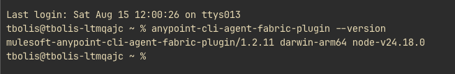

# Phase 0 — Prerequisites

Before signing up or building anything, install the local tooling: VS Code,
the Anypoint Extension Pack, and the CLI for Agent Fabric plugin.

## Contents

- [1. Visual Studio Code](#1-visual-studio-code)
- [2. Anypoint Extension Pack](#2-anypoint-extension-pack)
- [3. CLI for Agent Fabric plugin](#3-cli-for-agent-fabric-plugin)
- [4. Verify you are on the latest versions](#4-verify-you-are-on-the-latest-versions)

## 1. Visual Studio Code

Install VS Code, "the open source AI code editor" — MuleSoft's Anypoint
tooling for agent networks runs as extensions inside it.

1. Go to https://code.visualstudio.com/
2. Click **Download for macOS** (or use the Web, Insiders, or other-platform
   links for a different OS).


## 2. Anypoint Extension Pack

Install the **Anypoint Extension Pack** (publisher: Salesforce, id
`salesforce.mule-dx-extension-pack`) from the VS Code Marketplace. It bundles
the tools needed for API design, integration development, debugging, and
testing on Anypoint Platform (Anypoint Code Builder).

1. Open https://marketplace.visualstudio.com/items?itemName=salesforce.mule-dx-extension-pack
   and click **Install** — or search **"Anypoint Extension Pack"** in the VS
   Code Extensions view and click **Install** there.
2. Requires **VS Code v1.99.3+** and an **Anypoint Platform account** (see
   [Phase 1 — Account Setup](01-account-setup.md) to create one).
3. Supported platforms: macOS (Apple Silicon & Intel), Windows x64, Web.


The pack installs 8 sub-extensions, including Anypoint Code Builder
(Platform, Runtime, MUnit, DataWeave, and dependency extensions):


Since this is the first extension you're installing from the Salesforce
publisher, VS Code asks you to confirm you trust it. Salesforce is shown as a
verified owner of salesforce.com — click **Trust Publisher & Install** to
proceed.


## 3. CLI for Agent Fabric plugin

The **CLI for Agent Fabric plugin** provides the `agent-network` commands that
create, build, publish, and deploy agent network projects, and that set up the
Agent Network Gateways. Anypoint Code Builder runs the same commands under the
hood, so the plugin is what lets you drive — or troubleshoot — every phase of
this guide from a terminal.

### 3.1 Install Node.js

The plugin is built with Node.js and installed with npm, so you need
**Node.js 20+** (**22+** if you also install the Anypoint CLI core package) and
**npm 7+**. Download them from the
[Node.js download page](https://nodejs.org/en/download/), then confirm:

```bash
node --version
npm --version
```

### 3.2 Install the CLI for Agent Fabric plugin globally

```bash
npm -g i mulesoft-anypoint-cli-agent-fabric-plugin
```

The package ships its own executable, so a global install is all you need —
there is no separate core CLI to install first. Verify it:

```bash
anypoint-cli-agent-fabric-plugin --version
```

The output reports the plugin version, your platform, and the Node.js version
it is running on:

```text
mulesoft-anypoint-cli-agent-fabric-plugin/1.2.11 darwin-arm64 node-v24.18.0
```



Every command is invoked through that executable, for example:

```bash
anypoint-cli-agent-fabric-plugin agent-network project build
```

These are the commands it provides:

- `agent-network:project:create` — creates a new agent network project and its
  initial configuration files
- `agent-network:project:build` — builds the project and validates its
  configuration
- `agent-network:project:publish` — publishes the project to Anypoint Exchange
- `agent-network:project:deploy` — deploys the project to the target environment
- `agent-network:setup:gateways` — sets up the Agent Network Gateways in a
  target space

Full flag reference:
[CLI for Agent Fabric Plugin](https://docs.mulesoft.com/anypoint-cli/latest/agent-fabric).

### 3.3 Optional: add it to the Anypoint CLI 4.x core package

If you already use the Anypoint CLI for other Anypoint Platform tasks, you can
also register Agent Fabric as one of its plugins, which makes the same commands
available under `anypoint-cli-v4`:

```bash
npm install -g anypoint-cli-v4-public
anypoint-cli-v4 plugins:install mulesoft-anypoint-cli-agent-fabric-plugin
anypoint-cli-v4 plugins
```

This guide uses the standalone `anypoint-cli-agent-fabric-plugin` executable
from step 3.2.

## 4. Verify you are on the latest versions

> **Important:** Agent Fabric is evolving fast. Check **both** the Anypoint
> Extension Pack (Anypoint Code Builder) **and** the CLI for Agent Fabric
> plugin against their latest published versions, and **update anything that
> is behind before you continue**. Mixing an older extension or plugin with the
> current platform is the most common cause of failures later in this guide:
> missing `agent-network` commands, schema validation errors on
> `agent-network.yaml`, and gateway or deployment steps that fail without an
> obvious reason.

**Anypoint Extension Pack (Anypoint Code Builder)**

1. In VS Code, open the Extensions view (`Cmd`/`Ctrl` + `Shift` + `X`).
2. Search for **"Anypoint Extension Pack"** and check the installed entry: if
   an **Update** button is shown, click it, then reload VS Code.
3. Run **Extensions: Check for Extension Updates** from the Command Palette
   (`Cmd`/`Ctrl` + `Shift` + `P`) to catch updates to the 8 bundled
   sub-extensions as well.
4. Compare against the version on the
   [Marketplace listing](https://marketplace.visualstudio.com/items?itemName=salesforce.mule-dx-extension-pack)
   (**Version History** tab), and keep VS Code itself on **v1.99.3+**.

**CLI for Agent Fabric plugin**

1. Check the latest published version on npm — either on the
   [package page](https://www.npmjs.com/package/mulesoft-anypoint-cli-agent-fabric-plugin)
   or from a terminal:

   ```bash
   npm view mulesoft-anypoint-cli-agent-fabric-plugin version
   ```

2. Compare it with your installed version — the number after the `/` is what
   has to match:

   ```bash
   anypoint-cli-agent-fabric-plugin --version
   ```

3. If they differ, reinstall globally to pull the latest:

   ```bash
   npm -g i mulesoft-anypoint-cli-agent-fabric-plugin@latest
   ```

   If you also registered it inside the Anypoint CLI core package
   ([step 3.3](#33-optional-add-it-to-the-anypoint-cli-4x-core-package)), update
   that copy too — otherwise `anypoint-cli-v4` keeps running the older version:

   ```bash
   npm install -g anypoint-cli-v4-public
   anypoint-cli-v4 plugins:install mulesoft-anypoint-cli-agent-fabric-plugin
   ```

> **Note:** This guide was written against
> `mulesoft-anypoint-cli-agent-fabric-plugin` 1.2.11. Newer versions are
> expected — treat this as a floor, not a target, and always verify against npm
> rather than pinning to the number above.

---

**Next:** [Phase 1 — Account Setup](01-account-setup.md)
