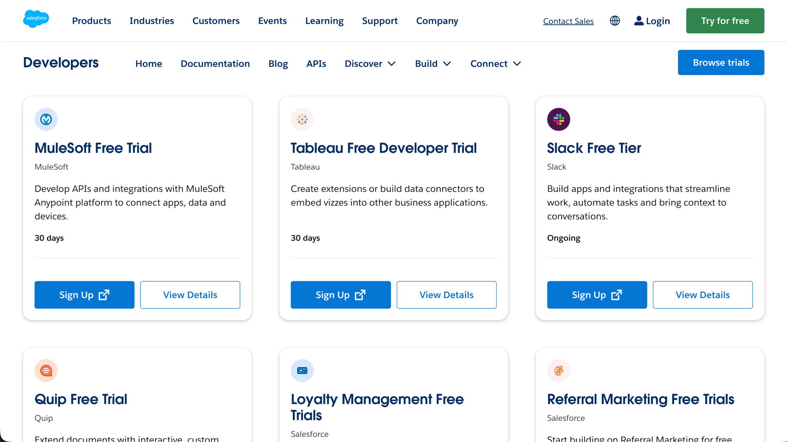
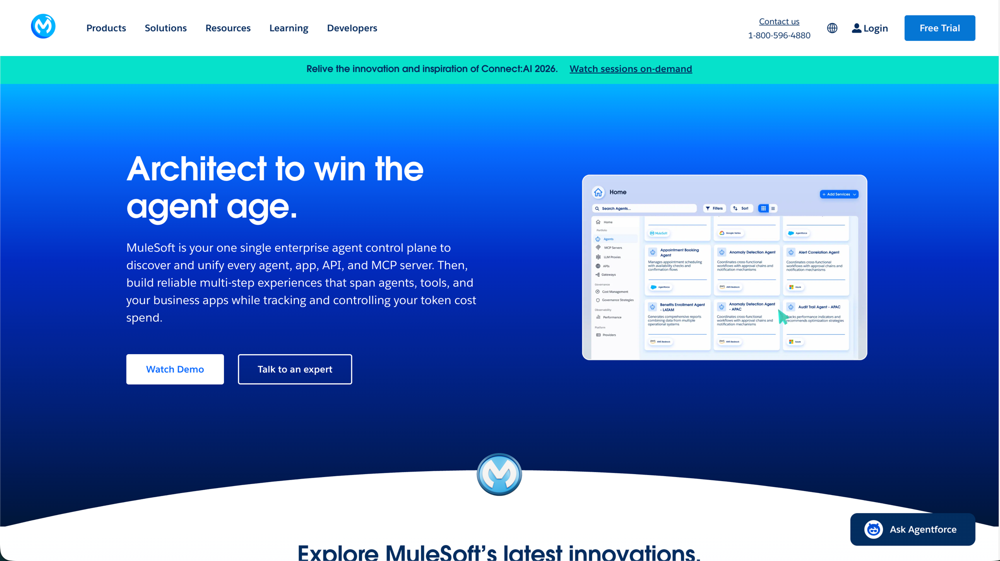
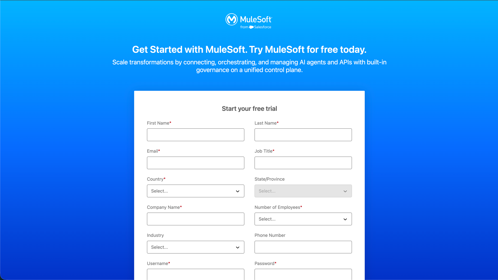
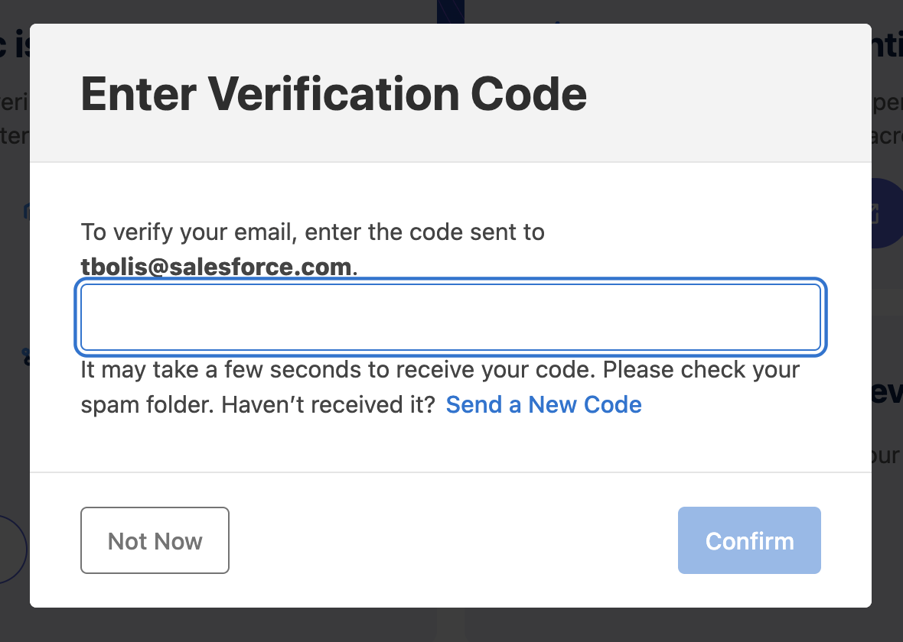
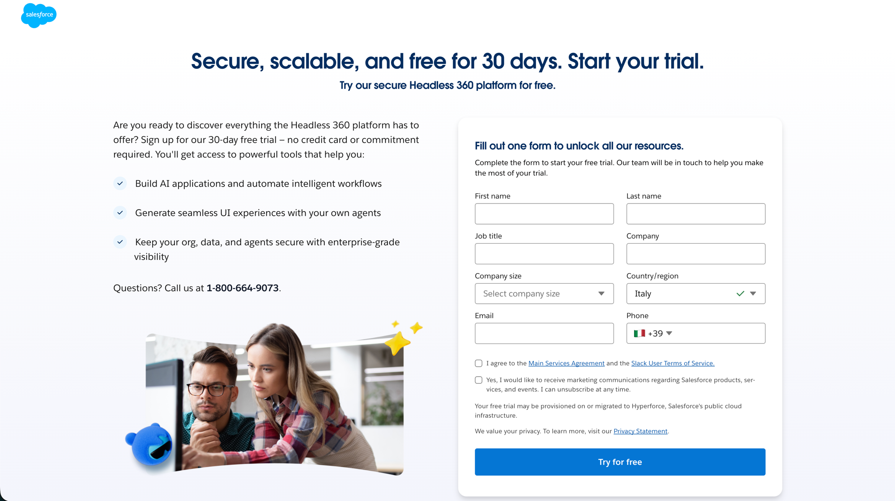
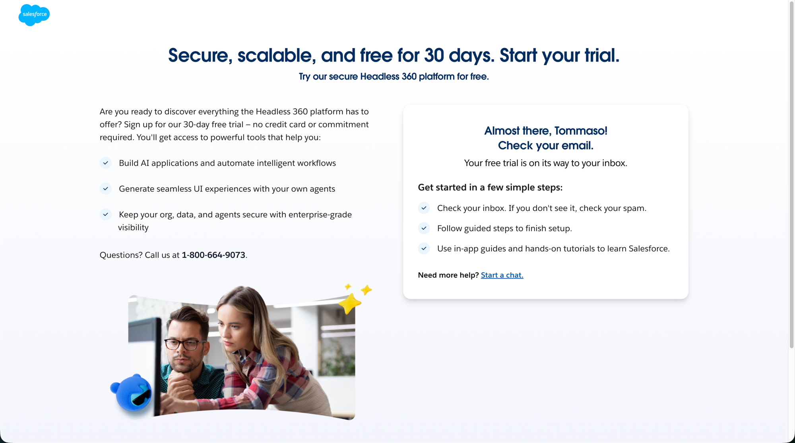
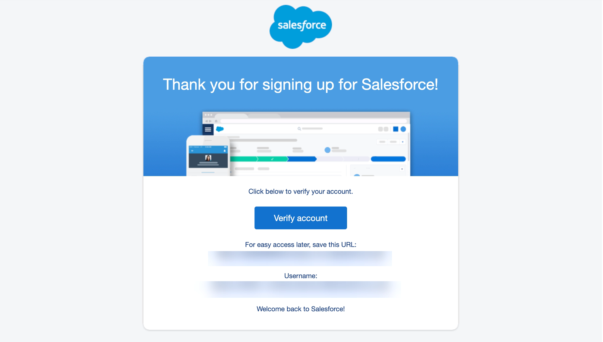
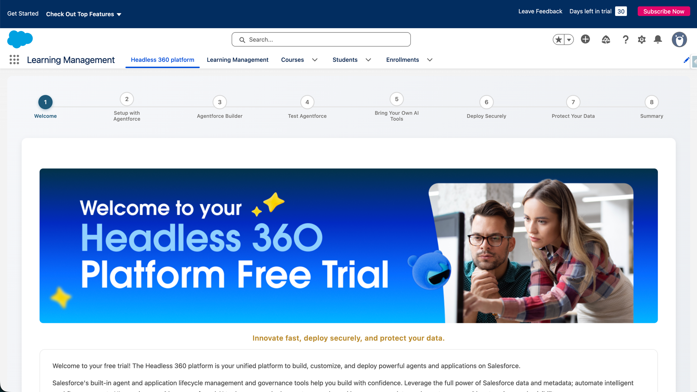

# Phase 1 — Account Setup

Sign up for a MuleSoft free trial. This creates the Anypoint Platform account
needed for the Anypoint Extension Pack and for deploying the agent network
later.

> **Alternative entry point:** Salesforce also maintains a single directory
> of all Salesforce free trials at
> https://developer.salesforce.com/free-trials — including the **MuleSoft
> Free Trial** (30 days) alongside Tableau, Slack, Quip, and others. Use
> **Browse trials** or find the "MuleSoft Free Trial" card and click
> **Sign Up** as a shortcut instead of starting from mulesoft.com directly.
>
> 

## Contents

- [1. Start a free MuleSoft trial](#1-start-a-free-mulesoft-trial)
- [2. Fill out the trial form](#2-fill-out-the-trial-form)
- [3. Verify your email (optional)](#3-verify-your-email-optional)
- [4. Salesforce Developer Edition (for MuleSoft Vibes)](#4-salesforce-developer-edition-for-mulesoft-vibes)

## 1. Start a free MuleSoft trial

Go to https://www.mulesoft.com/ and click **Free Trial** (top-right nav) —
or use the alternative entry point above.

MuleSoft positions itself as a single enterprise **agent control plane**:
discover and unify every agent, app, API, and MCP server, then build
reliable multi-step experiences that span agents, tools, and business apps
while tracking token cost spend.

## 2. Fill out the trial form

Fill out the **"Start your free trial"** form.

Required fields: First Name, Last Name, Email, Job Title, Country, Company
Name, Number of Employees, Username, Password.
Optional fields: State/Province (enabled once Country is set), Industry,
Phone Number.

Submit the form to create your trial account.

## 3. Verify your email (optional)

After submitting, you may be prompted to verify your email address:

1. Enter the verification code sent to the email you registered with, then
   click **Confirm**.
2. If it hasn't arrived, check spam or click **Send a New Code**.
3. This step is optional — click **Not Now** to defer it and continue.

## 4. Salesforce Developer Edition (for MuleSoft Vibes)

MuleSoft Vibes (the Agentforce Vibes IDE) runs against a Salesforce org, not
the Anypoint Platform account — sign up for a free **Salesforce Developer
Edition** org, separate from the MuleSoft trial account created above.

1. Go to https://www.salesforce.com/platform/free-trial/signup/ and sign up
   for the **Agentforce 360 Platform Free Trial**.
2. Fill out the **"Fill out one form to unlock all our resources"** form:
   First name, Last name, Job title, Company, Company size, Country/region,
   Email, Phone.
3. Check **"I agree to the Main Services Agreement and the Slack User Terms
   of Service"**, then click **Try for free**.

This provisions a free Salesforce Platform environment with Agentforce and
Data 360 — including a hosted MCP endpoint, the Agentforce Vibes browser IDE
(no local setup), and 60+ MCP tools / 30+ coding skills out of the box. Note:
the org is terminated after 45 days of inactivity.

After submitting, you'll land on a confirmation page — check your email for a
**"Welcome to your Developer Edition"** message with a link to reset your
password and your org's login URL and username.

The email itself has a **Verify account** button plus a save-for-later login
URL and a generated username. Both are blurred below — treat them like
credentials and avoid sharing unredacted screenshots of this email.

Once you've clicked **Verify account**, reset your password, and logged in,
you'll land on a guided-tour welcome page for your Developer Edition org —
confirming the org is ready to use.

---

**Next:** [Phase 2 — Environment Setup](02-environment-setup.md)
