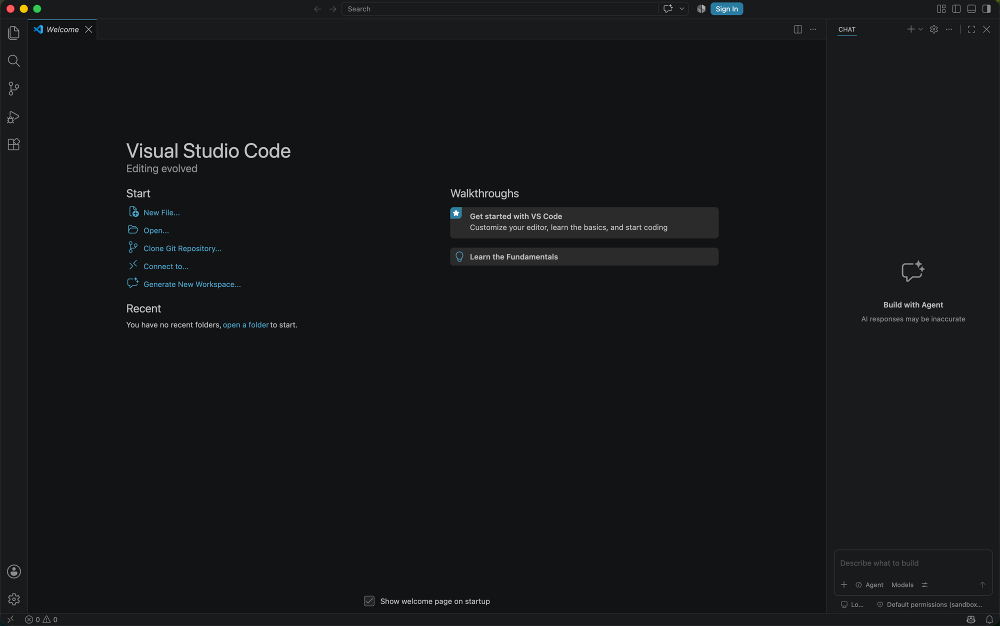
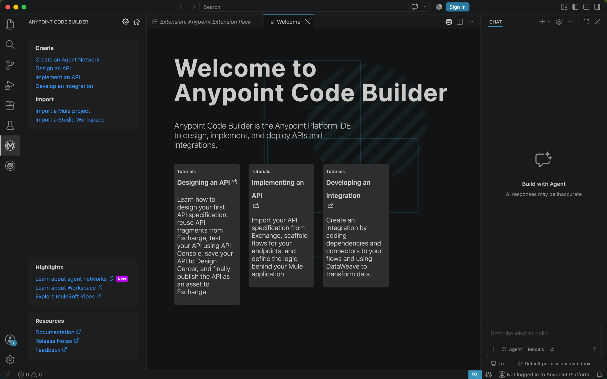
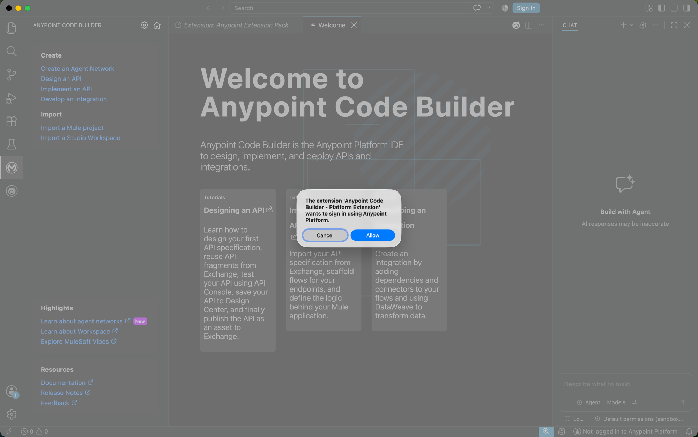
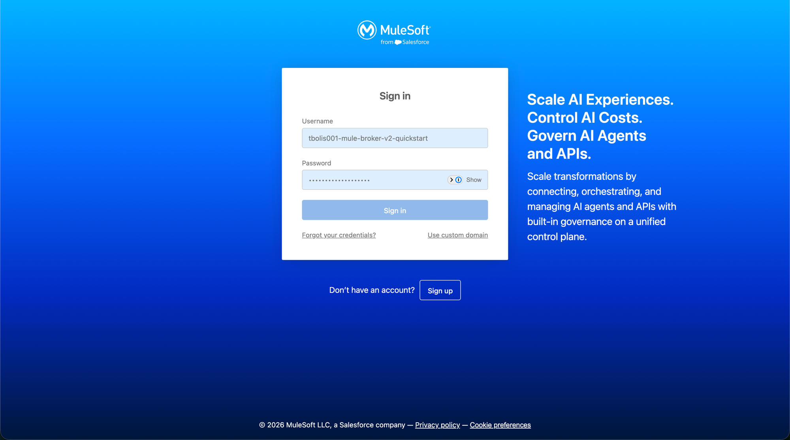
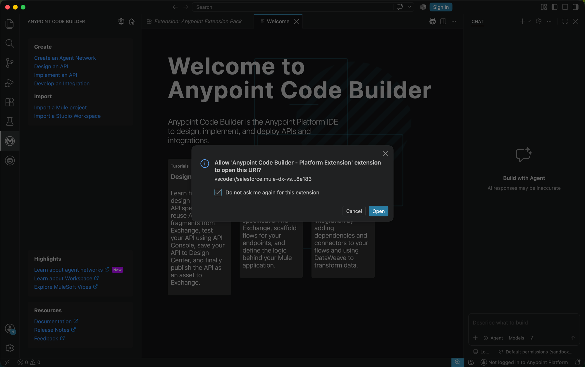
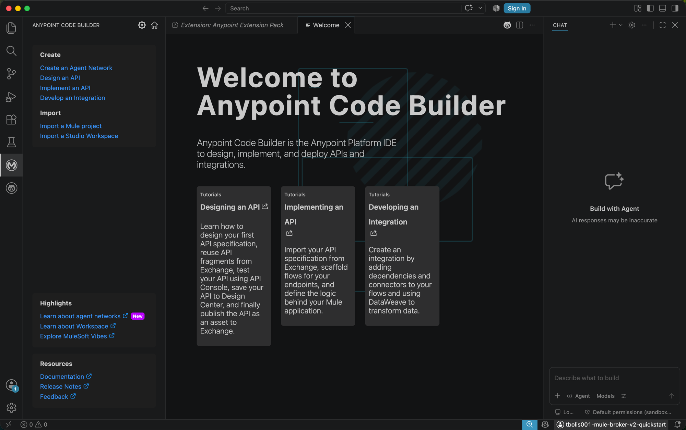

# Phase 2 — Environment Setup

With the prerequisites installed and a trial account created, confirm the
local dev environment is ready before building the agent network.

## Contents

- [1. Confirm VS Code is installed and ready](#1-confirm-vs-code-is-installed-and-ready)
- [2. Open the Anypoint Code Builder welcome view](#2-open-the-anypoint-code-builder-welcome-view)
- [3. Log in to Anypoint Platform](#3-log-in-to-anypoint-platform)

## 1. Confirm VS Code is installed and ready

Open VS Code. You should land on the Welcome tab with no folders open yet —
this is the starting point for setting up the agent-network project.

## 2. Open the Anypoint Code Builder welcome view

With the Anypoint Extension Pack installed, click the MuleSoft icon in the
Activity Bar (left sidebar) to open **Anypoint Code Builder**, the Anypoint
Platform IDE for designing, implementing, and deploying APIs and
integrations. The **Create** section includes a **Create an Agent Network**
link — this is the entry point for Phase 3.

The bottom-right status bar shows **"Not logged in to Anypoint Platform."**

## 3. Log in to Anypoint Platform

Click **"Not logged in to Anypoint Platform"** in the bottom-right corner of
the status bar to start the sign-in flow.

1. VS Code asks the Anypoint Code Builder extension's permission to sign in —
   click **Allow**.

   

2. Your browser opens the MuleSoft sign-in page. Enter your trial account's
   username and password (created in [Phase 1](01-account-setup.md)) and
   click **Sign in**.

   

3. Your browser asks permission to hand control back to VS Code via a
   `vscode://` URI — click **Open** (optionally check "Do not ask me again
   for this extension" to skip this prompt next time).

   

4. Back in VS Code, the status bar now shows your Anypoint Platform username
   — you're signed in.

   

---

**Next:** [Phase 3 — Link Anypoint Platform to Salesforce](03-link-salesforce.md)
