# Phase 3 — Link Anypoint Platform to Salesforce (enable Vibes)

MuleSoft Vibes and Agentforce features in Anypoint Platform run against a
linked Salesforce org. This links the Salesforce Developer Edition org
created in [Phase 0](00-prerequisites.md) to the Anypoint Platform account
from [Phase 1](01-account-setup.md).

## Contents

- [1. Enable Einstein in Salesforce (if not already on)](#1-enable-einstein-in-salesforce-if-not-already-on)
- [2. Open Access Management → Salesforce](#2-open-access-management--salesforce)
- [3. Accept the Agentforce terms](#3-accept-the-agentforce-terms)
- [4. Start adding the Salesforce org](#4-start-adding-the-salesforce-org)
- [5. Get the tenant key from Salesforce Setup](#5-get-the-tenant-key-from-salesforce-setup)
- [6. Paste the tenant key back in Anypoint Platform](#6-paste-the-tenant-key-back-in-anypoint-platform)
- [7. Confirm the alias and add the org](#7-confirm-the-alias-and-add-the-org)
- [8. Copy the Anypoint Platform Org Key](#8-copy-the-anypoint-platform-org-key)
- [9. Paste the Org Key back in Salesforce](#9-paste-the-org-key-back-in-salesforce)
- [10. Confirm Agentforce is enabled](#10-confirm-agentforce-is-enabled)
- [11. Verify: MuleSoft Vibes chat in VS Code](#11-verify-mulesoft-vibes-chat-in-vs-code)
- [12. Enable all MCP servers](#12-enable-all-mcp-servers)

## 1. Enable Einstein in Salesforce (if not already on)

Before linking the two platforms, make sure Einstein is turned on in the
Salesforce org — Agentforce/Vibes features depend on it. In Salesforce
**Setup**, search for **"Einstein"** → **Einstein Setup**, and check that
**Turn on Einstein** is set to **On**.

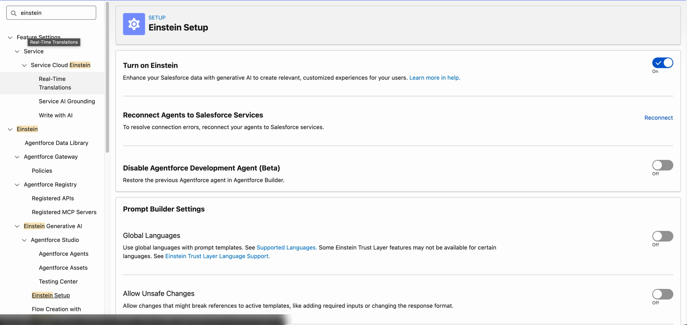

## 2. Open Access Management → Salesforce

In Anypoint Platform, go to **Access Management** and select **Salesforce**
from the left nav. This page manages capabilities integrated with Salesforce
— cross-platform access to data and AI tools through trusted Salesforce
orgs.

## 3. Accept the Agentforce terms

Click **Accept** on the **"Enable Agentforce for Anypoint Platform"** banner.
Review the terms (including the Generative AI section), check **"I accept
the terms and conditions"**, then click **Accept**.

## 4. Start adding the Salesforce org

Click **Add Salesforce Org**. This opens a dialog asking for a **Salesforce
Org Tenant Key** — you can get this from the Salesforce Administrator inside
**MuleSoft > Setup** in the Salesforce org itself, so leave this dialog open
and switch to Salesforce next.

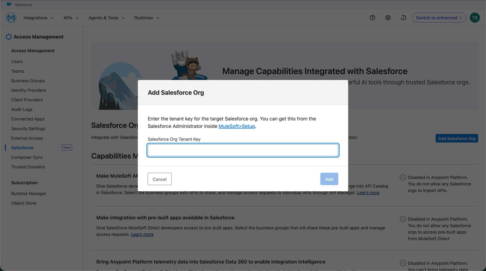

## 5. Get the tenant key from Salesforce Setup

In the Salesforce org (from [Phase 0](00-prerequisites.md)), go to **Setup**
and search for **"Anypoint"** → **Anypoint Platform Setup**. This page shows
the connection status and capabilities that can be enabled between the two
platforms (seamless login, MuleSoft service discovery, and Agentforce in
Anypoint Platform).

Click **Complete the Connection**.

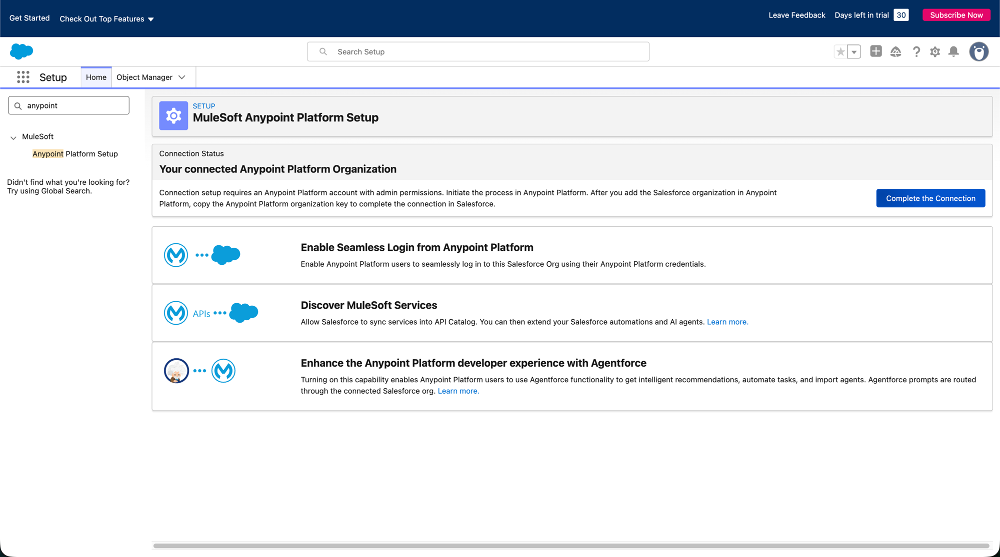

This opens a dialog with **"Your Salesforce org tenant key"** — copy it
using the copy icon next to it. (Treat this key like a credential; it's
blurred here since it authorizes the connection to this org.)

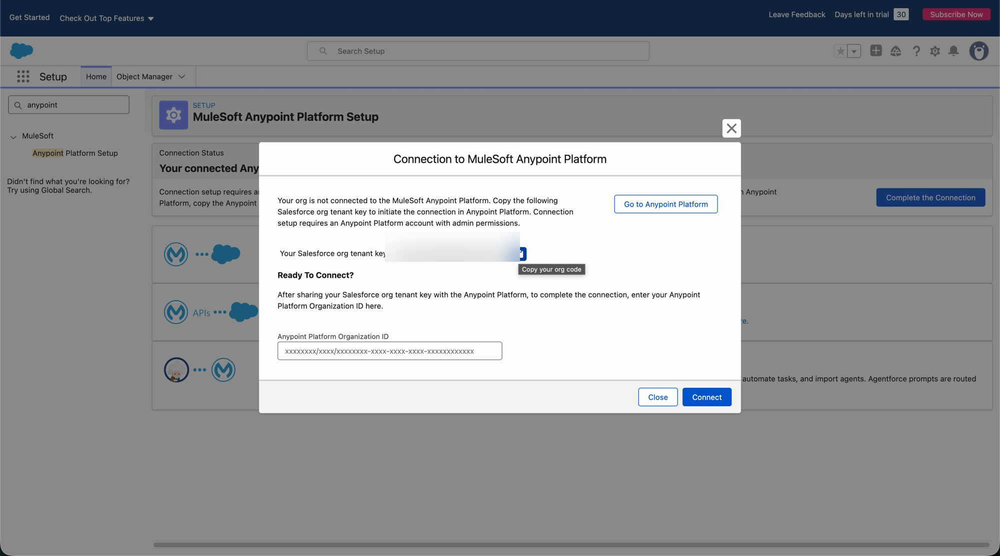

## 6. Paste the tenant key back in Anypoint Platform

Switch back to the **Add Salesforce Org** dialog in Anypoint Platform and
paste the tenant key into the **Salesforce Org Tenant Key** field.

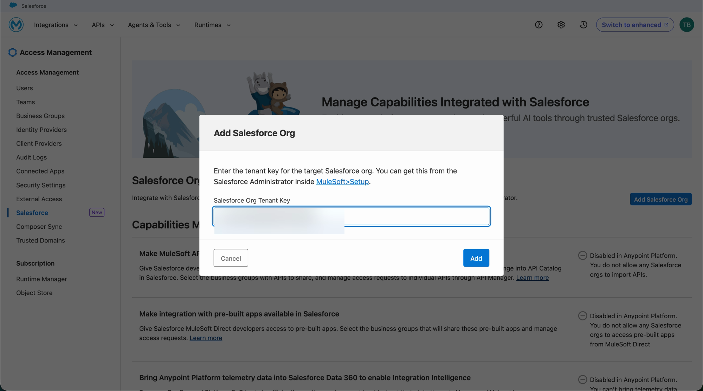

## 7. Confirm the alias and add the org

Once the tenant key validates (green checkmark), the dialog reveals the
Salesforce org's **Org ID** and **Org URL**, plus a **Name Used in Anypoint
Platform** field — this is just a display alias inside Anypoint Platform, so
any name works. Confirm or edit it, then click **Add**.

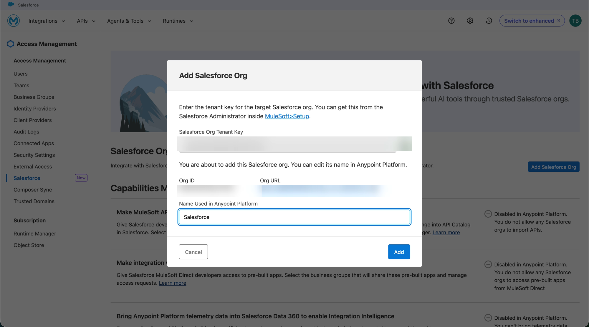

## 8. Copy the Anypoint Platform Org Key

A success dialog confirms the Salesforce org was added, and shows the
**Anypoint Platform Org Key** — the reverse credential needed to complete the
connection from the Salesforce side. Copy it using the **Copy** button.

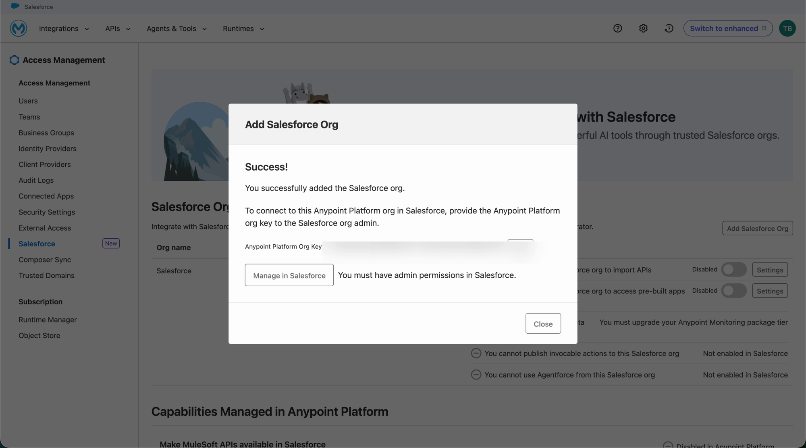

## 9. Paste the Org Key back in Salesforce

Switch back to Salesforce's **Connection to MuleSoft Anypoint Platform**
dialog, paste the Anypoint Platform Org Key into the **Anypoint Platform
Organization ID** field, and click **Connect**.

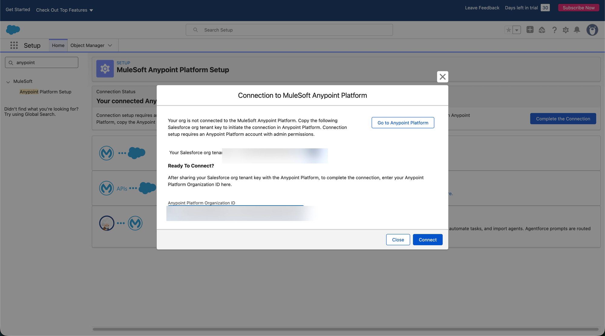

## 10. Confirm Agentforce is enabled

Salesforce shows an **"Agentforce successfully enabled in MuleSoft Anypoint
Platform"** banner, and the **Anypoint Platform Setup** page now shows the
connected org's details — the connected Anypoint org, its Org ID, and the
Anypoint org admin's name and email.

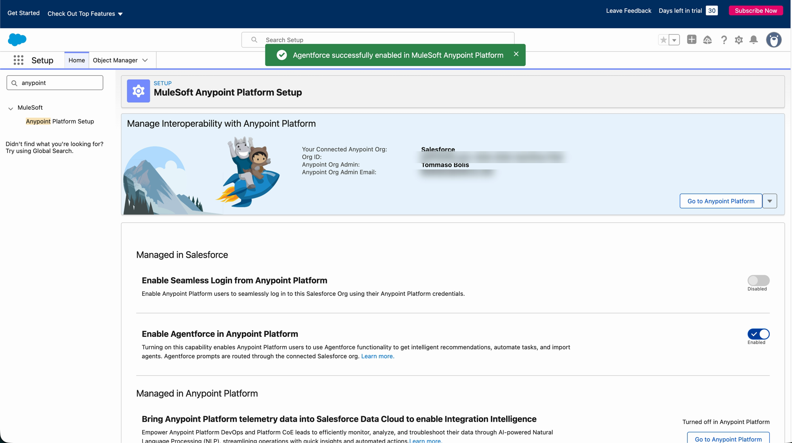

From here, the Agentforce/Vibes capabilities can also be enabled from the
**Capabilities Managed in Anypoint Platform** section on the Salesforce
access management page.

## 11. Verify: MuleSoft Vibes chat in VS Code

With the two accounts linked, the **MuleSoft Vibes** chat panel in Anypoint
Code Builder (VS Code) is ready to use — a "Build with Agent" chat surface
alongside the editor.

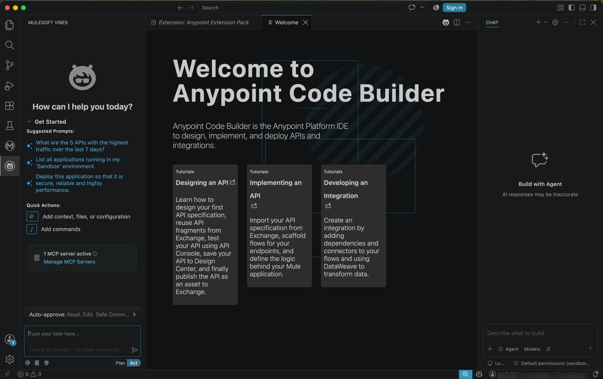

## 12. Enable all MCP servers

The MuleSoft Vibes panel starts with only 1 of 3 MCP servers active. Click
**Manage MCP Servers** to expand the list, then toggle on the remaining
servers — **MuleSoft MCP DX Server**, **MuleSoft MCP DX Policy Server**, and
**MuleSoft Platform MCP Server** — until all three show active.

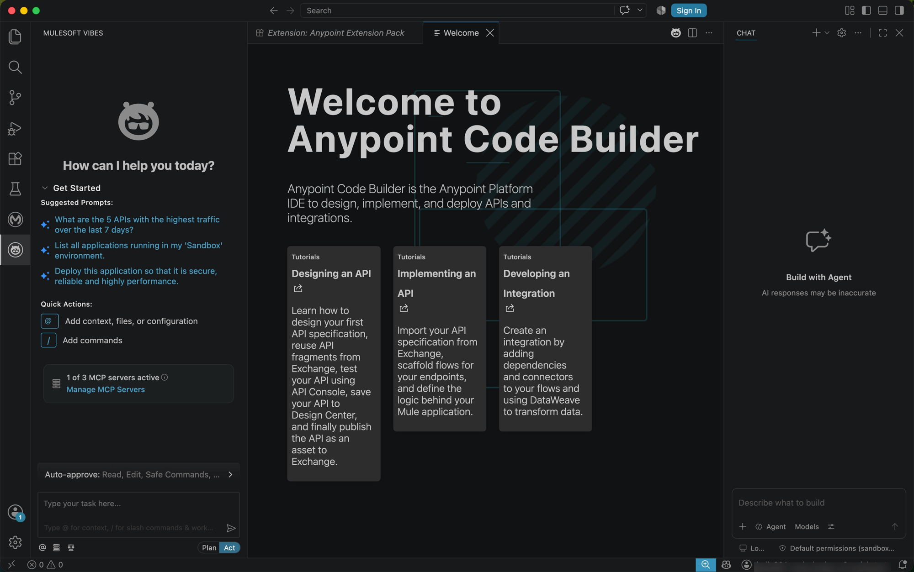

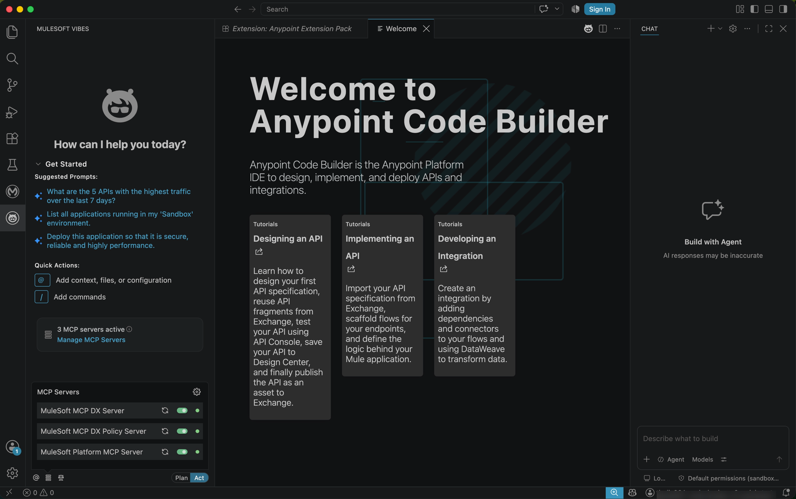

---

**Previous:** [Phase 2 — Environment Setup](02-environment-setup.md) ·
**Next:** [Phase 4 — Set Up Mock Agents and MCP Servers](04-mock-agents-and-mcps.md)
