# Phase 5 — Set Up Agent Network Gateways

With Anypoint Platform linked to Salesforce and the MCP servers enabled, set
up the Agent Network Gateways the agent network will run on.

## Contents

- [1. Grant the required Anypoint Platform permissions](#1-grant-the-required-anypoint-platform-permissions)
- [2. Set up Agent Network Gateways](#2-set-up-agent-network-gateways)
  - [Select a Business Group (Command Palette path)](#select-a-business-group-command-palette-path)
  - [Select an environment (Command Palette path)](#select-an-environment-command-palette-path)
  - [Select the target space type (Command Palette path)](#select-the-target-space-type-command-palette-path)
  - [Select the target region (Command Palette path)](#select-the-target-region-command-palette-path)
  - [Confirm the gateway name (Command Palette path)](#confirm-the-gateway-name-command-palette-path)
- [3. Wait for the gateway to deploy](#3-wait-for-the-gateway-to-deploy)

## 1. Grant the required Anypoint Platform permissions

Before setting up the gateways, make sure the user has the permissions listed
in the [Agent Network platform requirements](https://docs.mulesoft.com/agent-network/latest/af-get-started#platform-requirements)
docs — permissions across Runtime Manager, Anypoint Code Builder, Design
Center, API Manager, Exchange, Usage, and CloudHub 2.0.

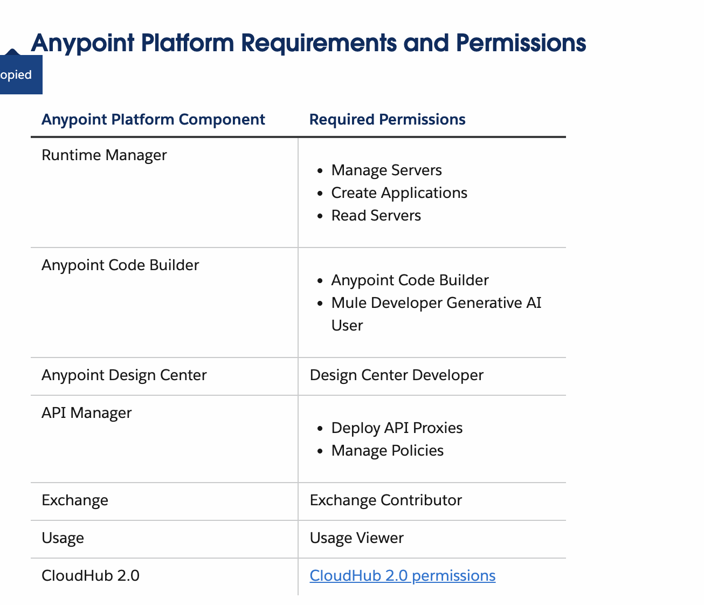

In Anypoint Platform, go to **Access Management → Users**, select the user,
and click **Add Permissions**. For simplicity, rather than picking individual
permissions one by one, click **Select all** on each product category to
grant every permission, then continue through **Select Business Groups** and
**Select Environments** and scope that to just the Business Group and
environment you'll use for the agent network.

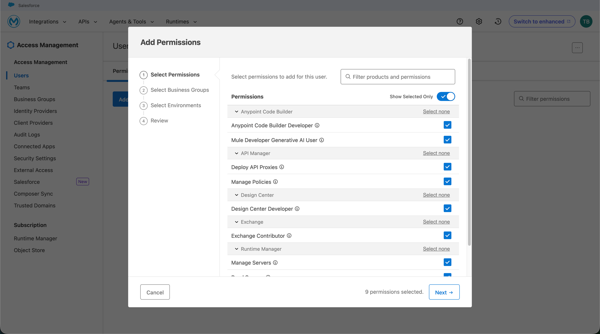

## 2. Set up Agent Network Gateways

**For trial accounts, use the Anypoint Platform UI** — the VS Code Command
Palette command doesn't work on trial accounts due to trial-related
limitations, so the UI is the go-to path here.

In Anypoint Platform, go to **Runtime Manager → Omni Gateways**, select the
**Managed Omni Gateway** tab, and click **Add Managed Omni Gateway**.

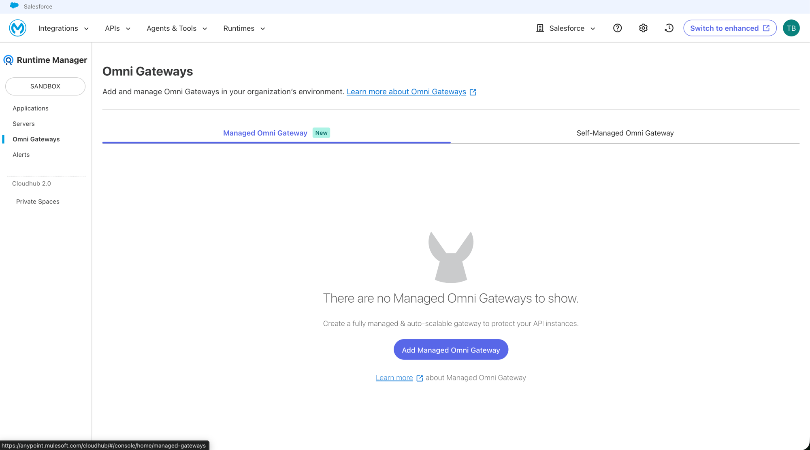

Fill out the form: **Gateway Name** (e.g. `agent-network-shared-gw`),
**Deployment Target** (region + space type, e.g. Cloudhub-US-East-2 / Shared
Space), **Release Channel** (e.g. Edge), **Version** (latest), and **Gateway
type** (e.g. Small Omni Gateway). Note: some configurations are disabled and
not customizable on trial accounts.

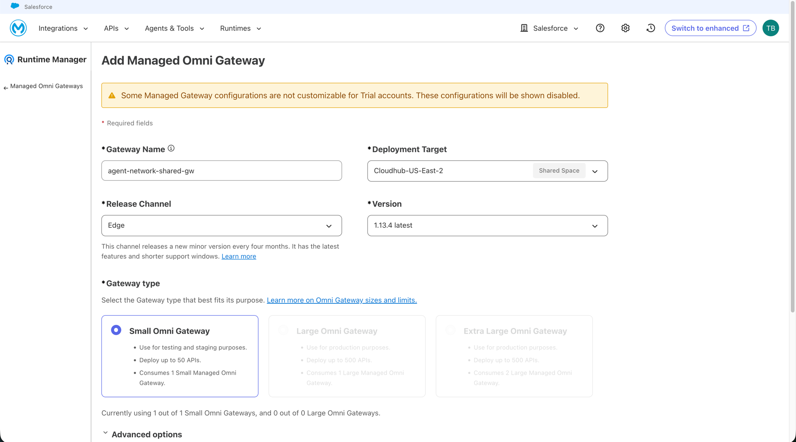

> **Non-trial accounts:** you can alternatively open the Command Palette
> (**Cmd+Shift+P**) and run **"MuleSoft: Set Up Agent Network Gateways..."**,
> which walks through the same choices as a series of quick-picks instead of
> the single form above — see steps 3–7 below.
>
> 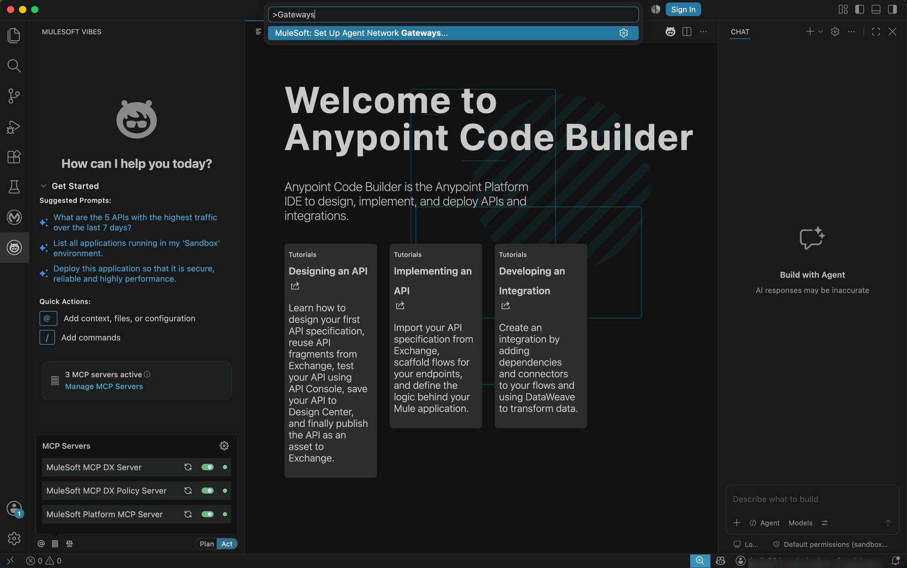

### Select a Business Group (Command Palette path)

Pick the Business Group to set up the gateways in — for example, the
**Salesforce** Business Group.

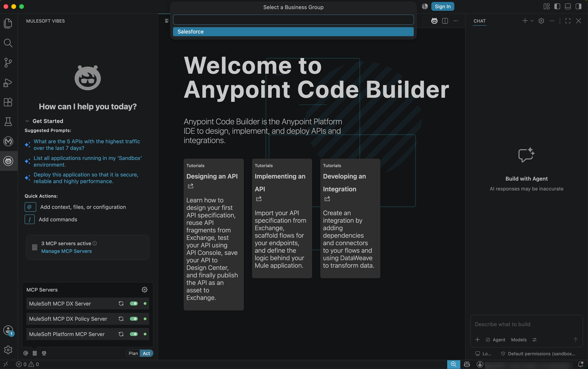

### Select an environment (Command Palette path)

Pick the environment to deploy the gateway to — for example, **Sandbox**.

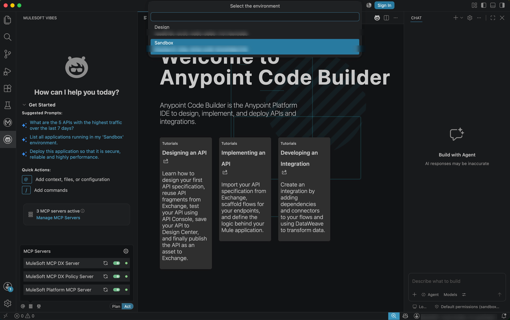

### Select the target space type (Command Palette path)

Pick **Shared Space** or **Private Space** for the gateway.

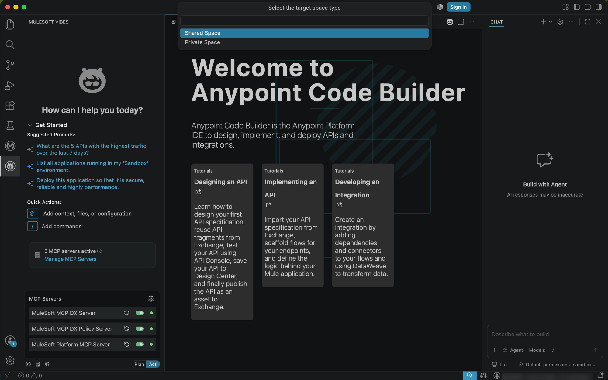

### Select the target region (Command Palette path)

Pick the CloudHub region to deploy the gateway to — for example,
**Cloudhub-US-East-2**.

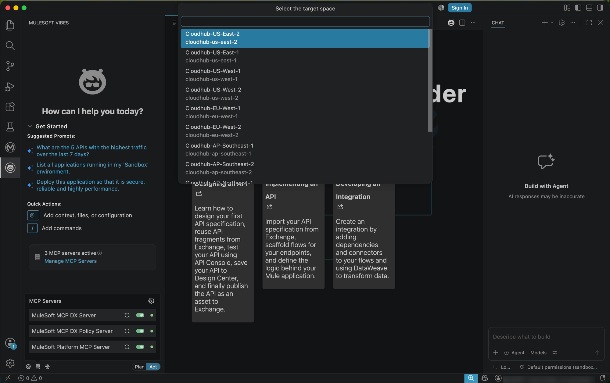

### Confirm the gateway name (Command Palette path)

Confirm or edit the default gateway name, then press **Enter**.

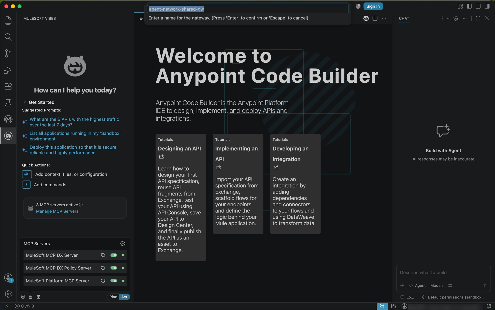

## 3. Wait for the gateway to deploy

Either path (Command Palette or manual) redirects to the gateway's
**Dashboard** in Runtime Manager, showing status **Starting...** while it
deploys. Wait until the status shows the gateway is running before continuing
— the dashboard also shows the gateway's public and cluster endpoints.

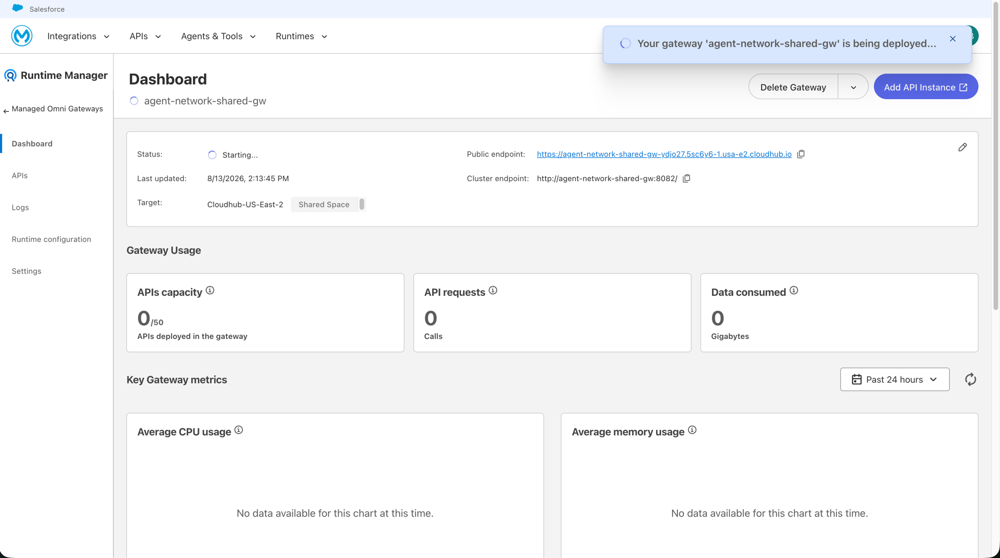

Once deployed, the status turns green and shows **Running**.

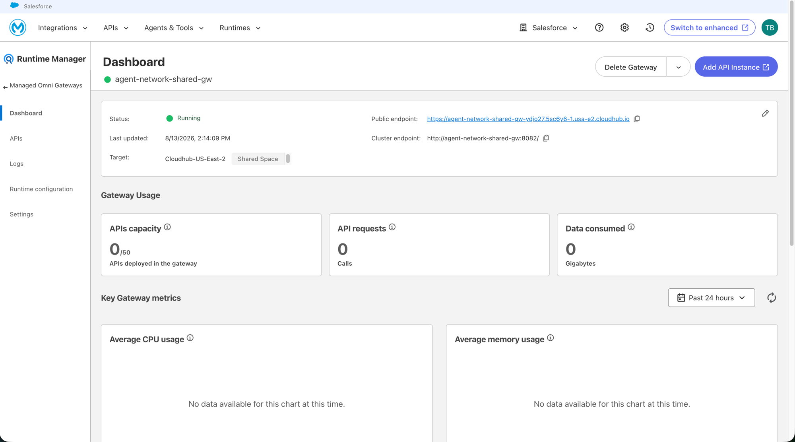

---

**Previous:** [Phase 4 — Set Up Mock Agents and MCP Servers](04-mock-agents-and-mcps.md) ·
**Next:** [Phase 6 — Build the Agent Network](06-build-agent-network.md)
