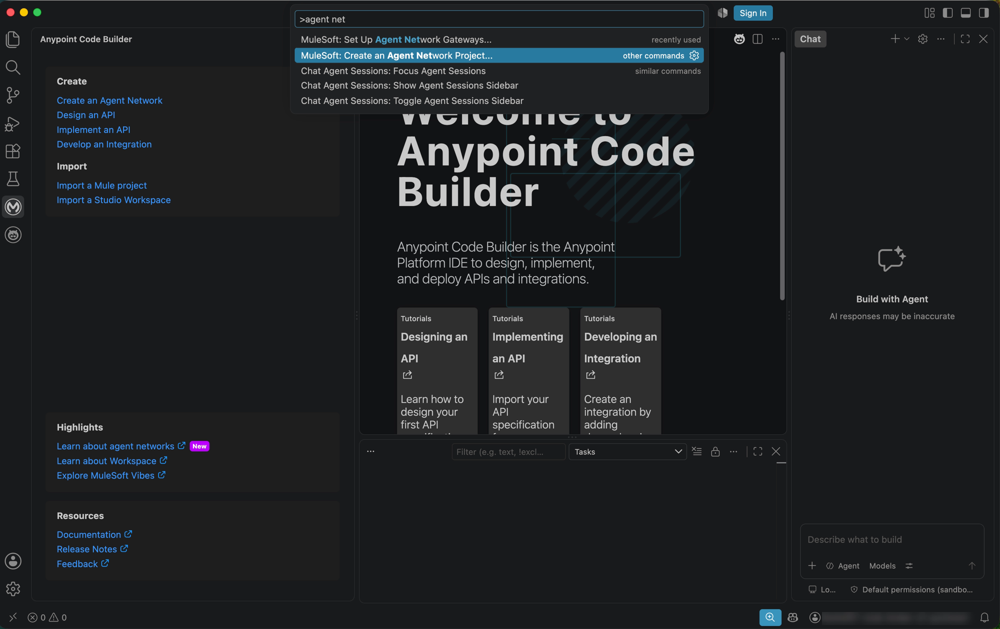
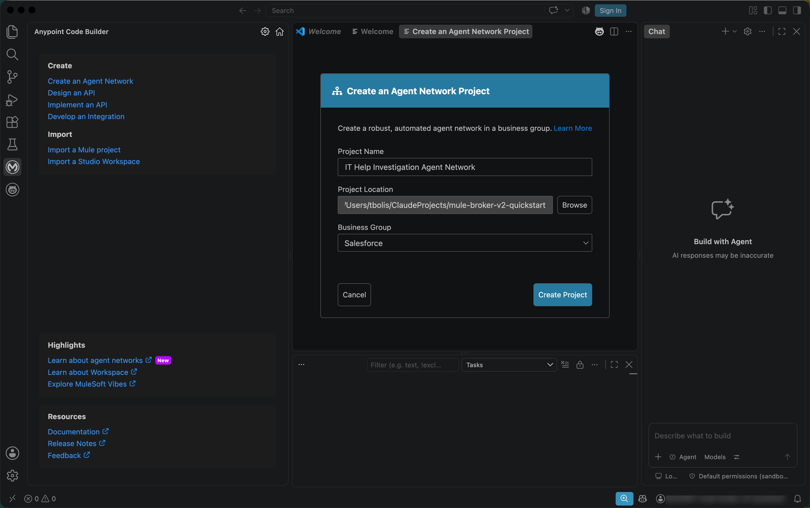
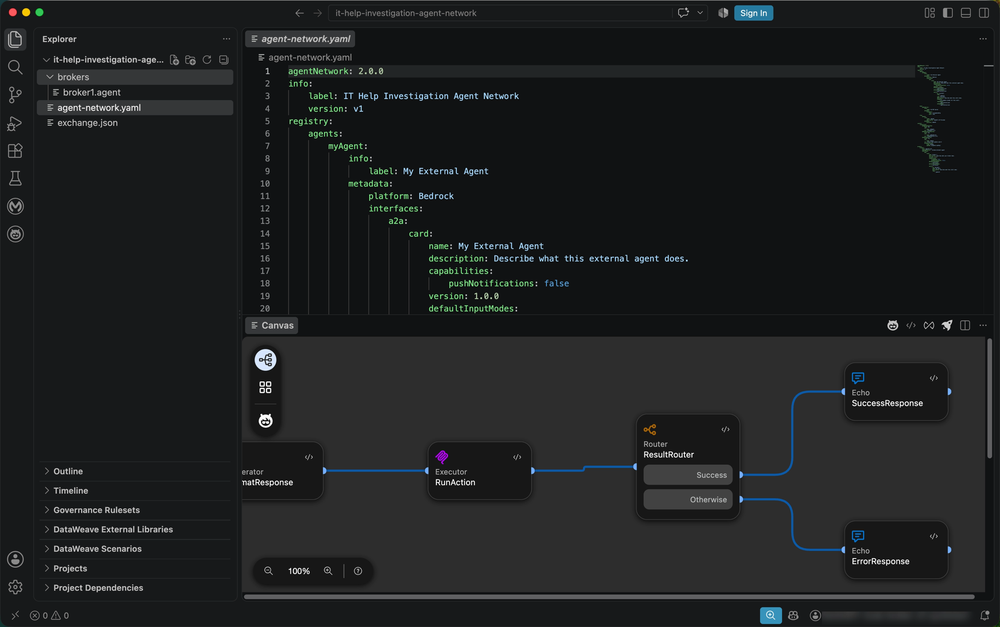
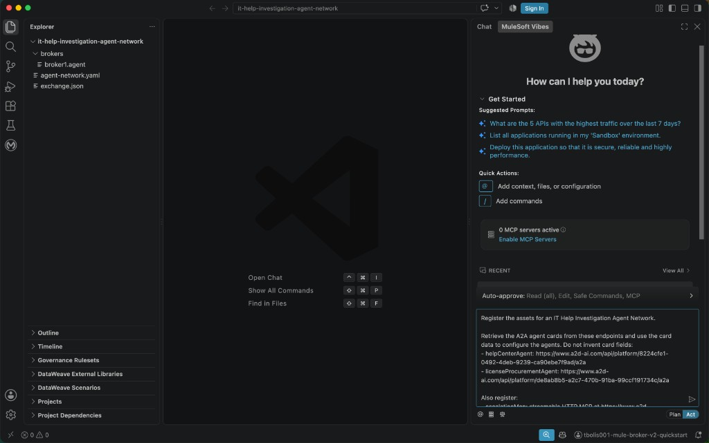
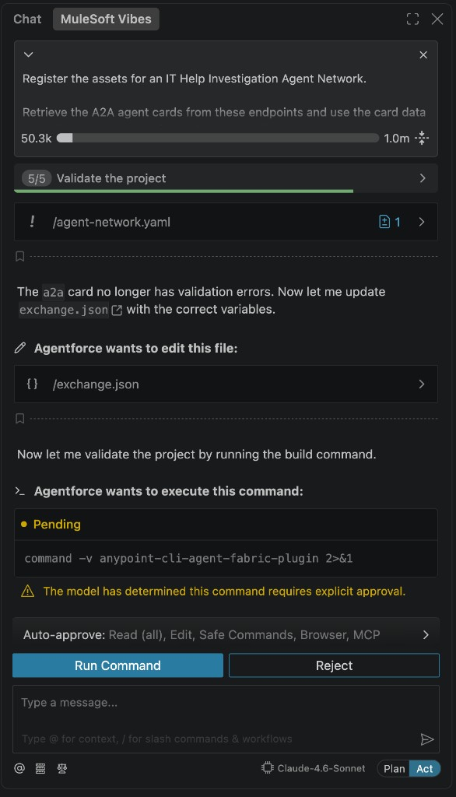
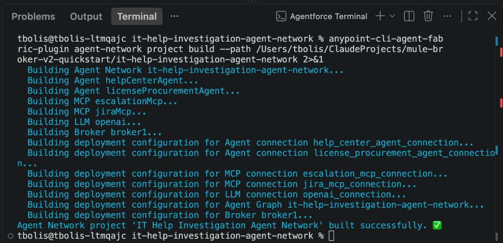
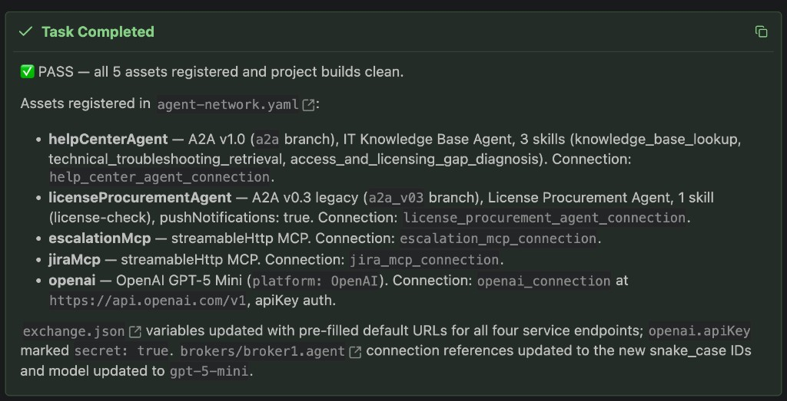
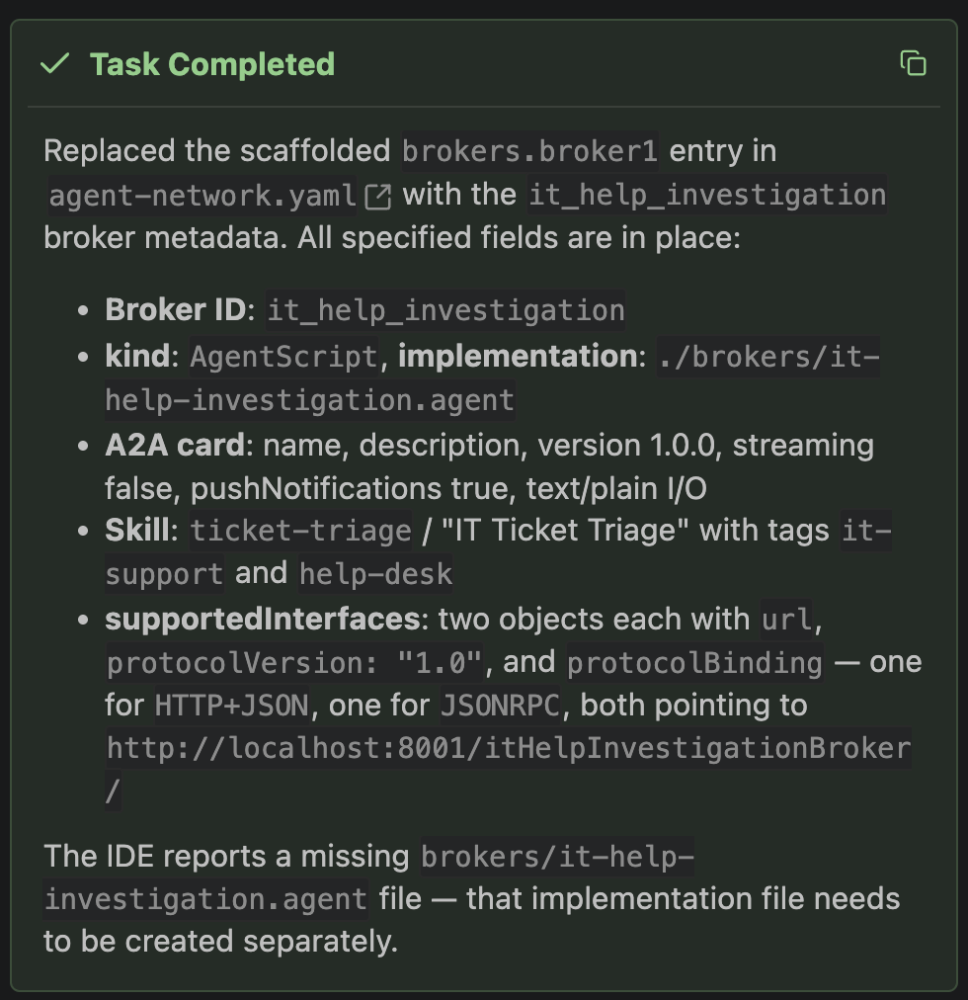
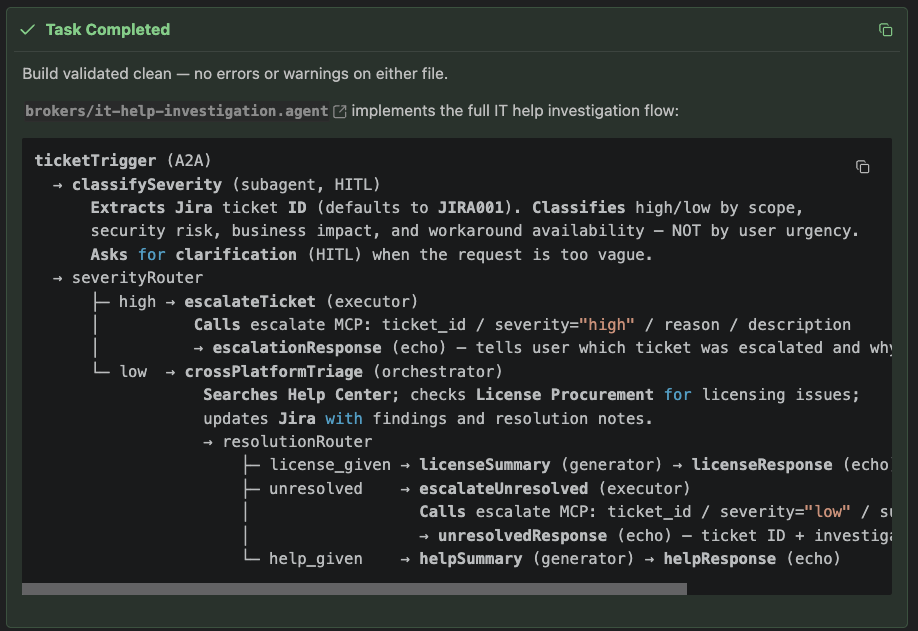
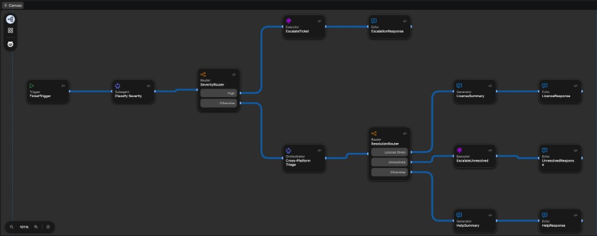

# Phase 6 — Build the Agent Network

With the Agent Network Gateways up and running, build the first example
agent network.

> **Note:** MuleSoft Vibes execution is probabilistic, so generated steps,
> wording, intermediate corrections, and visible output may differ from the
> screenshots. Focus on achieving the documented final state rather than
> matching the screenshots exactly.

## Contents

- [1. Create the Agent Network project](#1-create-the-agent-network-project)
  - [Prompt 1 — Register the network assets](#prompt-1--register-the-network-assets)
  - [Prompt 2 — Add broker metadata](#prompt-2--add-broker-metadata)
  - [Prompt 3 — Create the IT help investigation flow](#prompt-3--create-the-it-help-investigation-flow)

## 1. Create the Agent Network project

With the gateway running, create the agent network project in Anypoint Code
Builder. Open the Command Palette (**Cmd+Shift+P**) and run **"MuleSoft:
Create an Agent Network Project..."**, or use the Welcome view's **Create →
Create an Agent Network** link.



In the **Create an Agent Network Project** dialog, enter a **Project Name**
(e.g. `IT Help Investigation Agent Network`), confirm the **Project Location**,
pick the **Business Group** (e.g. **Salesforce**), and click **Create
Project**.



You land in the scaffolded project. The Explorer shows `brokers/broker1.agent`,
`agent-network.yaml`, and `exchange.json`. `agent-network.yaml` defines the
network — `agentNetwork: 2.0.0`, the network's `label`, and a
`registry.agents` example agent (`myAgent`, platform `Bedrock`, an `a2a` card).
The **Canvas** view visualizes the broker's flow: a Generator, an Executor
(`RunAction`), a Router (`ResultRouter`) with **Success**/**Otherwise**
branches, and Echo nodes for the success and error responses.



### Prompt 1 — Register the network assets

In **MuleSoft Vibes**, enter the following prompt:

> **Note:** Replace the four example A2A and MCP URLs in the prompt with the
> corresponding endpoint URLs you [recorded in Phase 4](04-mock-agents-and-mcps.md#6-note-down-each-assets-endpoint-url).
> Leave `https://api.openai.com/v1` unchanged.

```text
Register the assets for an IT Help Investigation Agent Network.

Retrieve the A2A agent cards from these endpoints and use the card data to configure the agents. Do not invent card fields:
- helpCenterAgent: https://www.a2d-ai.com/api/platform/8224cfe1-0492-4deb-9239-ca90ebe7f9ad/a2a
- licenseProcurementAgent: https://www.a2d-ai.com/api/platform/de8ab8b5-a2c7-470b-91ba-99ccf191734c/a2a

Also register:
- escalationMcp: streamable HTTP MCP at https://www.a2d-ai.com/api/platform/7d7ed142-32b5-4589-a285-0da266b85e25/
- jiraMcp: streamable HTTP MCP at https://www.a2d-ai.com/api/platform/b57202bb-baa0-4b96-aa82-eeb178303da8/
- openAI: OpenAI gpt-5-mini at https://api.openai.com/v1

Create a connection for every registered asset using lowercase snake_case only for names.
```



Approve commands when MuleSoft Vibes requests permission. At the end, allow it
to run the build command to validate the project. If validation or build errors
occur, allow MuleSoft Vibes to address all errors and keep iterating—fixing
issues and rerunning the build—until the project builds successfully.





The **Task Completed** screen confirms that all five assets are registered,
their connections and configuration are updated, and the project builds
cleanly.



#### Resulting `agent-network.yaml`

```yaml
agentNetwork: 2.0.0
info:
    label: IT Help Investigation Agent Network
    version: v1
registry:
    agents:
        helpCenterAgent:
            info:
                label: IT Knowledge Base Agent
            metadata:
                platform: Other
                interfaces:
                    a2a:
                        card:
                            name: IT Knowledge Base Agent
                            description: Use this agent to search the internal IT knowledge base and resolve technical support queries (e.g., VPN resets, software sync issues) with step-by-step articles. If no documentation exists, the agent diagnoses the gap, identifies structural access or licensing issues to route to teams like procurement, and explicitly flags unresolved cases for human escalation.
                            version: 1.0.0
                            capabilities:
                                streaming: false
                                pushNotifications: false
                            defaultInputModes:
                                - application/json
                                - text/plain
                            defaultOutputModes:
                                - application/json
                                - text/plain
                            skills:
                                - id: knowledge_base_lookup
                                  name: IT Knowledge Base Lookup
                                  description: Searches internal corporate documentation repositories, technical wikis, and systemic reference indexes to locate specific, pre-documented answers regarding standardized IT configurations, enterprise hardware directory specifications, and real-time environment status lookups.
                                  tags: []
                                  examples: []
                                - id: technical_troubleshooting_retrieval
                                  name: Technical Troubleshooting Retrieval
                                  description: Extracts and delivers highly structured, sequentially ordered operational instructions designed to assist end-users with the direct self-remediation of desktop client applications, active infrastructure failures, operating system exceptions, and hardware malfunctions.
                                  tags: []
                                  examples: []
                                - id: access_and_licensing_gap_diagnosis
                                  name: Access and Licensing Gap Diagnosis
                                  description: Analyzes systemic user errors to determine if the technical issue originates from a missing corporate software seed license, unfulfilled manager approvals, or incomplete identity synchronization records, subsequently routing the request to the appropriate procurement or HRIS access team.
                                  tags: []
                                  examples: []
        licenseProcurementAgent:
            info:
                label: License Procurement Agent
            metadata:
                platform: Other
                interfaces:
                    a2a_v03:
                        card:
                            name: License Procurement Agent
                            description: Checks software license availability and provisions licenses for employees.
                            url: ${licenseProcurementAgent.url}
                            protocolVersion: "0.3.0"
                            version: 1.0.0
                            capabilities:
                                streaming: false
                                pushNotifications: true
                                stateTransitionHistory: false
                            defaultInputModes:
                                - application/json
                                - text/plain
                            defaultOutputModes:
                                - application/json
                                - text/plain
                            skills:
                                - id: license-check
                                  name: License Check and Provision
                                  description: Check license availability and provision for a user.
                                  tags: []
                                  examples:
                                      - Provision a Figma license for jane.doe@company.com
                                      - Check if we have available GitHub Enterprise seats
                                      - I need access to Tableau
    mcps:
        escalationMcp:
            info:
                label: Escalation MCP
            metadata:
                transport:
                    kind: streamableHttp
        jiraMcp:
            info:
                label: Jira MCP
            metadata:
                transport:
                    kind: streamableHttp
    llms:
        openai:
            info:
                label: OpenAI GPT-5 Mini
                description: OpenAI GPT-5 Mini LLM Provider
            metadata:
                platform: OpenAI
context:
    connections:
        help_center_agent_connection:
            kind: a2a
            ref:
                name: helpCenterAgent
            url: ${helpCenterAgent.url}
        license_procurement_agent_connection:
            kind: a2a
            ref:
                name: licenseProcurementAgent
            url: ${licenseProcurementAgent.url}
        escalation_mcp_connection:
            kind: mcp
            ref:
                name: escalationMcp
            url: ${escalationMcp.url}
        jira_mcp_connection:
            kind: mcp
            ref:
                name: jiraMcp
            url: ${jiraMcp.url}
        openai_connection:
            kind: llm
            ref:
                name: openai
            url: https://api.openai.com/v1
            authentication:
                kind: apiKey
                apiKey: ${openai.apiKey}
brokers:
    ...
```

#### Resulting `exchange.json`

```json
{
  "main": "agent-network.yaml",
  "name": "IT Help Investigation Agent Network",
  "classifier": "agentic-network",
  "organizationId": "b397b009-dcfc-4b5b-826d-5ab393ec75b0",
  "descriptorVersion": "1.0.0",
  "apiVersion": "v1",
  "tags": [],
  "groupId": "b397b009-dcfc-4b5b-826d-5ab393ec75b0",
  "assetId": "it-help-investigation-agent-network",
  "version": "0.0.0",
  "dependencies": [],
  "metadata": {
    "variables": {
      "helpCenterAgent": {
        "url": {
          "description": "IT Knowledge Base Agent URL",
          "default": "https://www.a2d-ai.com/api/platform/8224cfe1-0492-4deb-9239-ca90ebe7f9ad/a2a",
          "secret": false
        }
      },
      "licenseProcurementAgent": {
        "url": {
          "description": "License Procurement Agent URL",
          "default": "https://www.a2d-ai.com/api/platform/de8ab8b5-a2c7-470b-91ba-99ccf191734c/a2a",
          "secret": false
        }
      },
      "escalationMcp": {
        "url": {
          "description": "Escalation MCP URL",
          "default": "https://www.a2d-ai.com/api/platform/7d7ed142-32b5-4589-a285-0da266b85e25/",
          "secret": false
        }
      },
      "jiraMcp": {
        "url": {
          "description": "Jira MCP URL",
          "default": "https://www.a2d-ai.com/api/platform/b57202bb-baa0-4b96-aa82-eeb178303da8/",
          "secret": false
        }
      },
      "openai": {
        "apiKey": {
          "description": "OpenAI API key",
          "default": "",
          "secret": true
        }
      }
    }
  }
}
```

### Prompt 2 — Add broker metadata

Start a new **MuleSoft Vibes** task for this prompt. Do not continue the task
used for Prompt 1.

```text
Replace the existing scaffolded brokers.broker1 entry in full with the following it_help_investigation broker metadata.

- Broker ID: it_help_investigation
- kind: AgentScript
- implementation: ./brokers/it-help-investigation.agent
- A2A card name: IT Help Investigation Broker
- Description: Triages IT support tickets, escalates critical issues, and resolves common problems through cross-platform investigation.
- Version: 1.0.0
- streaming false; pushNotifications true
- text/plain input/output
- Skill ticket-triage / IT Ticket Triage, description "Classifies and resolves IT support tickets.", tags it-support and help-desk
- Under `interfaces.a2a.card.supportedInterfaces`, add two objects with `url`, `protocolVersion`, and `protocolBinding`:
  - HTTP+JSON at http://localhost:8001/itHelpInvestigationBroker/, protocolVersion "1.0"
  - JSONRPC at http://localhost:8001/itHelpInvestigationBroker/, protocolVersion "1.0"
```

The **Task Completed** notification confirms that the scaffolded
`brokers.broker1` entry was replaced with the `it_help_investigation` broker
metadata, including both supported interfaces. The missing
`./brokers/it-help-investigation.agent` diagnostic is expected at this stage:
Prompt 2 adds metadata only, and the broker implementation file has not yet
been created.



#### Resulting broker configuration

```yaml
...
brokers:
    it_help_investigation:
        kind: AgentScript
        implementation: ./brokers/it-help-investigation.agent
        interfaces:
            a2a:
                card:
                    name: IT Help Investigation Broker
                    description: Triages IT support tickets, escalates critical issues, and resolves common problems through cross-platform investigation.
                    version: 1.0.0
                    capabilities:
                        streaming: false
                        pushNotifications: true
                    defaultInputModes:
                        - text/plain
                    defaultOutputModes:
                        - text/plain
                    skills:
                        - id: ticket-triage
                          name: IT Ticket Triage
                          description: Classifies and resolves IT support tickets.
                          tags:
                              - it-support
                              - help-desk
                    supportedInterfaces:
                        - url: http://localhost:8001/itHelpInvestigationBroker/
                          protocolVersion: "1.0"
                          protocolBinding: HTTP+JSON
                        - url: http://localhost:8001/itHelpInvestigationBroker/
                          protocolVersion: "1.0"
                          protocolBinding: JSONRPC
```

If `brokers/broker1.agent` is still present, delete it. It is an unused
artifact from the initial project scaffold.

### Prompt 3 — Create the IT help investigation flow

> **Implementation note:** In this example, severity classification is
> performed by a Subagent node. A Generator node would likely be a simpler
> choice for this focused classification step, but both node types work.

In **MuleSoft Vibes**, enter the following prompt:

```text
Create the broker behavior for this use case:

Employees submit IT support requests that can include a Jira ticket ID. The broker must understand the request, assess its severity, investigate routine issues across the available services, keep Jira updated, and escalate cases that cannot be handled automatically.

Flow:
1. Read the incoming request and identify its Jira ticket ID. If none is provided, use JIRA001.
2. Classify the issue as high or low severity and retain a short reason based on scope, security risk, business impact, urgency, and whether a workaround exists.
   - High: an outage or degradation affecting multiple users, a team, a building, or a department; a security incident such as suspicious access, compromised credentials, malware, or possible data exposure; a business-critical service or production system is unavailable; or work is broadly blocked with no viable workaround.
   - Low: a clearly scoped single-user issue; password reset, MFA setup, email sync, or routine VPN/connectivity help; a software license or access request with no security incident; a how-to question; or an issue with a reasonable workaround.
   - Do not classify an issue as high only because the user says it is urgent. Base severity on evidence of scope, security, and impact.
   - If the request is too vague to classify, ask for the affected users, systems, security indicators, business impact, and available workaround before continuing.
   - The classification reason must identify the decisive evidence in one concise sentence.
3. Immediately escalate high-severity issues through the Escalation MCP service, then tell the user which ticket was escalated and why.
4. For low-severity issues, search the Help Center for a known solution.
5. If the issue concerns software licensing or access, consult the License Procurement agent.
6. Update Jira with the investigation findings and resolution notes.
7. Finish with one of three outcomes:
   - Help provided: summarize the solution for the user.
   - License or access provided: summarize what was provisioned.
   - Unresolved: escalate to a human and tell the user, including the ticket ID and investigation summary.

For both high-severity and unresolved escalation, call the Escalation MCP tool named `escalate`. It requires these string inputs:
- `ticket_id`: the extracted Jira ticket ID, or JIRA001 when absent
- `severity`: `high` for immediate high-severity escalation, or `low` for an unresolved low-severity case
- `reason`: the classification reason for high severity, or a concise explanation that automated investigation could not resolve the case
- `description`: the full original support request

Business constraints:
- Escalation must happen only for high-severity or unresolved cases.
- The investigation must not escalate a case by itself.
- Routing between outcomes must follow the assessed severity and investigation result.
- Every path must return a clear final response to the original caller.
- Use only the agents, MCP services, and OpenAI model already registered in the project.

Choose the appropriate Agent Network implementation from this use case and flow. Do not ask me to specify nodes, transitions, action names, connection names, or Agent Script syntax.
```

If MuleSoft Vibes asks for permission to run the build, approve it so the
project can be validated.

The **Task Completed** notification confirms that the build validated cleanly
and the broker implementation contains the complete IT help investigation
flow.



Open the **Canvas** view and verify that the generated flow looks similar to
the reference below. Confirm that it includes ticket intake, severity
classification, immediate high-severity escalation, low-severity
cross-platform investigation, resolution routing, and a clear response for
each outcome. Node names and layout may vary.



### Resulting `brokers/it-help-investigation.agent`

```text
# @dialect: AGENTFABRIC=1.1

system:
  instructions: "You are an IT Help Desk broker. You triage incoming IT support tickets, classify their severity, escalate critical issues immediately, and investigate common problems through available services."

config:
  agent_name: "it-help-investigation"
  default_llm: @llm.openai_mini

llm:
  openai_mini:
    target: "llm://openai_connection"
    kind: "OpenAI"
    model: "gpt-5-mini"


# -- ACTION DEFINITIONS -------------------------------------------------------

actions:
  help_center_agent:
    target: "a2a://help_center_agent_connection"
    kind: "a2a:send_message"

  license_procurement_agent:
    target: "a2a://license_procurement_agent_connection"
    kind: "a2a:send_message"

  escalate:
    target: "mcp://escalation_mcp_connection"
    kind: "mcp:tool"
    tool_name: "escalate"
    inputs:
      ticket_id: string
      severity: string
      reason: string
      description: string

  update_jira:
    target: "mcp://jira_mcp_connection"
    kind: "mcp:tool"
    tool_name: "updateIssue"


# -- TRIGGER ------------------------------------------------------------------

trigger ticketTrigger:
  kind: "a2a"
  target: "brokers://it_help_investigation/a2a"
  on_message: ->
    transition to @subagent.classifySeverity


# -- SEVERITY CLASSIFICATION --------------------------------------------------

subagent classifySeverity:
  description: "Classifies the severity of the IT support ticket, extracts the Jira ticket ID, and requests clarification when the request is too vague to classify."
  label: "Classify Severity"
  llm: @llm.openai_mini
  system:
    instructions: |
      You are an IT support triage specialist. Classify the severity of the incoming ticket and extract its Jira ticket ID.

      TICKET ID:
      - Extract the Jira ticket ID from the request (e.g., JIRA-123, ITSD-456).
      - If no ticket ID is present, use "JIRA001".

      SEVERITY — classify as HIGH when ANY of the following apply:
      - An outage or service degradation affecting multiple users, a team, a building, or a department.
      - A security incident: suspicious access, compromised credentials, malware, or possible data exposure.
      - A business-critical service or production system is unavailable.
      - Work is broadly blocked with no viable workaround.

      SEVERITY — classify as LOW when the issue meets one of these profiles:
      - Clearly scoped to a single user with no team-wide impact.
      - Password reset, MFA setup, email sync, or routine VPN/connectivity help.
      - Software license or access request with no security incident.
      - A how-to question.
      - An issue that has a reasonable workaround available.

      IMPORTANT RULES:
      - Do NOT classify as high solely because the user says the issue is "urgent" or "critical". Base classification on evidence of scope, security risk, and business impact.
      - The reason must identify the decisive evidence in one concise sentence.

      IF THE REQUEST IS TOO VAGUE TO CLASSIFY:
      - If you lack sufficient information to determine severity, ask the user for all of the following before classifying:
        1. How many users are affected?
        2. Which systems or services are impacted?
        3. Are there any security indicators (suspicious logins, credential exposure, malware)?
        4. What is the business impact if unresolved?
        5. Is there a workaround available?
      - Wait for the user's response, then classify.
  reasoning:
    instructions: ->
      | Classify the severity of this IT support ticket: {!@request.payload.message.parts[0].text}
    outputs:
      properties:
        ticket_id:
          type: "string"
          description: "The Jira ticket ID extracted from the input, or JIRA001 if absent"
        severity:
          type: "string"
          description: "The severity level of the ticket"
          enum:
            - "high"
            - "low"
        reason:
          type: "string"
          description: "One concise sentence identifying the decisive evidence for the classification"
    max_number_of_loops: 5
  on_exit: ->
    transition to @router.severityRouter


# -- SEVERITY ROUTING ---------------------------------------------------------

router severityRouter:
  description: "Routes based on classified severity."
  routes:
    - target: @executor.escalateTicket
      when: @subagent.classifySeverity.output.severity == "high"
      label: "High"
  otherwise:
    target: @orchestrator.crossPlatformTriage


# -- HIGH: ESCALATION ---------------------------------------------------------

executor escalateTicket:
  description: "Immediately escalates a high-severity ticket via the Escalation MCP service."
  do: ->
    run @actions.escalate
      with ticket_id = @subagent.classifySeverity.output.ticket_id
      with severity = "high"
      with reason = @subagent.classifySeverity.output.reason
      with description = @request.payload.message.parts[0].text
  on_exit: ->
    transition to @echo.escalationResponse

echo escalationResponse:
  kind: "a2a:status_update_event"
  state: "TASK_STATE_COMPLETED"
  message: a2a.message({
    messageId: uuid(),
    parts: [
      a2a.textPart("Ticket " + @subagent.classifySeverity.output.ticket_id + " has been escalated to the on-call team. Reason: " + @subagent.classifySeverity.output.reason)
    ]
  })


# -- LOW: CROSS-PLATFORM TRIAGE -----------------------------------------------

orchestrator crossPlatformTriage:
  description: "Investigates low-severity tickets across the Help Center, License Procurement, and Jira."
  label: "Cross-Platform Triage"
  llm: @llm.openai_mini
  system:
    instructions: |
      Investigate this low-severity IT support ticket. Follow these steps in order:

      Step 1: Search the Help Center agent for relevant articles or known solutions.
      Step 2: If the issue involves software licensing, software access, or a missing entitlement (and there is no security incident), also consult the License Procurement agent.
      Step 3: Update the Jira ticket with your investigation findings and resolution notes.

      Resolution rules:
      - If the Help Center provided a solution that resolves the issue, set resolution to "help_given".
      - If the License Procurement agent resolved a licensing or access issue, set resolution to "license_given".
      - If neither agent could resolve the issue and it requires human intervention, set resolution to "unresolved".

      Always update the Jira ticket before exiting.
  reasoning:
    instructions: ->
      | Investigate and resolve this IT support ticket. Ticket ID: {!@subagent.classifySeverity.output.ticket_id}. Original request: {!@request.payload.message.parts[0].text}
    actions:
      search_help: @actions.help_center_agent
      check_license: @actions.license_procurement_agent
      update_ticket: @actions.update_jira
    outputs:
      properties:
        resolution:
          type: "string"
          description: "The resolution outcome"
          enum:
            - "help_given"
            - "license_given"
            - "unresolved"
        summary:
          type: "string"
          description: "Summary of investigation findings and resolution actions taken"
    max_number_of_loops: 8
    task_timeout_secs: 120
  on_exit: ->
    transition to @router.resolutionRouter


# -- RESOLUTION ROUTING -------------------------------------------------------

router resolutionRouter:
  description: "Routes based on the resolution type from triage."
  routes:
    - target: @generator.licenseSummary
      when: @orchestrator.crossPlatformTriage.output.resolution == "license_given"
      label: "License Given"
    - target: @executor.escalateUnresolved
      when: @orchestrator.crossPlatformTriage.output.resolution == "unresolved"
      label: "Unresolved"
  otherwise:
    target: @generator.helpSummary


# -- HELP GIVEN PATH ----------------------------------------------------------

generator helpSummary:
  description: "Generates a clear resolution summary for the user."
  system:
    instructions: "Generate a clear, actionable resolution summary for the end user based on the Help Center findings."
  prompt: ->
    | Resolution found. Original request: {!@request.payload.message.parts[0].text}. Investigation findings: {!@orchestrator.crossPlatformTriage.output.summary}. Write a concise, friendly summary the user can act on.
  on_exit: ->
    transition to @echo.helpResponse

echo helpResponse:
  kind: "a2a:status_update_event"
  state: "TASK_STATE_COMPLETED"
  message: a2a.message({
    messageId: uuid(),
    parts: [
      a2a.textPart(@generator.helpSummary.output)
    ]
  })


# -- LICENSE GIVEN PATH -------------------------------------------------------

generator licenseSummary:
  description: "Generates a summary of what license or access was provisioned."
  system:
    instructions: "Generate a clear, friendly summary of the license or access provisioning completed for the end user."
  prompt: ->
    | License or access provisioned. Original request: {!@request.payload.message.parts[0].text}. Actions taken: {!@orchestrator.crossPlatformTriage.output.summary}. Write a concise summary of what was provisioned.
  on_exit: ->
    transition to @echo.licenseResponse

echo licenseResponse:
  kind: "a2a:status_update_event"
  state: "TASK_STATE_COMPLETED"
  message: a2a.message({
    messageId: uuid(),
    parts: [
      a2a.textPart(@generator.licenseSummary.output)
    ]
  })


# -- UNRESOLVED PATH ----------------------------------------------------------

executor escalateUnresolved:
  description: "Escalates an unresolved low-severity ticket to a human agent."
  do: ->
    run @actions.escalate
      with ticket_id = @subagent.classifySeverity.output.ticket_id
      with severity = "low"
      with reason = @orchestrator.crossPlatformTriage.output.summary
      with description = @request.payload.message.parts[0].text
  on_exit: ->
    transition to @echo.unresolvedResponse

echo unresolvedResponse:
  kind: "a2a:status_update_event"
  state: "TASK_STATE_COMPLETED"
  message: a2a.message({
    messageId: uuid(),
    parts: [
      a2a.textPart("Ticket " + @subagent.classifySeverity.output.ticket_id + " could not be resolved automatically and has been escalated to a human agent. Investigation summary: " + @orchestrator.crossPlatformTriage.output.summary)
    ]
  })
```

---

**Previous:** [Phase 5 — Set Up Agent Network Gateways](05-set-up-agent-network-gateways.md) ·
**Next:** [Phase 7 — Publish the Agent Network](07-publish-agent-network.md)
