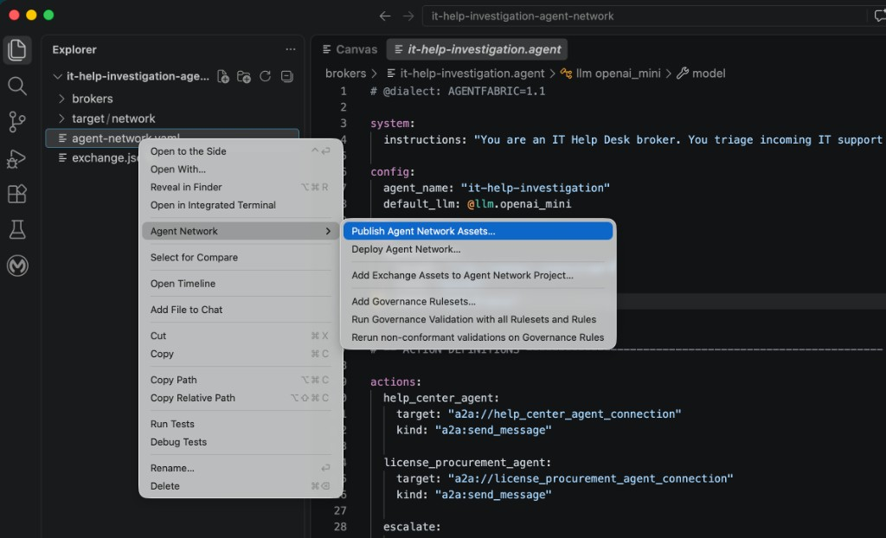
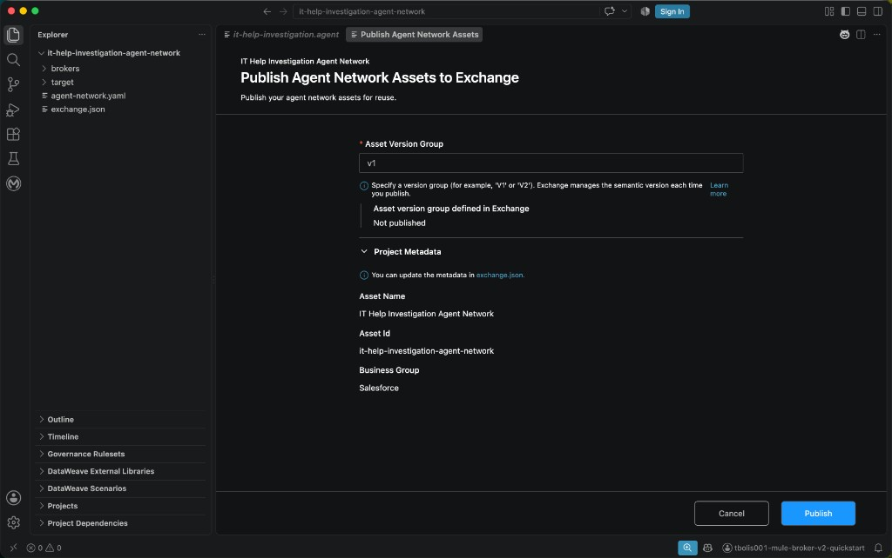
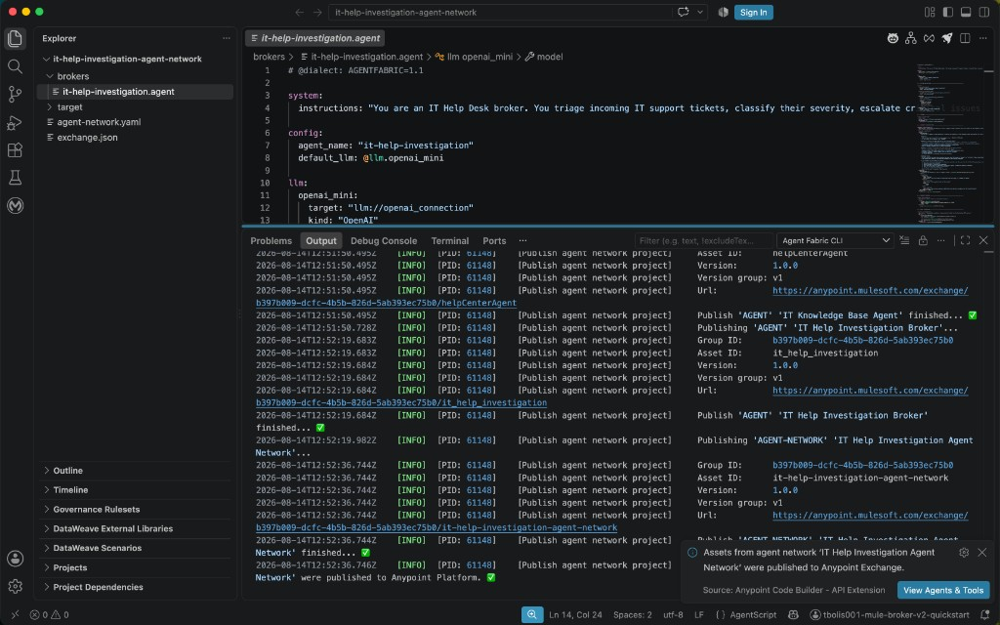
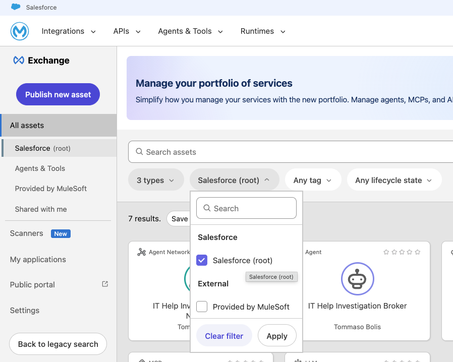
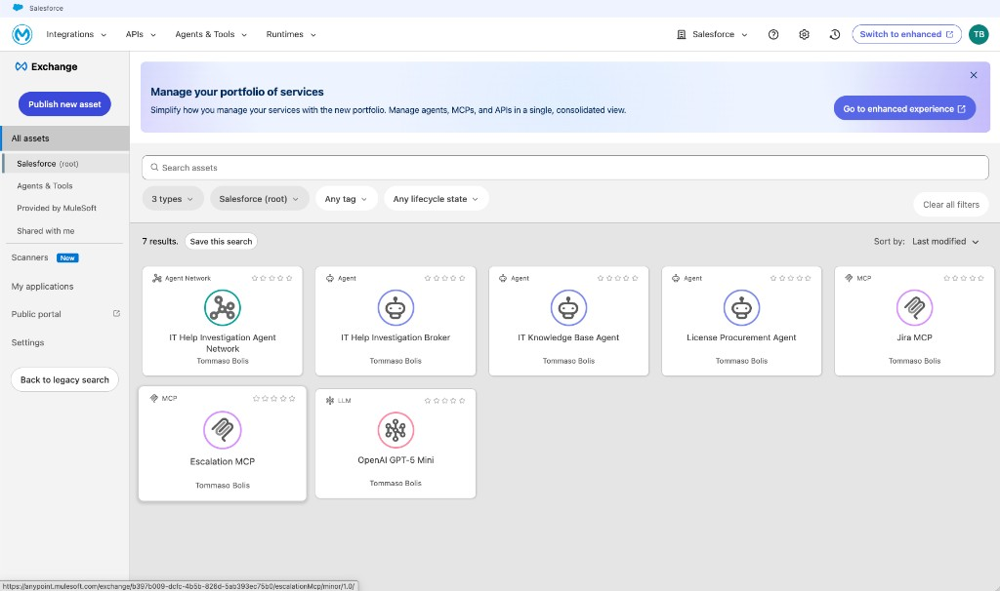
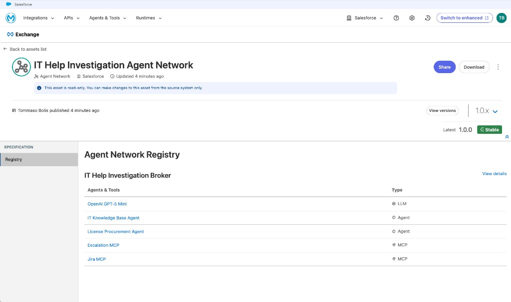
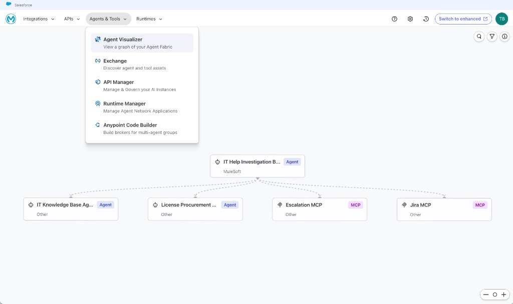

# Phase 7 — Publish the Agent Network

Publish the completed agent network project to Anypoint Exchange so its
brokers, agents, MCP servers, and provider definitions are available as
Exchange assets.

## Contents

- [1. Review the project metadata](#1-review-the-project-metadata)
- [2. Publish the Agent Network assets](#2-publish-the-agent-network-assets)
- [3. Verify the assets in Exchange](#3-verify-the-assets-in-exchange)

## 1. Review the project metadata

Before publishing, confirm that the project builds successfully and review
`exchange.json`. Verify the asset name, asset ID, version, organization ID,
group ID, and required variables.

The `groupId` determines the Anypoint Platform business group where the assets
are published. Update it before publishing if the assets must belong to a
different business group.

## 2. Publish the Agent Network assets

Make sure Anypoint Code Builder is signed in to the correct Anypoint Platform
account. Then publish the project using either of these methods:

- In the Explorer, right-click `agent-network.yaml` and select **Agent Network
  → Publish Agent Network Assets...**.
- Open the Command Palette (**Cmd+Shift+P**) and run **MuleSoft: Publish Agent
  Network Assets**.

In **Publish Agent Network Assets to Exchange**, enter the **Asset Version
Group** (for example, `v1`) and review the Asset Name, Asset ID, and Business
Group under **Project Metadata**. Click **Publish**.

Anypoint Code Builder builds the project and publishes the Agent Network assets
to Anypoint Exchange. If Code Builder asks for confirmation or permission to
run the required commands, approve the request.

Open the **Output** tab, select **Agent Fabric CLI**, and wait for every asset
and the Agent Network to report `finished`. Publishing is complete when the
output and notification confirm that the network was published to Anypoint
Exchange. If any issue occurs, use **MuleSoft Vibes** to diagnose and address
it, then retry until publishing succeeds.

## 3. Verify the assets in Exchange

Open Anypoint Exchange and select **All assets**. Open the business group
filter, select the same business group used during publishing, and click
**Apply** to filter the asset list.

You should see these seven published assets:

- IT Help Investigation Agent Network
- IT Help Investigation Broker
- IT Knowledge Base Agent
- License Procurement Agent
- Jira MCP
- Escalation MCP
- OpenAI GPT-5 Mini

Confirm that their published versions match the project metadata.

Open **IT Help Investigation Agent Network** and select **Registry**. Verify
that **IT Help Investigation Broker** references OpenAI GPT-5 Mini, both
agents, and both MCP servers. Also confirm that the expected version is marked
**Stable**.

You can also open **Agents & Tools → Agent Visualizer** to inspect the
rendered network. Confirm that **IT Help Investigation Broker** is connected
to both agents and both MCP servers.

For the detailed product workflow, see
[Publish Agent Network Assets](https://docs.mulesoft.com/anypoint-code-builder/af-publish-agent-network-assets).

---

**Previous:** [Phase 6 — Build the Agent Network](06-build-agent-network.md) ·
**Next:** [Phase 8 — Deploy the Agent Network](08-deploy-agent-network.md)
