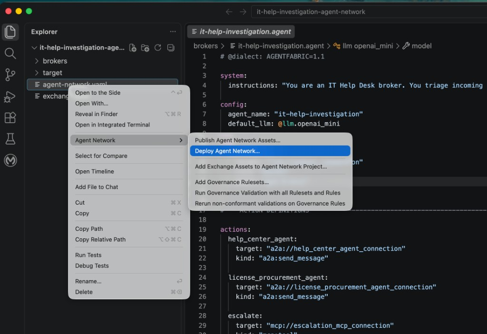
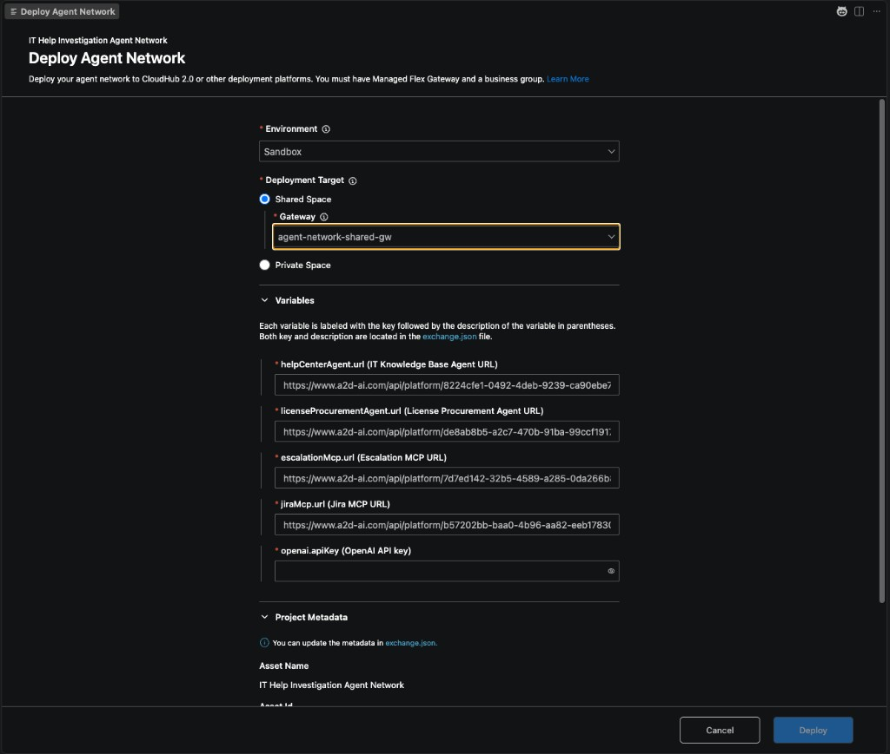
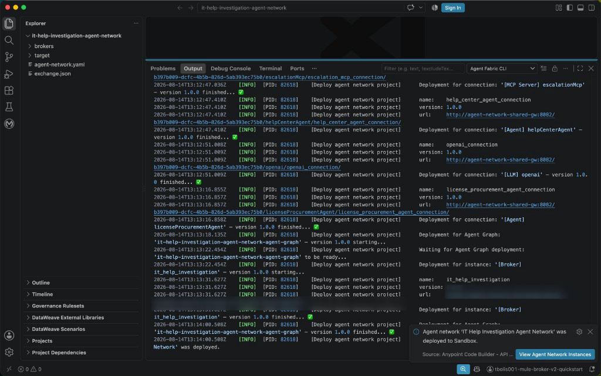
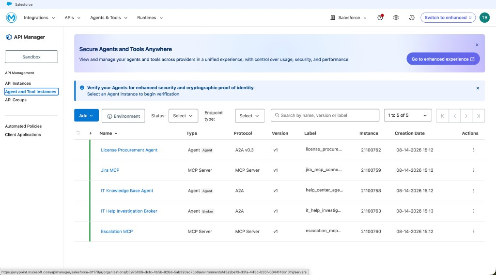
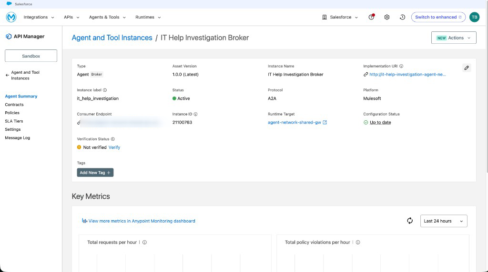
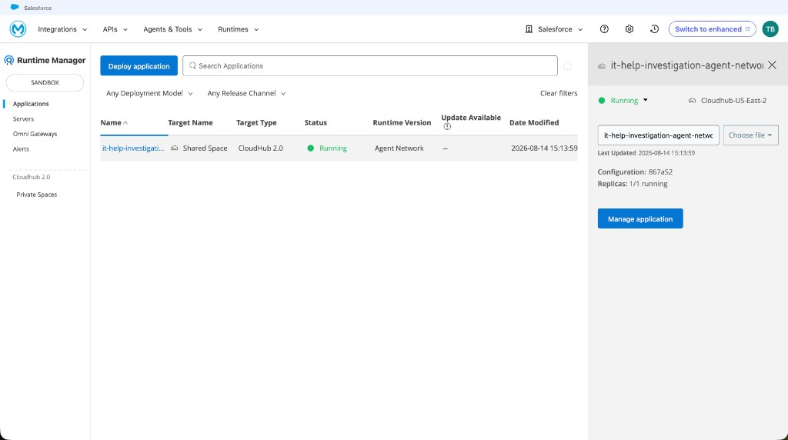

# Phase 8 — Deploy the Agent Network

Deploy the published Agent Network to CloudHub 2.0 so its broker and
connections are available as running instances.

## Contents

- [1. Confirm the deployment prerequisites](#1-confirm-the-deployment-prerequisites)
- [2. Open the deployment workflow](#2-open-the-deployment-workflow)
- [3. Configure and deploy the network](#3-configure-and-deploy-the-network)
- [4. Verify the deployed instances](#4-verify-the-deployed-instances)

## 1. Confirm the deployment prerequisites

Before deploying, confirm that:

- The Agent Network project builds successfully.
- The Agent Network assets are published to Anypoint Exchange.
- The target CloudHub 2.0 shared or private space is available.
- The Agent Network gateways from
  [Phase 5](05-set-up-agent-network-gateways.md) are running.
- Anypoint Code Builder is signed in to the correct Anypoint Platform account.

## 2. Open the deployment workflow

In Anypoint Code Builder, start deployment using either of these methods:

- In the Explorer, right-click `agent-network.yaml` and select **Agent Network
  → Deploy Agent Network...**.
- Open the Command Palette (**Cmd+Shift+P**) and run **MuleSoft: Deploy Agent
  Network**.

## 3. Configure and deploy the network

In **Deploy Agent Network**, select the **Environment** and **Deployment
Target**. For a shared space, select its managed gateway; for a private space,
select the corresponding target space and gateways.

Under **Variables**, verify the agent and MCP endpoint URLs, then enter your
OpenAI API key in `openai.apiKey`. Keep this secret value private and do not
save it in source control. Review the project metadata and click **Deploy**.

If no deployment target appears, return to
[Phase 5](05-set-up-agent-network-gateways.md) and verify that the target space
and gateways are configured for the selected business group and environment.

Open the **Output** tab, select **Agent Fabric CLI**, and wait for the
connections, Agent Graph, and broker instance to finish deploying. Deployment
is complete when the output reports that the Agent Network was deployed and
the notification confirms the target environment. If any issue occurs, use
**MuleSoft Vibes** to diagnose and address it, then retry until deployment
succeeds.

## 4. Verify the deployed instances

In Anypoint Platform, go to **API Manager → Agent and Tool Instances** and
select the deployment environment. Verify that the five expected instances
appear: the IT Help Investigation Broker, both agents, and both MCP servers.

Open **IT Help Investigation Broker** and confirm that its status is
**Active**. Note down the **Consumer Endpoint**; you use this URL to call and
test the deployed broker. Open the endpoint link and copy the complete URL,
because the value displayed on the summary page can be truncated.

Then go to **Runtime Manager → Applications**, select the deployment
environment, and open the Agent Network application. Confirm that its status
is **Running** and that the target and target type match the selected
CloudHub 2.0 space.

For the detailed product workflow and troubleshooting guidance, see
[Deploy Agent Network Instances](https://docs.mulesoft.com/agent-network/latest/af-deploy-agent-network-targets).

---

**Previous:** [Phase 7 — Publish the Agent Network](07-publish-agent-network.md) ·
**Next:** [Phase 9 — Test the Agent Network Broker](09-test-agent-network-broker.md)
