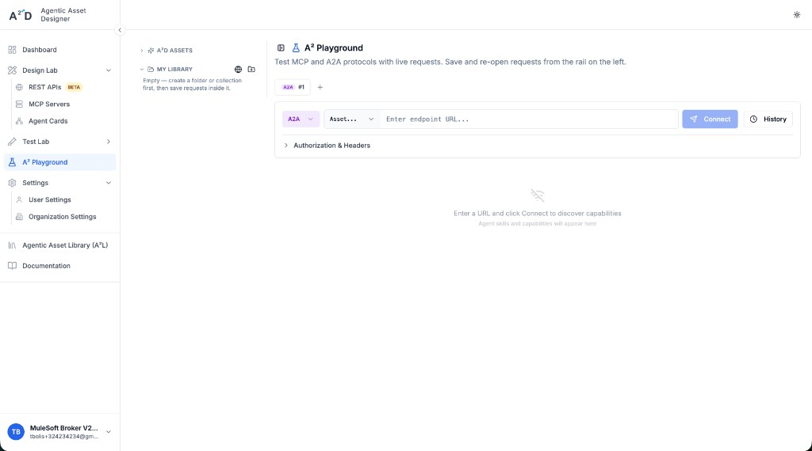
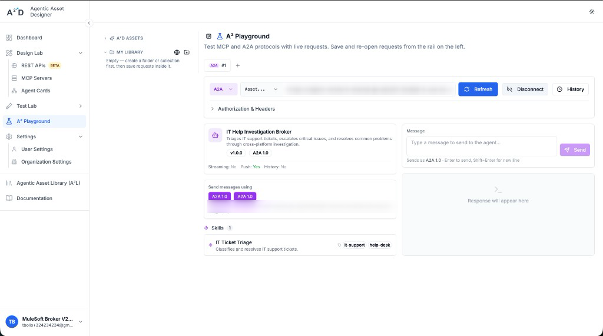
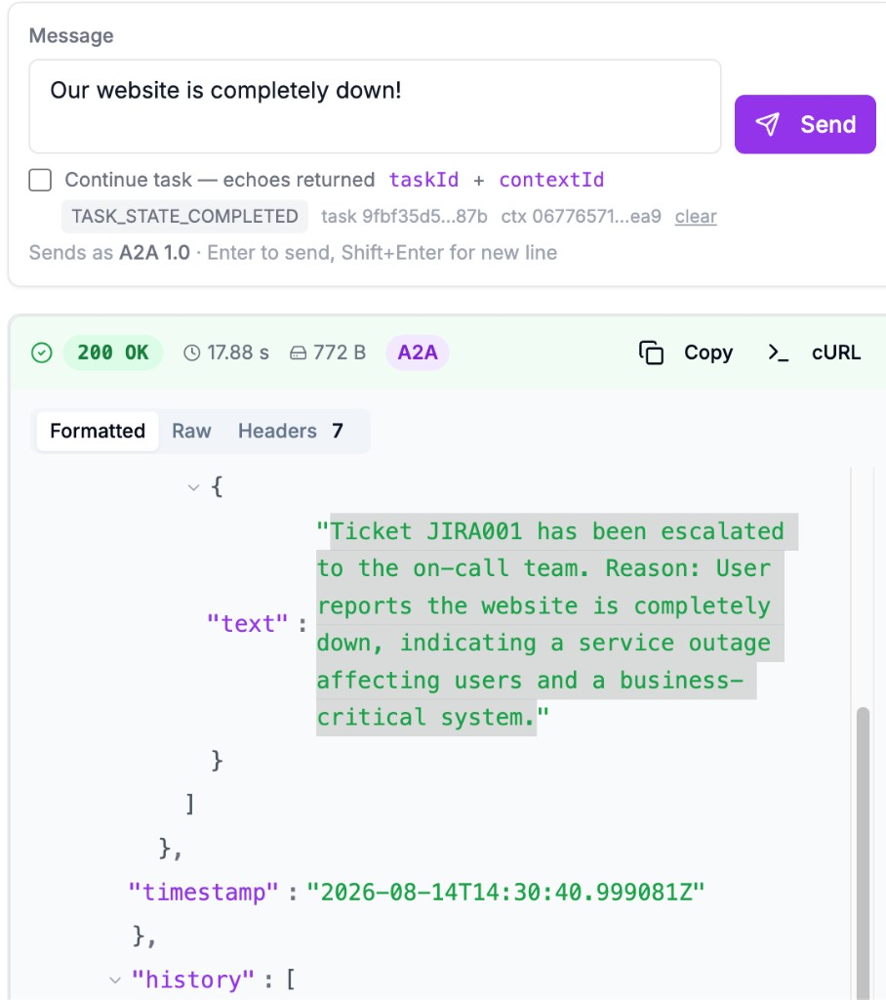
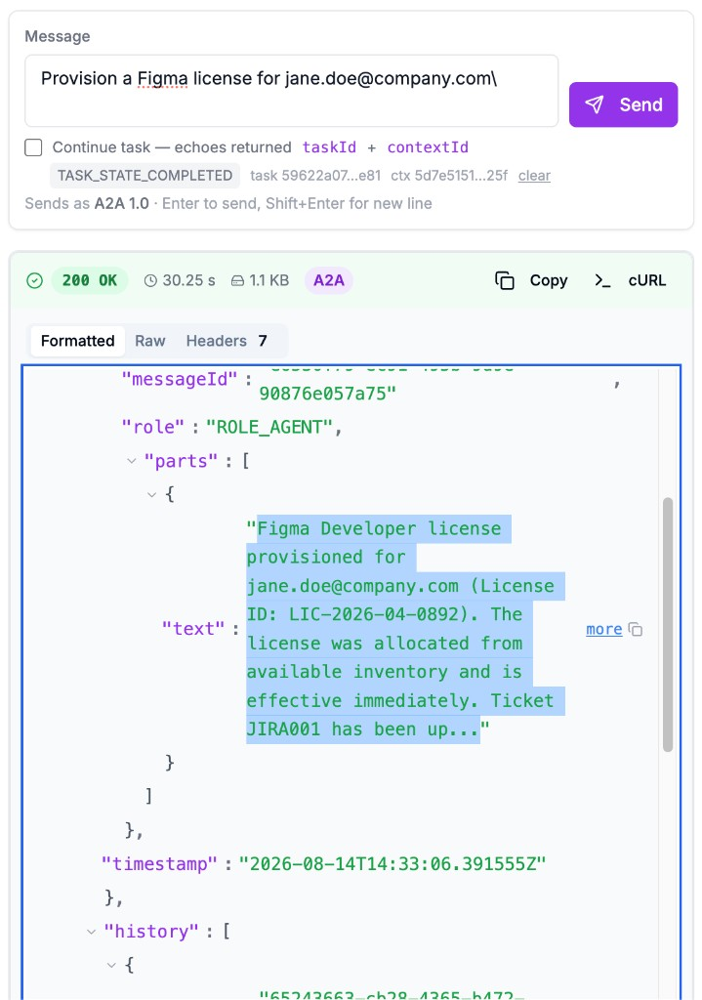
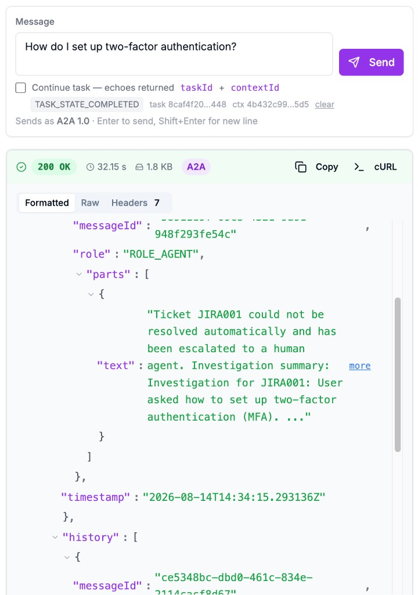
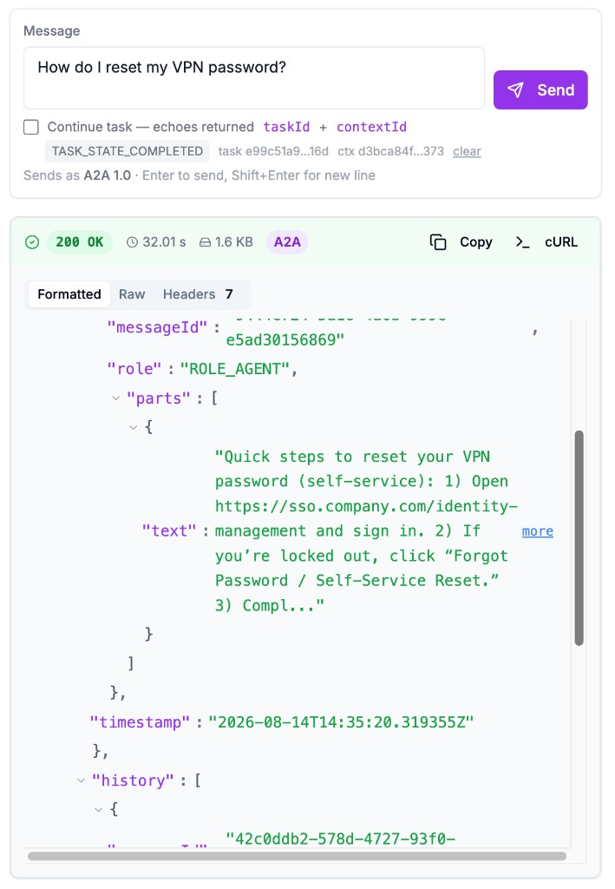
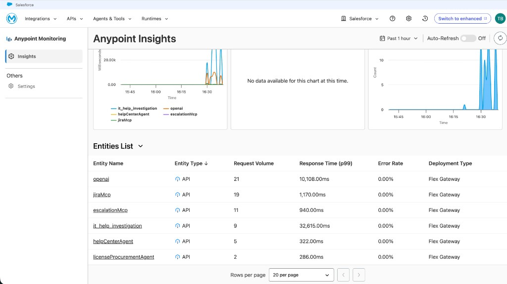

# Phase 9 — Test the Agent Network Broker

Test the deployed IT Help Investigation Broker through its A2A consumer
endpoint and verify that requests follow the expected investigation paths.

> **Note:** This guide uses A² Playground for convenience, but you can test the
> broker with any A2A 1.0-compatible client, including Postman, cURL, or a
> custom application.

## Contents

- [1. Prepare the broker endpoint](#1-prepare-the-broker-endpoint)
- [2. Verify the broker agent card](#2-verify-the-broker-agent-card)
- [3. Send test support requests](#3-send-test-support-requests)
- [4. Verify the responses and activity](#4-verify-the-responses-and-activity)

## 1. Prepare the broker endpoint

Use the complete **Consumer Endpoint** recorded in
[Phase 8](08-deploy-agent-network.md#4-verify-the-deployed-instances). Confirm
that the IT Help Investigation Broker instance is **Active** before testing.

Go to [a2d-ai.com](https://www.a2d-ai.com/), open **A² Playground**, and select
the **A2A** protocol. Paste the Consumer Endpoint into **Enter endpoint URL**
and click **Connect**.



## 2. Verify the broker agent card

After you click **Connect**, A² Playground retrieves the broker's A2A agent
card. Confirm that it shows **IT Help Investigation Broker**, A2A 1.0, and the
**IT Ticket Triage** skill. The message panel is now ready for test requests.



## 3. Send test support requests

Use these four messages to exercise the broker's escalation, licensing, and
Help Center paths. Because none includes a Jira ticket ID, verify that responses
which reference a ticket use `JIRA001`.

- **License Procurement — low severity**

  ```text
  Provision a Figma license for jane.doe@company.com
  ```

- **Unresolved two-factor authentication request — low severity**

  ```text
  How do I set up two-factor authentication?
  ```

- **Help Center VPN password reset — low severity**

  ```text
  How do I reset my VPN password?
  ```

- **Immediate escalation — high severity**

  ```text
  Our website is completely down!
  ```

### Expected responses

Exact wording, generated IDs, and timing can vary. Verify that each response
uses the expected route and outcome:

- **Website outage:** Returns `200 OK`, uses `JIRA001`, and confirms immediate
  escalation to the on-call team with the high-severity reason.

  

- **Figma license:** Returns `200 OK` and confirms that a Figma Developer
  license was provisioned for `jane.doe@company.com` and the ticket was
  updated.

  

- **Two-factor authentication:** Returns `200 OK`; when the automated
  investigation cannot find a solution, it confirms that `JIRA001` was
  escalated to a human with an investigation summary.

  

- **VPN password reset:** Returns `200 OK` and provides actionable self-service
  password-reset instructions from the Help Center.

  

## 4. Verify the responses and activity

For each request, confirm that the broker returns a clear final response and
follows the expected route:

- High-severity issues are escalated immediately.
- Routine low-severity issues use the Help Center.
- License and access requests consult License Procurement.
- Jira receives the investigation findings and resolution notes.
- Unresolved low-severity issues are escalated to a human.

Use API Manager message logs and Anypoint Monitoring when additional
troubleshooting or request tracing is needed.

> **Performance note:** In **Anypoint Monitoring → Insights**, the example test
> window reports a p99 response time of about 10 seconds for `openai` and
> 33 seconds for `it_help_investigation`. These values are p99 latency, not
> averages, and vary with traffic and downstream service performance.



For protocol details, see the
[Agent Script Reference](https://docs.mulesoft.com/agent-network/latest/af-agent-script-reference).

---

**Previous:** [Phase 8 — Deploy the Agent Network](08-deploy-agent-network.md)
