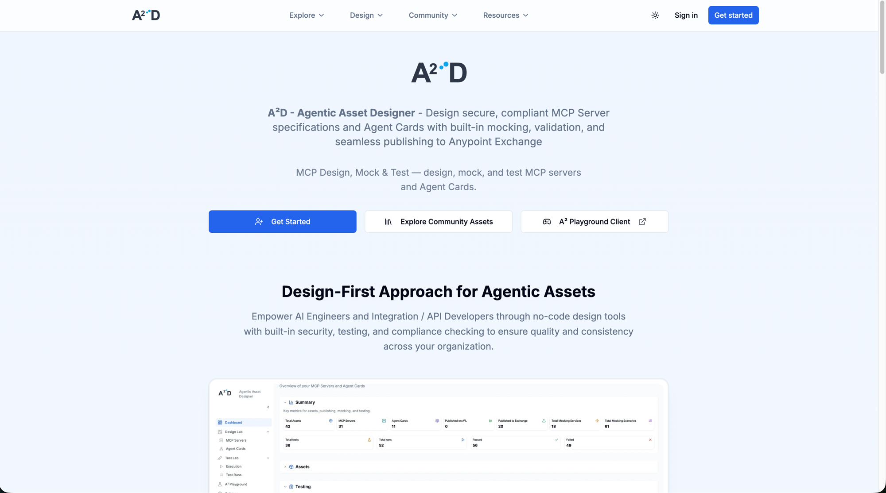
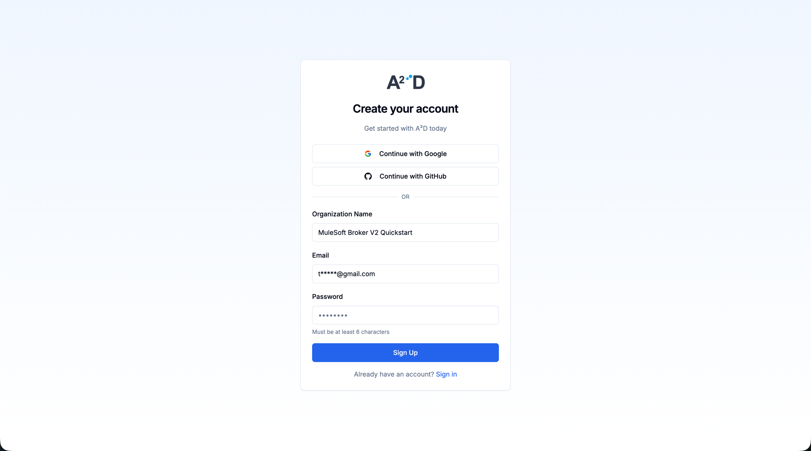
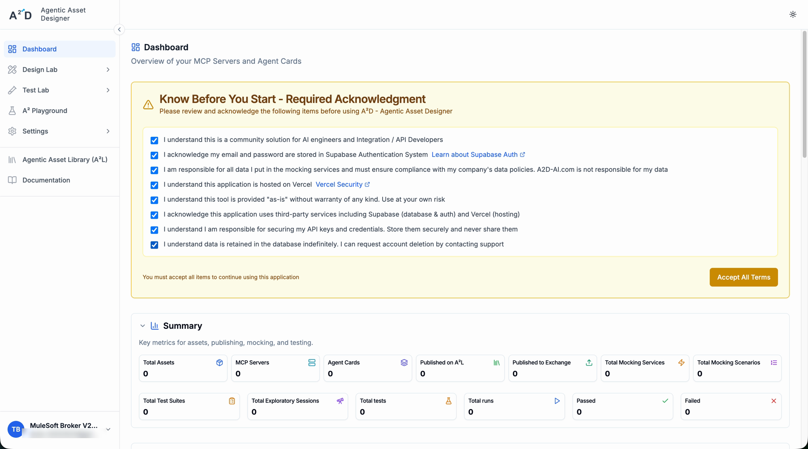
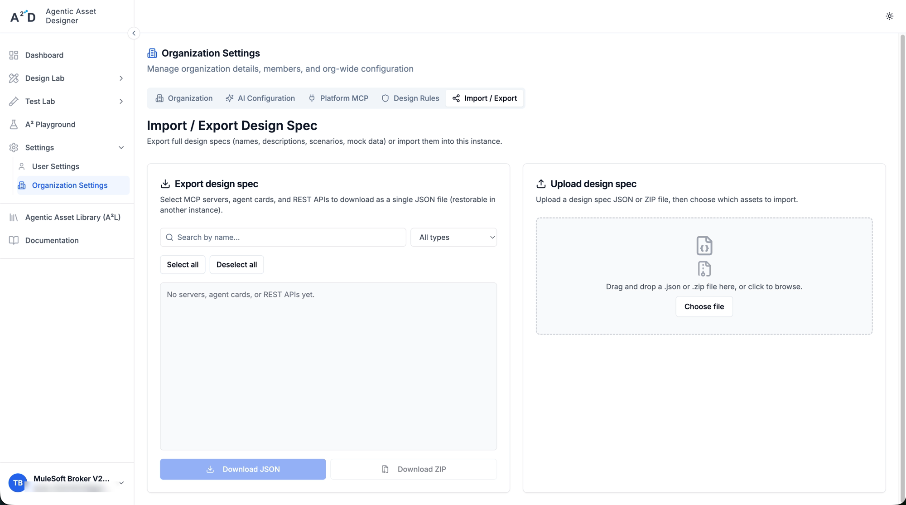
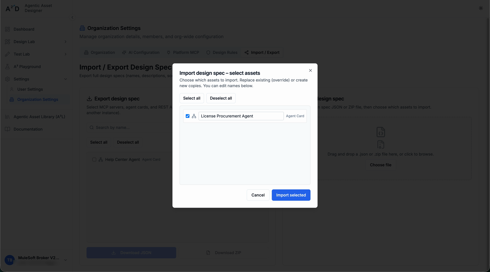
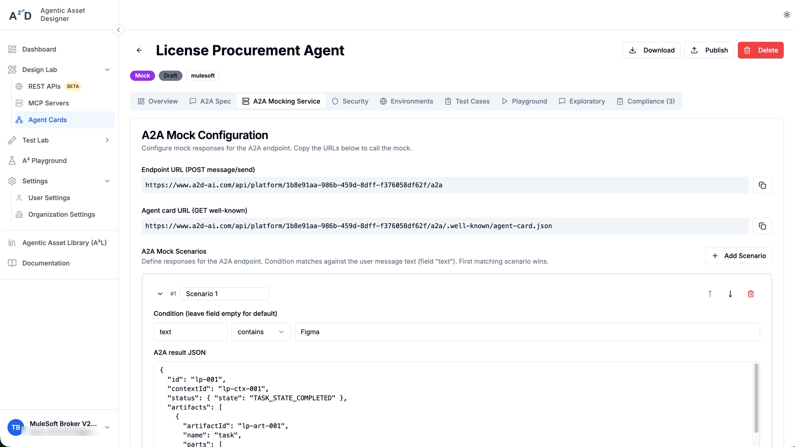
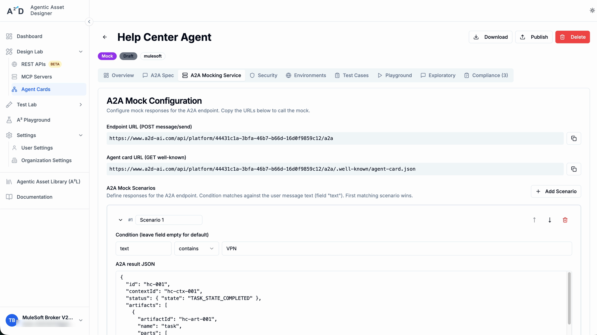
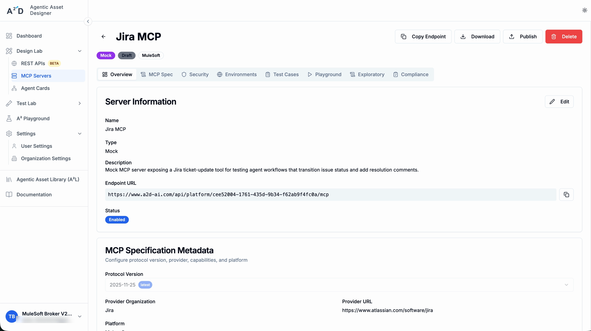
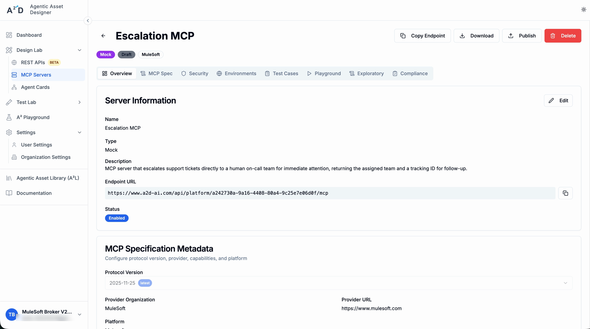

# Phase 4 — Set Up Mock Agents and MCP Servers

The agent network built in [Phase 6](06-build-agent-network.md) needs other
agents and MCP servers to talk to. Since this guide focuses on the **agent
network broker** itself rather than any specific downstream agent, it's
enough to use **a2d** to design and mock the agents and MCP servers the
network will call, instead of standing up real ones.

## Contents

- [1. Go to a2d-ai.com and get started](#1-go-to-a2d-aicom-and-get-started)
- [2. Register an account](#2-register-an-account)
- [3. Accept the terms on the Dashboard](#3-accept-the-terms-on-the-dashboard)
- [4. Go to Organization Settings](#4-go-to-organization-settings)
- [5. Import the example agent specs](#5-import-the-example-agent-specs)
- [6. Note down each asset's endpoint URL](#6-note-down-each-assets-endpoint-url)

## 1. Go to a2d-ai.com and get started

Go to [a2d-ai.com](https://www.a2d-ai.com/) — **A²D (Agentic Asset Designer)**
is a community tool for designing secure, compliant MCP Server specs and
Agent Cards, with built-in mocking, validation, and publishing to Anypoint
Exchange. Click **Get Started**.

## 2. Register an account

Sign up with Google or GitHub, or create an account manually with an
Organization Name, Email, and Password.

## 3. Accept the terms on the Dashboard

On first login, the Dashboard shows a **"Know Before You Start — Required
Acknowledgment"** banner. Review the items — this is a community solution,
auth/data is stored via Supabase, the app is hosted on Vercel, it's provided
"as-is", and you're responsible for your own data and API key security. Check
all items and click **Accept All Terms** to continue.

## 4. Go to Organization Settings

In the left nav, go to **Settings → Organization Settings**. The
**Import / Export** tab lets you export design specs (MCP servers, agent
cards, REST APIs) as JSON/ZIP, or import them into another instance.

## 5. Import the example agent and MCP specs

This repo includes example specs to use as mocks for the agent network, under
`specs/`:

- `agent-cards/` — bare Agent Card specs:
  - [`license-procurement-agent.json`](specs/agent-cards/license-procurement-agent.json) —
    checks software license availability and provisions licenses for
    employees.
  - [`help-center-agent.json`](specs/agent-cards/help-center-agent.json) —
    searches the IT knowledge base for answers to common issues.
- `mcp-metadata/` — MCP server specs:
  - [`escalation-mcp.json`](specs/mcp-metadata/escalation-mcp.json) —
    escalates a support ticket to the on-call team.
  - [`jira-mcp.json`](specs/mcp-metadata/jira-mcp.json) — updates a Jira
    ticket's status and adds a resolution comment.
- `a2d-specs/` — full A2D design spec exports, including
  each asset's mock scenarios:
  - [`license-procurement-agent.json`](specs/a2d-specs/license-procurement-agent.json) —
    Agent Card; mock scenarios for Figma, Tableau, and GitHub Enterprise
    license checks.
  - [`help-center-agent.json`](specs/a2d-specs/help-center-agent.json) —
    Agent Card; mock scenarios for VPN password reset and email sync issues.
  - [`jira-mcp.json`](specs/a2d-specs/jira-mcp.json) — MCP server; mock
    scenario for a successful Jira ticket update.
  - [`escalation-mcp.json`](specs/a2d-specs/escalation-mcp.json) — MCP
    server; mock scenario for a successful ticket escalation.

In the **Upload design spec** panel (same **Import / Export** tab), drag and
drop each JSON file from `specs/a2d-specs/`, or click
**Choose file**, then select which assets to import.

After uploading a spec, an **"Import design spec — select assets"** dialog
lists the assets found in the file (e.g. **License Procurement Agent**,
**Help Center Agent** — each tagged **Agent Card**, or **Jira MCP** tagged
**MCP Server**). Leave them checked (or click **Select all**) and click
**Import selected**. Repeat for each `a2d-specs/` file to import all the
assets.

## 6. Note down each asset's endpoint URL

After importing, open each asset's detail page (**Overview** tab) and note its
**Endpoint URL** — the agent network broker will call these mock endpoints.

- **License Procurement Agent** — Agent Card. Endpoint URL (POST
  `message/send`): `https://www.a2d-ai.com/api/platform/1b8e91aa-986b-459d-8dff-f376058df62f/a2a`.
  Agent card URL (GET well-known):
  `https://www.a2d-ai.com/api/platform/1b8e91aa-986b-459d-8dff-f376058df62f/a2a/.well-known/agent-card.json`.

  

- **Help Center Agent** — Agent Card. Endpoint URL (POST `message/send`):
  `https://www.a2d-ai.com/api/platform/44431c1a-3bfa-46b7-b66d-16d0f9859c12/a2a`.
  Agent card URL (GET well-known):
  `https://www.a2d-ai.com/api/platform/44431c1a-3bfa-46b7-b66d-16d0f9859c12/a2a/.well-known/agent-card.json`.

  

- **Jira MCP** — MCP Server. Endpoint URL:
  `https://www.a2d-ai.com/api/platform/cee52004-1761-435d-9b34-f62ab9f4fc0a/mcp`.

  

- **Escalation MCP** — MCP Server. Endpoint URL:
  `https://www.a2d-ai.com/api/platform/a242730a-9a16-4408-80a4-9c25e7e06d0f/mcp`.

  

---

**Previous:** [Phase 3 — Link Anypoint Platform to Salesforce](03-link-salesforce.md) ·
**Next:** [Phase 5 — Set Up Agent Network Gateways](05-set-up-agent-network-gateways.md)
