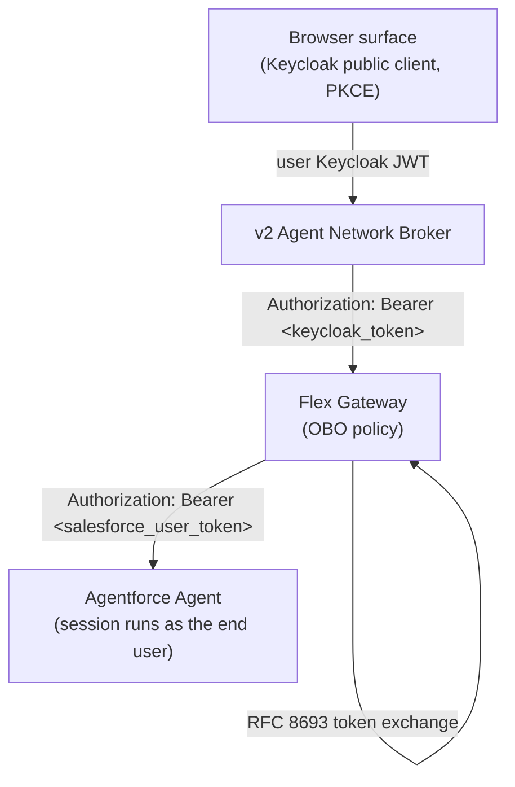

# Phase 0 — Overview & Architecture

> **Work in progress:** This document is actively being updated and may change.

> _Draft outline — section content to be filled in._

How On-Behalf-Of identity flows from the end user, through the v2 agent network
broker, to an Agentforce agent — and where the token exchange happens.

## Contents

- [1. The problem OBO solves](#1-the-problem-obo-solves)
- [2. The end-to-end flow](#2-the-end-to-end-flow)
- [3. Where the token exchange happens](#3-where-the-token-exchange-happens)
- [4. Zero code changes in the agent](#4-zero-code-changes-in-the-agent)
- [5. What you will set up](#5-what-you-will-set-up)

## 1. The problem OBO solves

_Outline: without OBO, every Agentforce call runs as a shared service account
(Client Credentials / "Run As" user). OBO makes the Agentforce session run as
the actual end user, so per-user data access and auditing are correct._

## 2. The end-to-end flow

_Outline: the user signs in at a browser surface against Keycloak (public OIDC
client, auth code + PKCE) and gets a Keycloak JWT; the v2 broker forwards that
token; the Flex Gateway OBO policy exchanges it for a Salesforce user token
before the request reaches the Agentforce agent._

## 3. Where the token exchange happens

_Outline: the RFC 8693 exchange happens entirely at the Flex Gateway layer via
the OAuth 2.0 OBO Credential Injection policy — the broker only forwards the
bearer token; it does not validate or exchange it._

## 4. Zero code changes in the agent

_Outline: the Agentforce agent (and any A2A wrapper in front of it) requires no
code changes — it receives a Salesforce user token instead of a service token
and passes it through. Identity is a gateway concern._

## 5. What you will set up

_Outline: a real Agentforce agent, a Keycloak identity provider, the Salesforce
token-exchange handler + Connected App, the Flex Gateway OBO policy, and the v2
broker wiring — one per following phase._

---

**Next:** [Phase 1 — Agentforce Setup](01-agentforce-setup.md)
