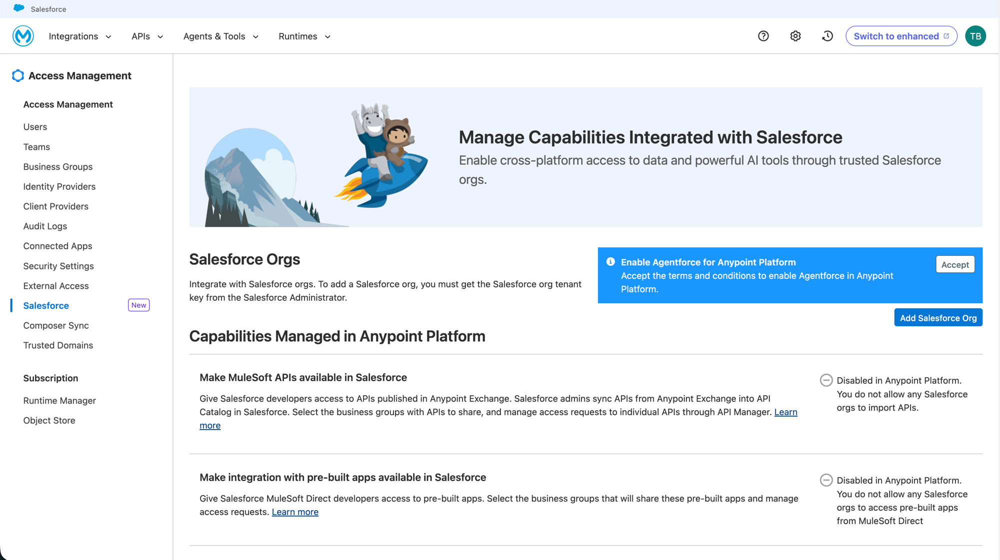
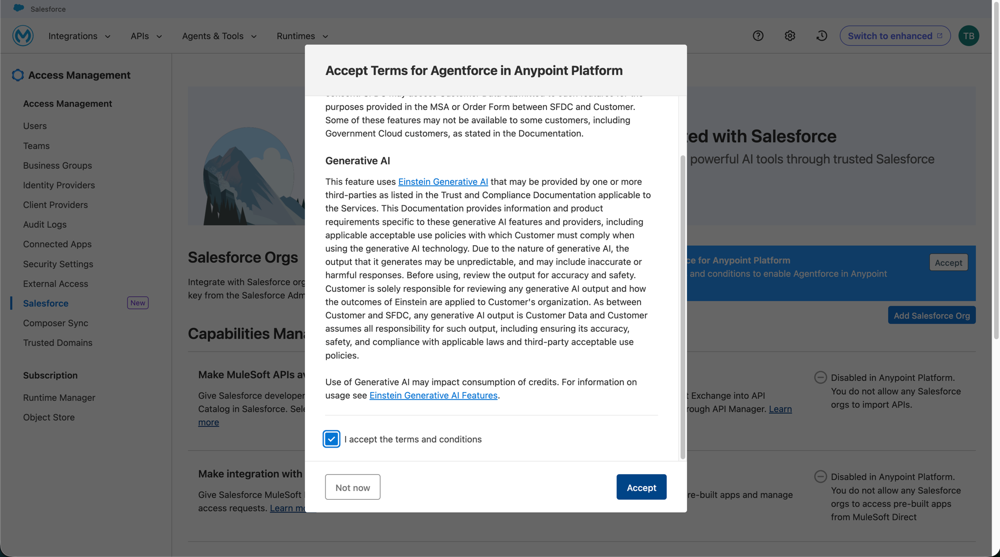

# Phase 1 — Enable Agentforce & Create the Agent

> _Draft outline — section content to be filled in._

Enable the platform features and create the Agentforce agent the v2 broker will
call on behalf of the end user. There are two ways to create the agent — this
guide leads with **AgentScript** as the recommended path and keeps the legacy
Agent Builder wizard as an alternative.

> **Prerequisite — a trial org with Agentforce enabled.** MuleSoft Vibes (the
> Agentforce Vibes IDE) runs against a Salesforce org, not the Anypoint Platform
> account — sign up for a free **Agentforce 360 Platform Free Trial** org,
> separate from the MuleSoft trial account. See
> [Quickstart Phase 1 — Account Setup §4](../quickstart/01-account-setup.md#4-agentforce-360-platform-free-trial-for-mulesoft-vibes)
> to provision it.

## Contents

- [1. Enable Einstein Generative AI](#1-enable-einstein-generative-ai)
- [2. Enable Agentforce](#2-enable-agentforce)
- [3. Create the Agentforce agent](#3-create-the-agentforce-agent)
  - [3.1 Recommended — deploy with AgentScript](#31-recommended--deploy-with-agentscript)
  - [3.2 Legacy — the Agent Builder wizard](#32-legacy--the-agent-builder-wizard)
- [4. Add a "Get Current User" action (optional)](#4-add-a-get-current-user-action-optional)
- [5. Activate and test the agent](#5-activate-and-test-the-agent)
- [6. Test the Agent API with curl](#6-test-the-agent-api-with-curl)

## 1. Enable Einstein Generative AI

Agentforce depends on Einstein Generative AI, so make sure Einstein is turned
on in the Salesforce org first. In Salesforce **Setup**, search for
**"Einstein"** → **Einstein Setup**, and check that **Turn on Einstein** is set
to **On**.

> If you followed the [Agent Network Quickstart](../quickstart/README.md), you
> already enabled this while linking the org — see
> [Quickstart Phase 3 §1](../quickstart/03-link-salesforce.md#1-enable-einstein-in-salesforce-if-not-already-on).

## 2. Enable Agentforce

Agentforce is enabled through **Anypoint Platform**'s Salesforce integration.
Go to **Access Management** and select **Salesforce** from the left nav — this
page manages the capabilities integrated with Salesforce, giving cross-platform
access to data and AI tools through trusted Salesforce orgs.

Click **Accept** on the **"Enable Agentforce for Anypoint Platform"** banner.
Review the terms (including the Generative AI section), check **"I accept the
terms and conditions"**, then click **Accept**.

## 3. Create the Agentforce agent

_Outline: create the target agent for OBO. Two approaches follow — AgentScript
(recommended) and the legacy Agent Builder wizard. The rest of this guide is
agnostic to which one you use; both yield an agent with an Agent API endpoint._

### 3.1 Recommended — deploy with AgentScript

_Outline: define and deploy the Agentforce agent from an AgentScript
(`# @dialect: AGENTFABRIC=1.0`) definition — a code-first, version-controllable
agent that fits the rest of the v2 network workflow. Capture the deployed
agent's ID / Agent API endpoint for later phases._

### 3.2 Legacy — the Agent Builder wizard

_Outline: the point-and-click alternative — New Agent wizard: select agent type,
subagents, customize, select data sources, create. Kept for readers who prefer
the Setup UI or an existing wizard-built agent._

## 4. Add a "Get Current User" action (optional)

_Outline: build the autolaunched Flow that returns the current user, add it as
an agent action. Makes "What is my name?" a clean identity-propagation probe in
Phase 6._

## 5. Activate and test the agent

_Outline: test in the agent panel, then activate._

## 6. Test the Agent API with curl

_Outline: get an access token, create a session, send a message against
`/einstein/ai-agent/v1/...`. Confirms the agent responds before adding OBO._

---

**Next:** [Phase 2 — Keycloak Identity Setup](02-keycloak-setup.md)
