# Phase 1 — Agentforce Setup

Enable Salesforce and Agentforce prerequisites, configure the connected app used
by the broker path, create the target agent, and validate API access before
moving to token exchange.

> **Prerequisite — a trial org with Agentforce enabled.** MuleSoft Vibes runs
> against a Salesforce org (not your Anypoint account). If needed, provision a
> free Agentforce trial org first:
> [Quickstart Phase 1 — Account Setup §4](../quickstart/01-account-setup.md#4-agentforce-360-platform-free-trial-for-mulesoft-vibes).

## Contents

- [Overview](#overview)
- [1. Platform Enablement](#1-platform-enablement)
  - [1.1 Enable Einstein Generative AI](#11-enable-einstein-generative-ai)
  - [1.2 Enable Agentforce](#12-enable-agentforce)
- [2. Connected App Setup](#2-connected-app-setup)
  - [2.1 Activate Connected Apps](#21-activate-connected-apps)
  - [2.2 Create a New Connected App](#22-create-a-new-connected-app)
  - [2.3 Basic Information](#23-basic-information)
  - [2.4 OAuth Scopes and Settings](#24-oauth-scopes-and-settings)
  - [2.5 Manage the Connected App](#25-manage-the-connected-app)
  - [2.6 Edit Policies](#26-edit-policies)
  - [2.7 View the Connected App](#27-view-the-connected-app)
  - [2.8 Get Consumer Credentials](#28-get-consumer-credentials)
  - [2.9 Activate Data Cloud (Optional)](#29-activate-data-cloud-optional)
- [3. Connected App Verification](#3-connected-app-verification)
  - [3.1 Obtain a Client Credentials Token](#31-obtain-a-client-credentials-token)
  - [3.2 Verify the Einstein Models API](#32-verify-the-einstein-models-api)
  - [3.3 Common Failures](#33-common-failures)
- [4. Create the Agentforce Agent](#4-create-the-agentforce-agent)
  - [4.1 Recommended — deploy with AgentScript](#41-recommended--deploy-with-agentscript)
  - [4.2 Legacy — the Agent Builder wizard](#42-legacy--the-agent-builder-wizard)
- [5. Add a "Get Current User" Action (Optional)](#5-add-a-get-current-user-action-optional)
- [6. Activate and Test the Agent](#6-activate-and-test-the-agent)
- [7. Test the Agent API](#7-test-the-agent-api)

## Overview

This phase covers the Salesforce configuration required to enable Agentforce
and Einstein Generative AI, create a single connected app for secure access to
both the Agentforce Agent API and the Einstein Models API, and then create and
activate a first Agentforce Service Agent.

For per-user identity propagation on top of this setup, continue with the OBO
phases in this guide.

### Scope

This phase combines two tracks:

- **Agentforce setup**: org-level enablement and connected-app configuration
  used by broker/API calls.
- **Agent creation**: creating and activating an Agentforce Service Agent,
  wiring it to the connected app, and optionally adding identity flow action.

### Prerequisites

- **Salesforce org** with Einstein and Agentforce capabilities available.
- **Admin setup permissions** for Einstein/Agentforce, connected apps, policies,
  and flows.
- **Email access** for connected-app identity verification and credential reveal.
- **curl** (and optionally **jq**) for verification/testing commands.

By the end of this phase, you will have:

- Enabled Einstein Generative AI and Agentforce.
- Created and configured a connected app for API access.
- Verified token issuance and Einstein API access.
- Created an Agentforce agent (or prepared the AgentScript path).
- Optionally added a `Get_Current_User` flow action for identity checks.
- Validated that the agent responds through the Agent API.

## 1. Platform Enablement

### 1.1 Enable Einstein Generative AI

In Salesforce **Setup**, navigate to **Einstein Setup** and confirm
**Turn on Einstein** is enabled.

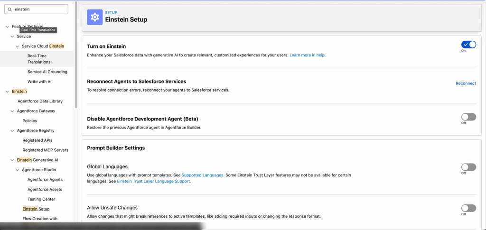

### 1.2 Enable Agentforce

In Salesforce **Setup**, navigate to:
**Einstein -> Einstein Generative AI -> Agentforce Studio -> Agentforce Agents**
and toggle **Agentforce** to **On**.


## 2. Connected App Setup

### 2.1 Activate Connected Apps

In Salesforce **Setup**, open **Apps -> External Client Apps -> Settings**, then
activate Connected Apps if your org requires it.


### 2.2 Create a New Connected App

From the **Connected Apps** section, click **New Connected App**.

### 2.3 Basic Information

Set:

- Connected App Name: `agentforce_connected_app`
- API Name: `agentforce_connected_app`
- Contact Email: `your-admin@email.com`
- Callback URL: `https://login.salesforce.com`

Enable OAuth.

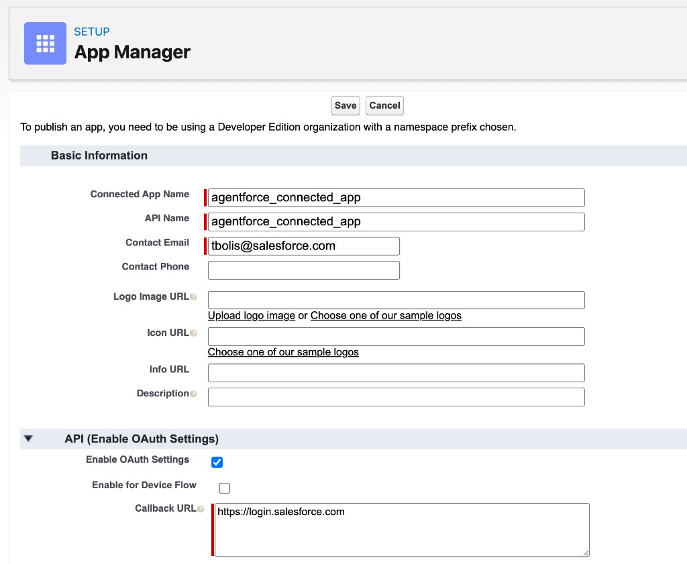

### 2.4 OAuth Scopes and Settings

Add OAuth scopes:

- `Manage user data via APIs (api)`
- `Access chatbot services (chatbot_api)`
- `Access the Salesforce API Platform (sfap_api)`
- `Perform requests at any time (refresh_token, offline_access)`

Enable:

- **Enable Client Credentials Flow**
- **Issue JSON Web Token (JWT)-based access tokens for named users**

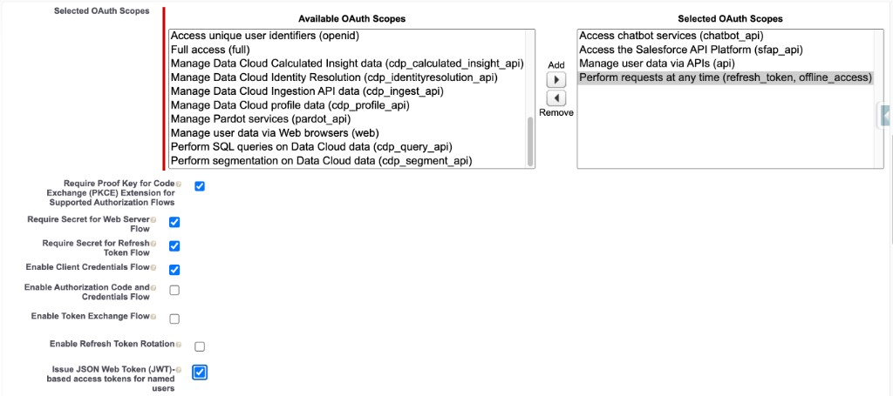

### 2.5 Manage the Connected App

Wait a few minutes after save, then go to **Setup -> Apps -> App Manager**,
find `agentforce_connected_app`, and choose **Manage**.


### 2.6 Edit Policies

In **Edit Policies**, set:

- **IP Relaxation**: Relax IP restrictions (or your org standard)
- **Run As (User)** under Client Credentials Flow
- **Access Token Timeout** as desired (example: 30 minutes)

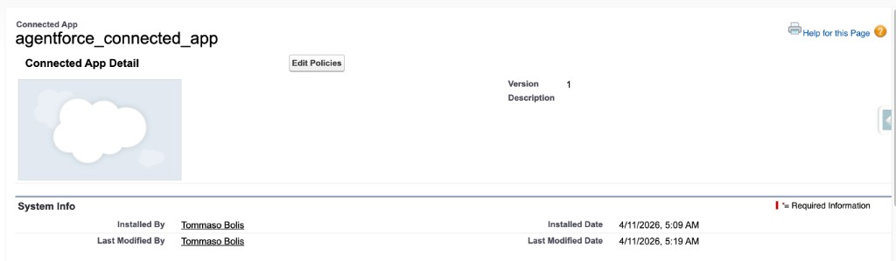

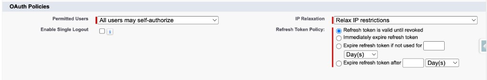

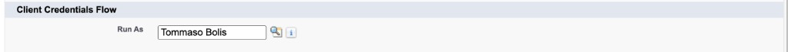

### 2.7 View the Connected App

From App Manager choose **View** when you need to retrieve consumer details.

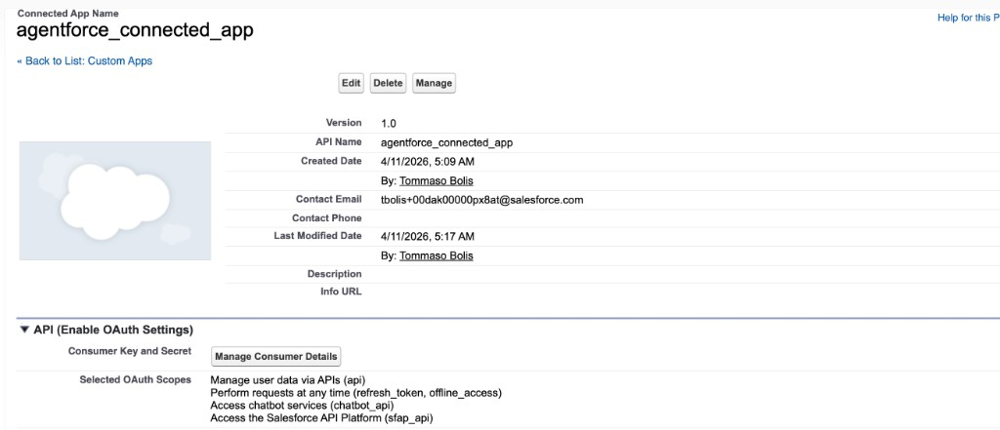

### 2.8 Get Consumer Credentials

Open **Manage Consumer Details**, complete verification, and copy:

- Consumer Key (`agentforce.clientId`)
- Consumer Secret (`agentforce.clientSecret`)

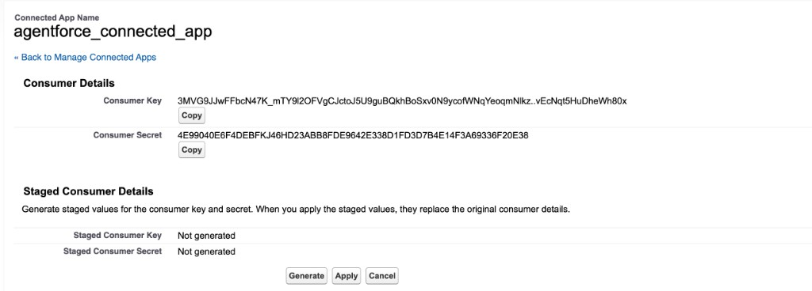

Use these credentials in your runtime configuration:

```properties
agentforce.clientId=YOUR_CONSUMER_KEY
agentforce.clientSecret=YOUR_CONSUMER_SECRET
```

Also note your **My Domain** URL from **Setup -> My Domain** (for example
`https://YOUR_ORG.my.salesforce.com`).

### 2.9 Activate Data Cloud (Optional)

Data Cloud is not required for the basic exercise. If needed:

1. Go to **Setup -> Data Cloud -> Data Cloud Setup Home**.
1. Click **Get Started**.
1. Wait 10-20 minutes for provisioning before Data Cloud-dependent steps.

## 3. Connected App Verification

### 3.1 Obtain a Client Credentials Token

```bash
curl -X POST \
  "https://YOUR_ORG.my.salesforce.com/services/oauth2/token" \
  -H "Content-Type: application/x-www-form-urlencoded" \
  -d "grant_type=client_credentials" \
  -d "client_id=YOUR_CONSUMER_KEY" \
  -d "client_secret=YOUR_CONSUMER_SECRET"
```

A successful response looks like:

```json
{
  "access_token": "00D...",
  "token_type": "Bearer",
  "instance_url": "https://YOUR_ORG.my.salesforce.com",
  "issued_at": "..."
}
```

### 3.2 Verify the Einstein Models API

```bash
SF_TOKEN="paste_access_token_here"

curl "https://YOUR_ORG.my.salesforce.com/services/data/v62.0/einstein/models" \
  -H "Authorization: Bearer $SF_TOKEN"
```

### 3.3 Common Failures

| Error | Cause | Fix |
| --- | --- | --- |
| `invalid_grant: no client credentials user enabled` | No **Run As** user configured | Set **Run As (User)** in connected app policies |
| `invalid_client` | Wrong Consumer Key or Secret | Verify in App Manager -> View -> Manage Consumer Details |
| `invalid_grant: user hasn't approved this consumer` | User/profile not pre-authorized | In policies, authorize relevant profile |
| `unsupported_grant_type` | Client credentials flow not enabled | Re-enable **Enable Client Credentials Flow** |
| `INVALID_SESSION_ID` on Models API | Einstein not fully enabled yet | Wait 5-10 minutes after enablement and retry |
| `404` on Models API endpoint | Wrong API version or Einstein unavailable | Verify licenses and try another API version |

## 4. Create the Agentforce Agent

Use one of the two approaches below.

### 4.1 Recommended — deploy with AgentScript

_TBD (intentionally left blank)._

### 4.2 Legacy — the Agent Builder wizard

Use this path if you prefer the Salesforce Setup UI.

### 4.2.1 Start the New Agent wizard

1. In Salesforce **Setup**, go to
   **Einstein -> Einstein Generative AI -> Agentforce Studio -> Agentforce Agents**.
1. Confirm the **Agentforce** toggle is **On**.
1. Click **+ New Agent**.


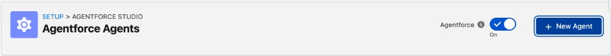

### 4.2.2 Select agent type

The Agent Creator opens at **1. Select an agent**.

1. Choose **Agentforce Service Agent**.
1. Click **Next**.

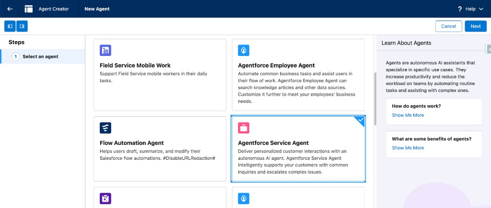

### 4.2.3 Select subagents

On **2. Select your subagents**:

1. Keep default subagents selected for this walkthrough (or adjust as needed).
1. Click **Next**.

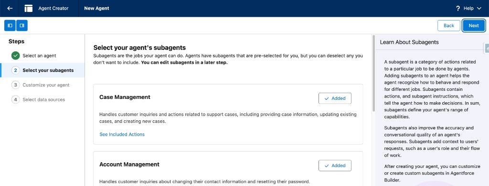

### 4.2.4 Customize your agent

On **3. Customize your agent**, fill required fields:

1. **Name / API Name** (defaults are fine unless your org requires otherwise).
1. **Description** (required).
1. **Role** (required).
1. **Company** (required).

Example company text:

> Salesforce is a global cloud computing company providing CRM software focused
> on sales, customer service, marketing automation, and analytics. Our
> AI-powered platform helps businesses connect with customers and drive growth.

Then click **Next**.

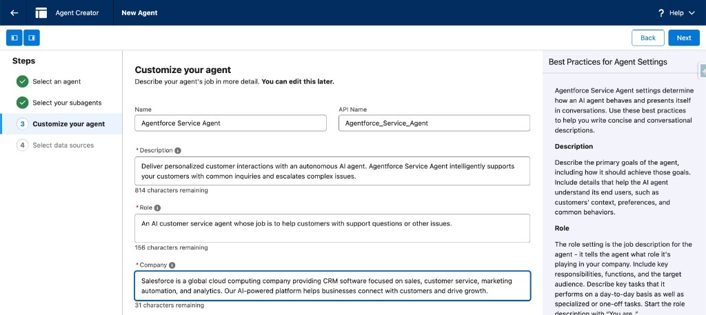

### 4.2.5 Select data sources and create

On **4. Select data sources (Optional)**:

1. Leave **Data Library** unset for this walkthrough (or choose one if you use it).
1. Click **Create**.

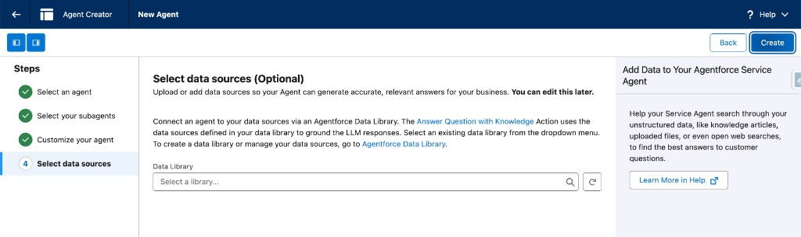

### 4.2.6 Add external app connection

After the agent is created, connect it to `agentforce_connected_app`.

1. Open your agent in **Agentforce Studio**.
1. Open the **Connections** tab.

> If your org shows only **Settings**, open **Settings** and use
> **Add external app** there.

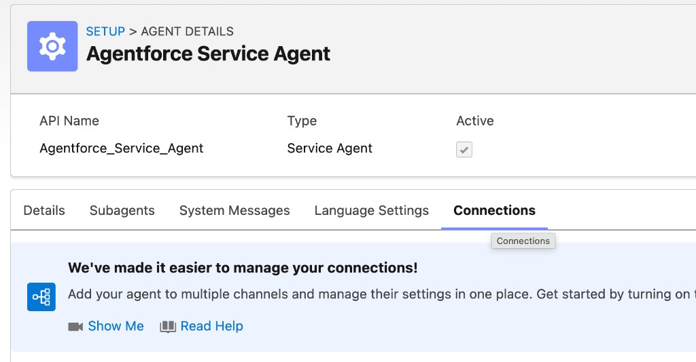

1. Click **Add external app**.
1. Set:
   - **Connection Type**: `API`
   - **Integration Name**: `agentforce_connected_app`
   - **Connected App**: `agentforce_connected_app`
1. Leave auto-filled **Configuration Information** as-is.
1. Click **Save**.

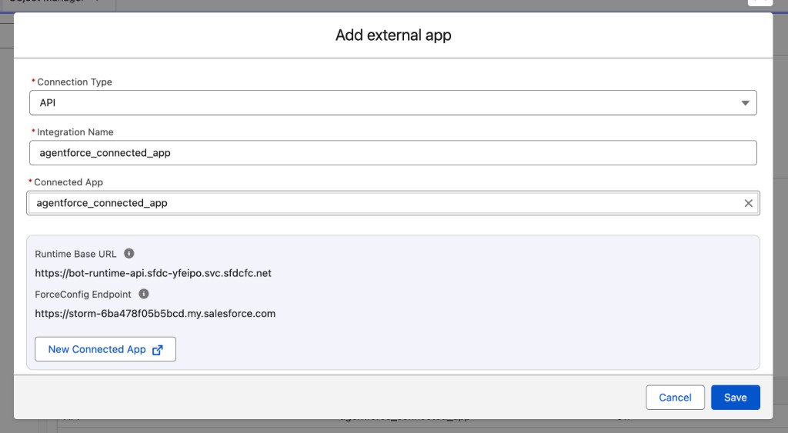

## 5. Add a "Get Current User" Action (Optional)

This section is only required if you want to prove identity propagation with a
prompt like "What is my name?".

### 5.1 Create the flow

1. Go to **Setup -> Flows -> New** (or **New Flow**).
1. In **New Automation**, choose **Autolaunched Flow (No Trigger)**.

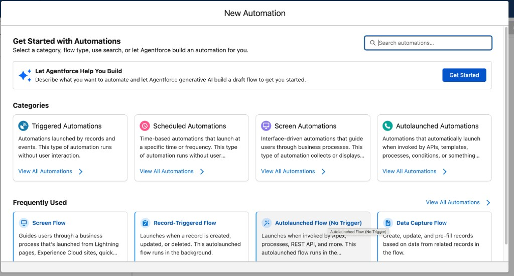

1. Add **Get Records** from the canvas:
   - **Label**: `Get User` (API name `Get_User`)
   - **Data Source**: Salesforce Object
   - **Object**: `User`
   - **Filter**: `Id` Equals **Running User -> Id** (same intent as `{!$User.Id}`)

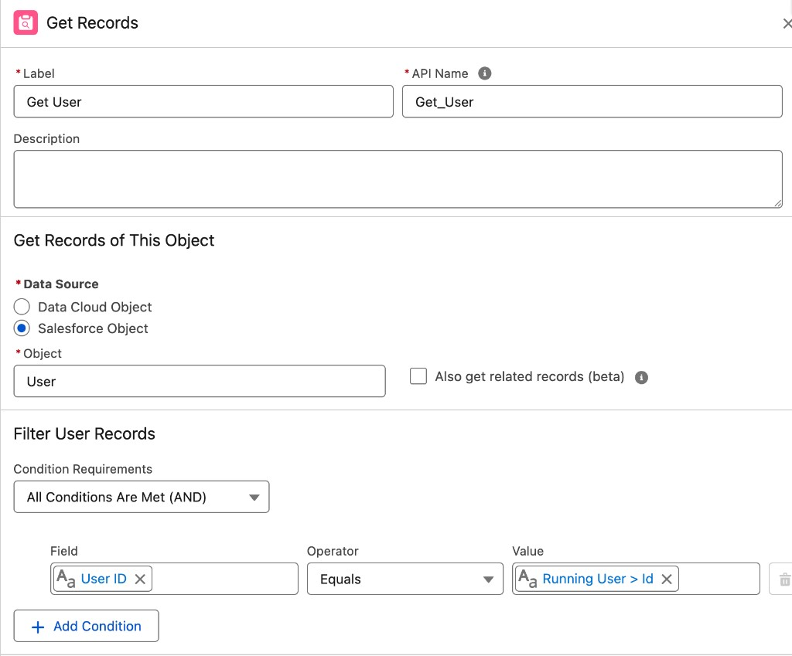

1. In the same **Get Records** element, set:
   - **Sort order**: Not Sorted
   - **How many records**: Only the first record
   - **How to store**: Automatically store all fields


1. Add input variable (required for Agentforce actions):
   - **API Name**: `requestReason`
   - **Data Type**: Text
   - **Available for Input**: Yes
1. Add variable `currentUser` (Record, object `User`) if needed, then add an
   **Assignment** that copies from **User from Get User** into `currentUser`
   (at least first name, last name, email).

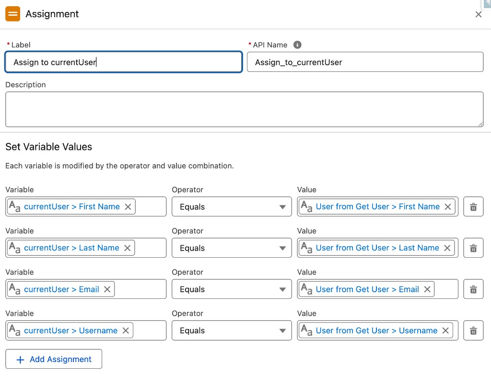

1. Add an assignment for output fields:
   - `outputName = {!Get_User.Name}`
   - `outputEmail = {!Get_User.Email}`
1. Mark `outputName` and `outputEmail` as **Available for Output**.
1. Save flow as `Get_Current_User`.
1. Activate the flow.

On the canvas, wire:
**Start -> Get User -> Assign to currentUser -> output assignment -> End**.

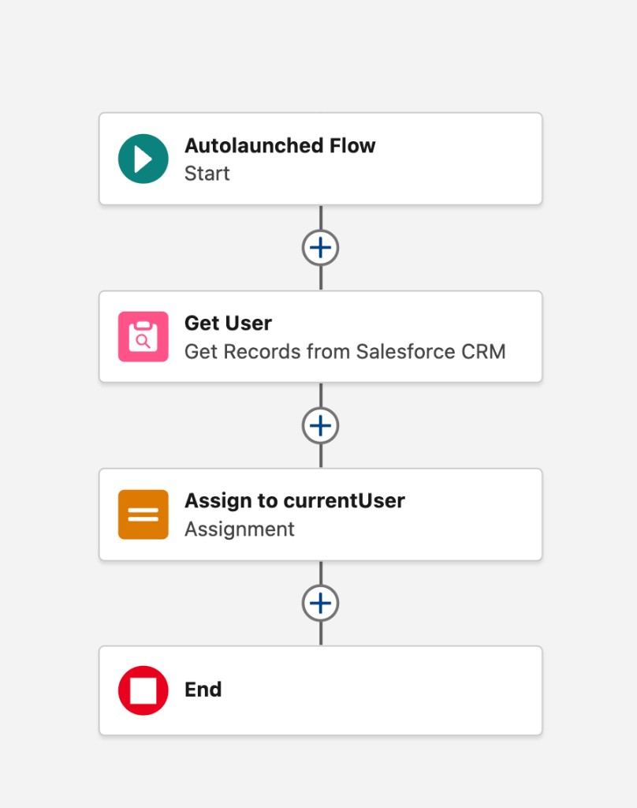

### 5.2 Add the flow action to the agent

1. In **Agentforce Studio**, open your agent.
1. Open the target **Topic/Subagent** for identity questions.
1. Open **Subagent Details** and confirm the subagent name/API name.

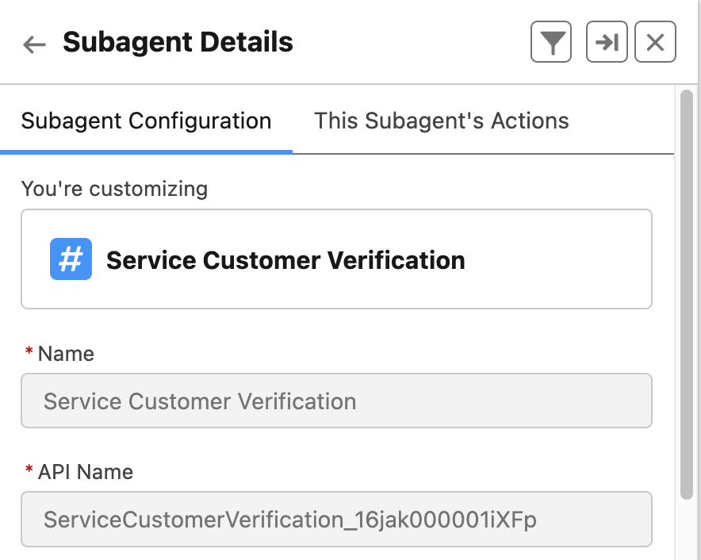

1. Open **This Subagent's Actions**.
1. If needed, deactivate agent editing mode, then choose **Add Action** and
   select `Get_Current_User`.

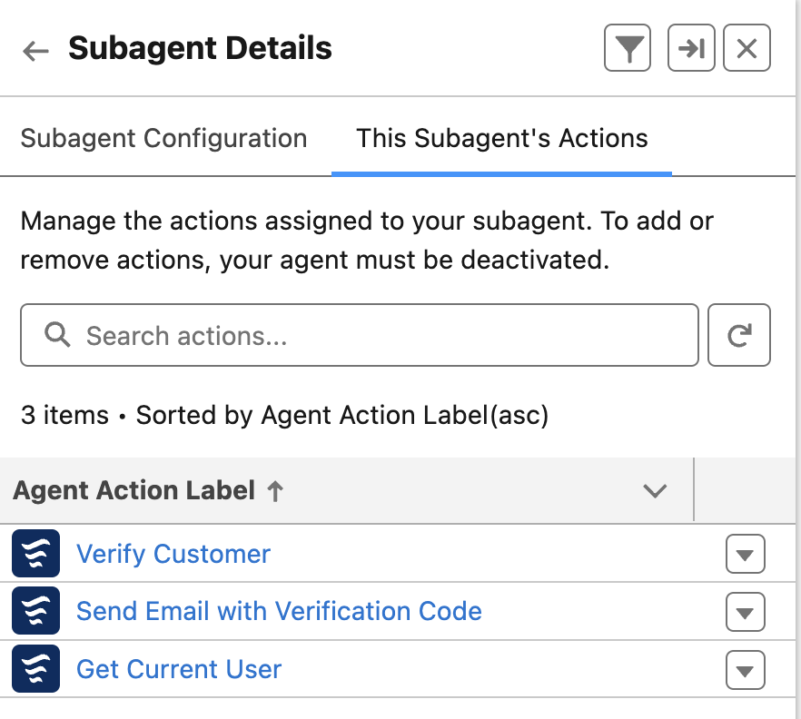

1. Configure action fields:
   - **Action Description**: Retrieves the current user's name and email
   - **Loading Text**: Looking up your identity...
1. In subagent/topic instructions, add:

> When the user asks who they are, asks for their name, or asks about their
> identity, use the "Get Current User" action to retrieve their name and email.

## 6. Activate and Test the Agent

Before activation, test prompts like:

- "What is my name?"
- "Can you make a reservation for me?"

Then activate the agent.

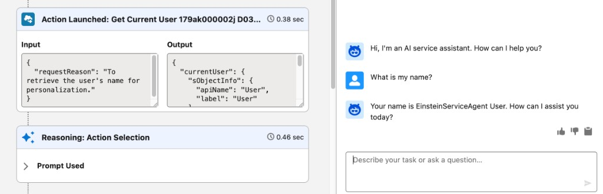

## 7. Test the Agent API

Create a session and send a test message using your token:

```bash
SESSION_ID=$(curl -s -X POST \
  "https://api.salesforce.com/einstein/ai-agent/v1/agents/YOUR_AGENT_ID/sessions" \
  -H "Authorization: Bearer $SF_TOKEN" \
  -H "Content-Type: application/json" \
  -d '{
    "externalSessionKey": "'$(uuidgen)'",
    "instanceConfig": {
      "endpoint": "https://YOUR_ORG.my.salesforce.com"
    },
    "streamingCapabilities": {
      "chunkTypes": ["Text"]
    },
    "bypassUser": false
  }' | jq -r '.sessionId')

curl -s -X POST \
  "https://api.salesforce.com/einstein/ai-agent/v1/sessions/$SESSION_ID/messages" \
  -H "Authorization: Bearer $SF_TOKEN" \
  -H "Content-Type: application/json" \
  -d '{
    "message": {
      "sequenceId": 1,
      "type": "Text",
      "text": "What is my name?"
    }
  }' | jq .
```

---

**Next:** [Phase 2 — Keycloak Identity Setup](02-keycloak-setup.md)
