# Phase 1 — Agentforce Setup

> **Work in progress:** This document is actively being updated and may change.

Enable Salesforce and Agentforce prerequisites, configure the connected app used
by the broker path, create the target agent, and validate API access before
moving to token exchange.

> **Prerequisite — use a Salesforce org where Connected Apps can be enabled.**
> MuleSoft Vibes runs against a Salesforce org (not your Anypoint account). The
> free Agentforce trial org from Quickstart Phase 1 is useful for exploration,
> but cannot be used for this OBO guide when Connected Apps are locked/disabled.
> Use a sandbox or another org where you can create and manage connected apps:
> [Quickstart Phase 1 — Account Setup §4](../quickstart/01-account-setup.md#4-agentforce-360-platform-free-trial-for-mulesoft-vibes).

## Contents

- [Overview](#overview)
- [1. Platform Enablement](#1-platform-enablement)
  - [1.1 Enable Einstein Generative AI](#11-enable-einstein-generative-ai)
  - [1.2 Enable Agentforce](#12-enable-agentforce)
- [2. Connected App Setup](#2-connected-app-setup)
  - [2.1 Activate Connected Apps](#21-activate-connected-apps)
  - [2.2 Create a New Connected App](#22-create-a-new-connected-app)
  - [2.3 Basic Information](#23-basic-information)
  - [2.4 OAuth Scopes and Settings](#24-oauth-scopes-and-settings)
  - [2.5 Manage the Connected App](#25-manage-the-connected-app)
  - [2.6 Edit Policies](#26-edit-policies)
  - [2.7 View the Connected App](#27-view-the-connected-app)
  - [2.8 Get Consumer Credentials](#28-get-consumer-credentials)
  - [2.9 Activate Data Cloud (Optional)](#29-activate-data-cloud-optional)
- [3. Connected App Verification](#3-connected-app-verification)
  - [3.1 Obtain a Client Credentials Token](#31-obtain-a-client-credentials-token)
  - [3.2 Verify the Einstein Models API](#32-verify-the-einstein-models-api)
  - [3.3 Common Failures](#33-common-failures)
- [4. Create the "Get Current User" Flow](#4-create-the-get-current-user-flow)
- [5. Create the Agentforce Agent](#5-create-the-agentforce-agent)
  - [5.1 Ensure Agentforce is enabled](#51-ensure-agentforce-is-enabled)
  - [5.2 Open Agentforce Builder](#52-open-agentforce-builder)
  - [5.3 Select the template](#53-select-the-template)
  - [5.4 Name the agent](#54-name-the-agent)
  - [5.5 Confirm Agent Summary](#55-confirm-agent-summary)
- [6. Add the "Get Current User" Action to the Agent](#6-add-the-get-current-user-action-to-the-agent)
- [7. Test the Agent in Preview](#7-test-the-agent-in-preview)
- [8. Activate the Agent](#8-activate-the-agent)
- [9. Test the Agent API](#9-test-the-agent-api)

## Overview

This phase covers the Salesforce configuration required to enable Agentforce
and Einstein Generative AI, create a single connected app for secure access to
both the Agentforce Agent API and the Einstein Models API, and then create and
activate a first Agentforce Service Agent.

For per-user identity propagation on top of this setup, continue with the OBO
phases in this guide.

### Scope

This phase combines two tracks:

- **Agentforce setup**: org-level enablement and connected-app configuration
  used by broker/API calls.
- **Agent creation**: creating and activating an Agentforce Service Agent,
  wiring it to the connected app, and adding identity flow action.

### Prerequisites

- **Salesforce org** with Einstein and Agentforce capabilities available.
- **Admin setup permissions** for Einstein/Agentforce, connected apps, policies,
  and flows.
- **Email access** for connected-app identity verification and credential reveal.
- **curl** (and optionally **jq**) for verification/testing commands.

By the end of this phase, you will have:

- Enabled Einstein Generative AI and Agentforce.
- Created and configured a connected app for API access.
- Verified token issuance and Einstein API access.
- Created an Agentforce agent (or prepared the AgentScript path).
- Added a `Get_Current_User` flow action for identity checks.
- Validated that the agent responds through the Agent API.

## 1. Platform Enablement

### 1.1 Enable Einstein Generative AI

In Salesforce **Setup**, navigate to **Einstein Setup** and confirm
**Turn on Einstein** is enabled.


### 1.2 Enable Agentforce

In Salesforce **Setup**, navigate to:
**Einstein -> Einstein Generative AI -> Agentforce Studio -> Agentforce Agents**
and toggle **Agentforce** to **On**.

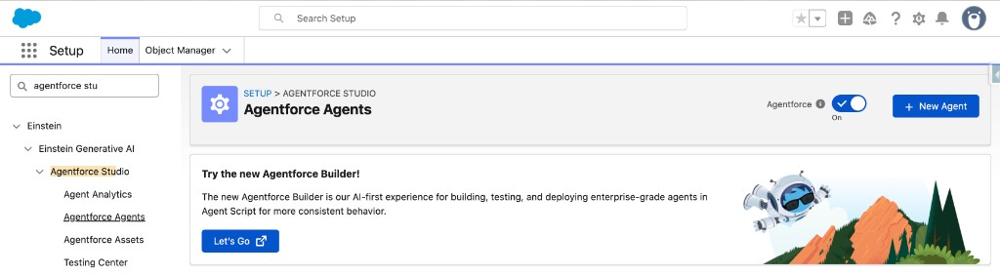

## 2. Connected App Setup

### 2.1 Activate Connected Apps

In Salesforce **Setup**, open **Apps -> External Client Apps -> Settings**, then
activate Connected Apps if your org requires it.

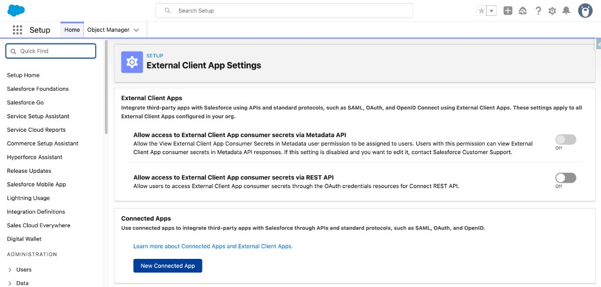

If **New Connected App** is disabled and Salesforce shows that connected apps
cannot be enabled for the org, stop here and switch to a different org. This is
common in the free Agentforce trial org used in quickstart onboarding.

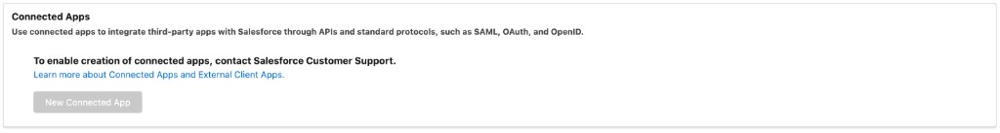

### 2.2 Create a New Connected App

From the **Connected Apps** section, click **New Connected App**.

### 2.3 Basic Information

Set:

- Connected App Name: `agentforce_connected_app`
- API Name: `agentforce_connected_app`
- Contact Email: `your-admin@email.com`
- Callback URL: `https://login.salesforce.com`

Enable OAuth.


### 2.4 OAuth Scopes and Settings

Add OAuth scopes:

- `Manage user data via APIs (api)`
- `Access chatbot services (chatbot_api)`
- `Access the Salesforce API Platform (sfap_api)`
- `Perform requests at any time (refresh_token, offline_access)`

Enable:

- **Enable Client Credentials Flow**
- **Issue JSON Web Token (JWT)-based access tokens for named users**


### 2.5 Manage the Connected App

Wait a few minutes after save, then go to **Setup -> Apps -> App Manager**,
find `agentforce_connected_app`, and choose **Manage**.

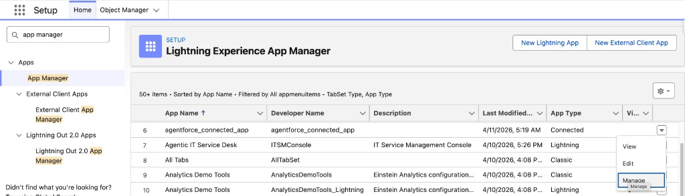

### 2.6 Edit Policies

In **Edit Policies**, set:

- **IP Relaxation**: Relax IP restrictions (or your org standard)
- **Run As (User)** under Client Credentials Flow
- **Access Token Timeout** as desired (example: 30 minutes)


### 2.7 View the Connected App

From App Manager choose **View** when you need to retrieve consumer details.

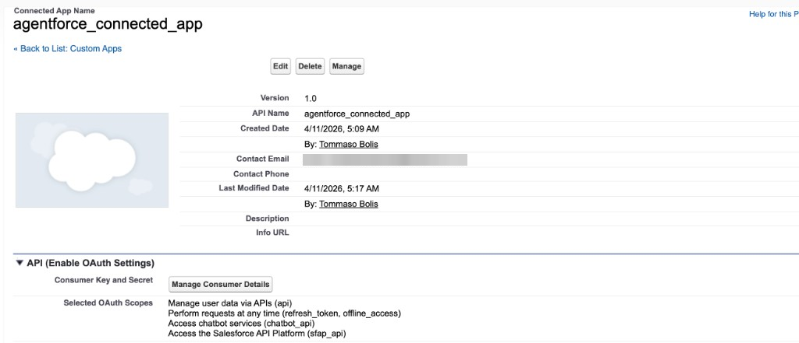

### 2.8 Get Consumer Credentials

Open **Manage Consumer Details**, complete verification, and copy:

- Consumer Key (`agentforce.clientId`)
- Consumer Secret (`agentforce.clientSecret`)


Use these credentials in your runtime configuration:

```properties
agentforce.clientId=YOUR_CONSUMER_KEY
agentforce.clientSecret=YOUR_CONSUMER_SECRET
```

Also note your **My Domain** URL from **Setup -> My Domain** (for example
`https://YOUR_ORG.my.salesforce.com`).

### 2.9 Activate Data Cloud (Optional)

Data Cloud is not required for the basic exercise. If needed:

1. Go to **Setup -> Data Cloud -> Data Cloud Setup Home**.
1. Click **Get Started**.
1. Wait 10-20 minutes for provisioning before Data Cloud-dependent steps.

## 3. Connected App Verification

### 3.1 Obtain a Client Credentials Token

```bash
curl -X POST \
  "https://YOUR_ORG.my.salesforce.com/services/oauth2/token" \
  -H "Content-Type: application/x-www-form-urlencoded" \
  -d "grant_type=client_credentials" \
  -d "client_id=YOUR_CONSUMER_KEY" \
  -d "client_secret=YOUR_CONSUMER_SECRET"
```

A successful response looks like:

```json
{
  "access_token": "00D...",
  "token_type": "Bearer",
  "instance_url": "https://YOUR_ORG.my.salesforce.com",
  "issued_at": "..."
}
```

### 3.2 Verify the Einstein Models API

```bash
SF_TOKEN="paste_access_token_here"

curl "https://YOUR_ORG.my.salesforce.com/services/data/v62.0/einstein/models" \
  -H "Authorization: Bearer $SF_TOKEN"
```

### 3.3 Common Failures

| Error | Cause | Fix |
| --- | --- | --- |
| `invalid_grant: no client credentials user enabled` | No **Run As** user configured | Set **Run As (User)** in connected app policies |
| `invalid_client` | Wrong Consumer Key or Secret | Verify in App Manager -> View -> Manage Consumer Details |
| `invalid_grant: user hasn't approved this consumer` | User/profile not pre-authorized | In policies, authorize relevant profile |
| `unsupported_grant_type` | Client credentials flow not enabled | Re-enable **Enable Client Credentials Flow** |
| `INVALID_SESSION_ID` on Models API | Einstein not fully enabled yet | Wait 5-10 minutes after enablement and retry |
| `404` on Models API endpoint | Wrong API version or Einstein unavailable | Verify licenses and try another API version |

## 4. Create the "Get Current User" Flow

1. Go to **Setup -> Flows -> New** (or **New Flow**).
1. In **New Automation**, choose **Autolaunched Flow (No Trigger)**.


1. Add **Get Records** from the canvas:
   - **Label**: `Get User` (API name `Get_User`)
   - **Data Source**: Salesforce Object
   - **Object**: `User`
   - **Filter**: `Id` Equals **Running User -> Id** (same intent as `{!$User.Id}`)


1. In the same **Get Records** element, set:
   - **Sort order**: Not Sorted
   - **How many records**: Only the first record
   - **How to store**: Automatically store all fields

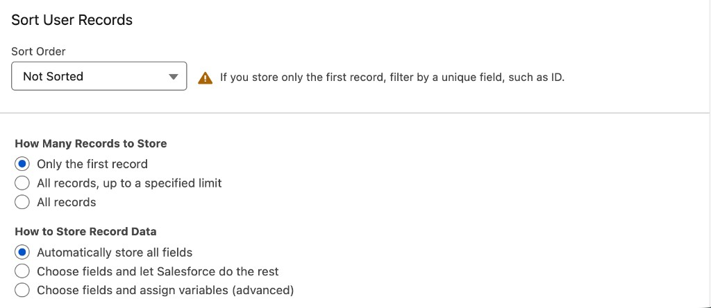

1. Add input variable (required for Agentforce actions):
   - **API Name**: `requestReason`
   - **Data Type**: Text
   - **Available for Input**: Yes
1. Add variable `currentUser` (Record, object `User`) if needed, then add an
   **Assignment** that copies from **User from Get User** into `currentUser`
   (at least first name, last name, email).


1. Add an assignment for output fields:
   - `outputName = {!Get_User.Name}`
   - `outputEmail = {!Get_User.Email}`
1. Mark `outputName` and `outputEmail` as **Available for Output**.
1. Save flow as `Get_Current_User`.
1. Activate the flow.

On the canvas, wire **Start → Get User → Assign to currentUser → (your Assignment
for outputName / outputEmail) → End**. Configure the Start element with the
`requestReason` input variable.


## 5. Create the Agentforce Agent

Use the new Agentforce Builder flow below.

### 5.1 Ensure Agentforce is enabled

If the **Agentforce** toggle in the top-right of **Agentforce Agents** is still
**Off**, enable it first:

1. Open **Setup -> Einstein -> Einstein Generative AI -> Agentforce Studio -> Agentforce Agents**.
1. Turn the **Agentforce** toggle to **On**.
1. Wait a few seconds for the page to refresh and confirm the toggle remains
   enabled.

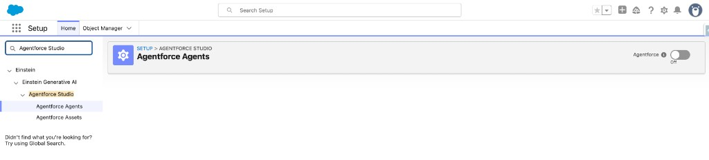

### 5.2 Open Agentforce Builder

1. Use either entry path to start the new Agentforce Builder:
   - **Option A (already in Agentforce Studio):** click **New Agent**.
   - **Option B (from Agentforce Agents home page):** click **Let's Go**.
   - **Option C (if you need to switch apps first):** open **App Launcher**,
     search `agentforce studio`, and select **Agentforce Studio**.

Option A example (`New Agent` from Agentforce Studio):
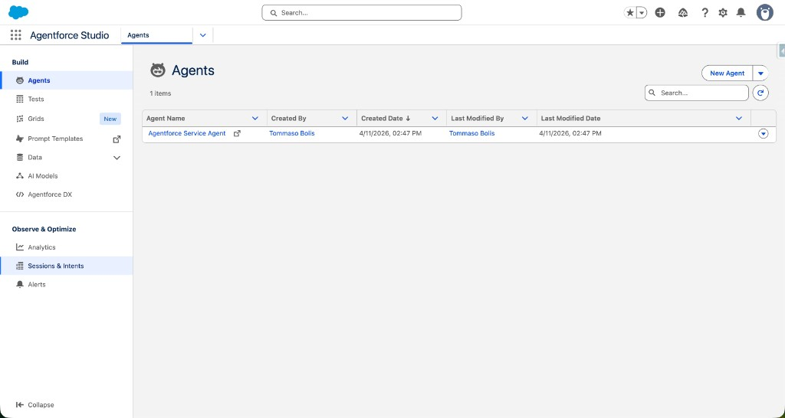

Option B example (`Let's Go` from Agentforce Agents page):
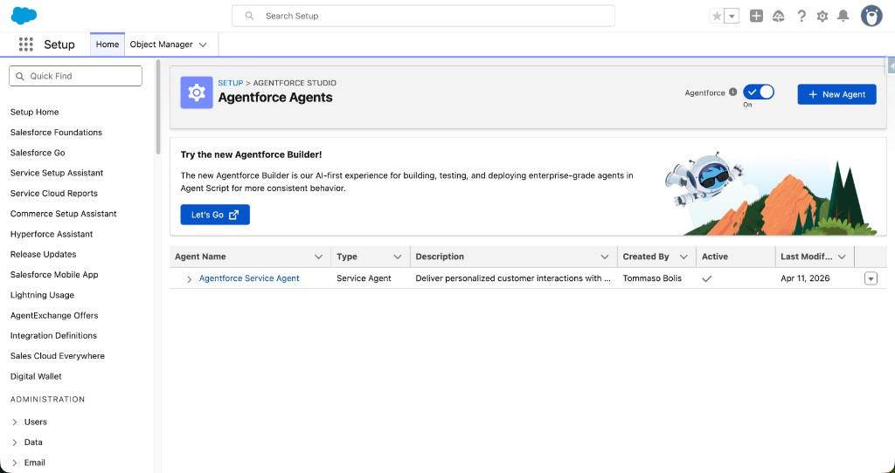

Option C example (open Agentforce Studio from App Launcher):
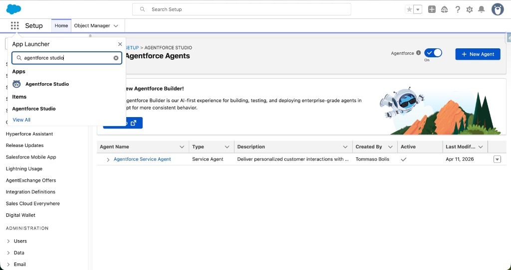

### 5.3 Select the template

1. In **Or, start with a template**, click **Select** on
   **Agentforce Employee Agent**.

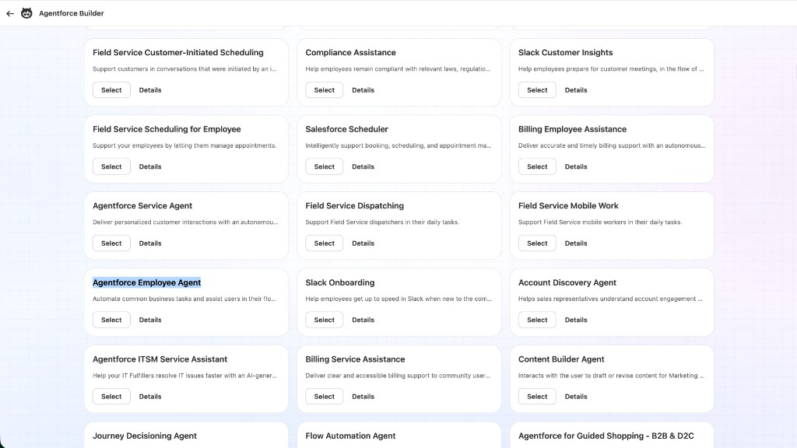

### 5.4 Name the agent

1. In **Name your agent**, set:
   - **Agent Name**: `Trusted Identity Agent`
   - **Developer Name**: `Trusted_Identity_Agent`
1. Click **Let's Go**.

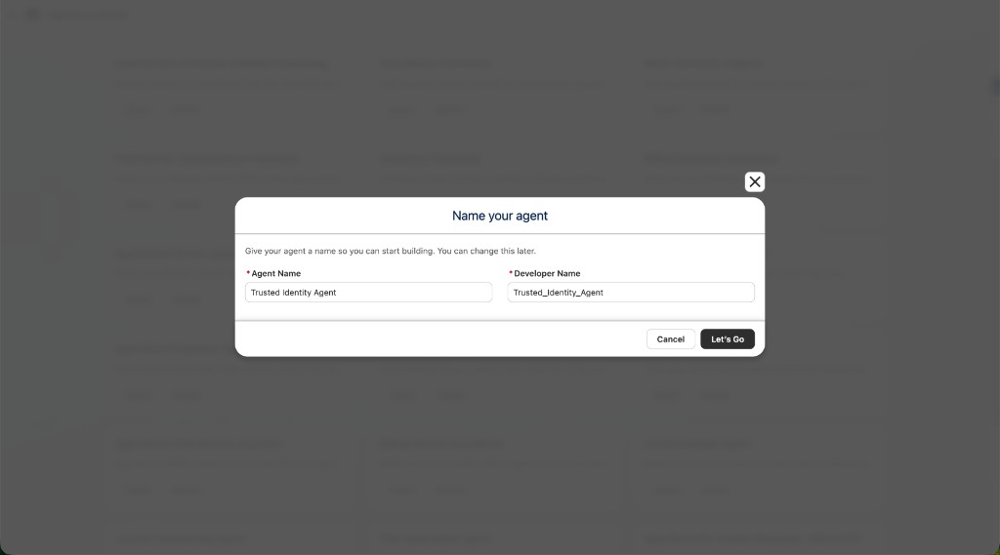

### 5.5 Confirm Agent Summary

1. After clicking **Let's Go**, confirm you land on the Agentforce Builder
   **Agent Summary** screen for your new agent.

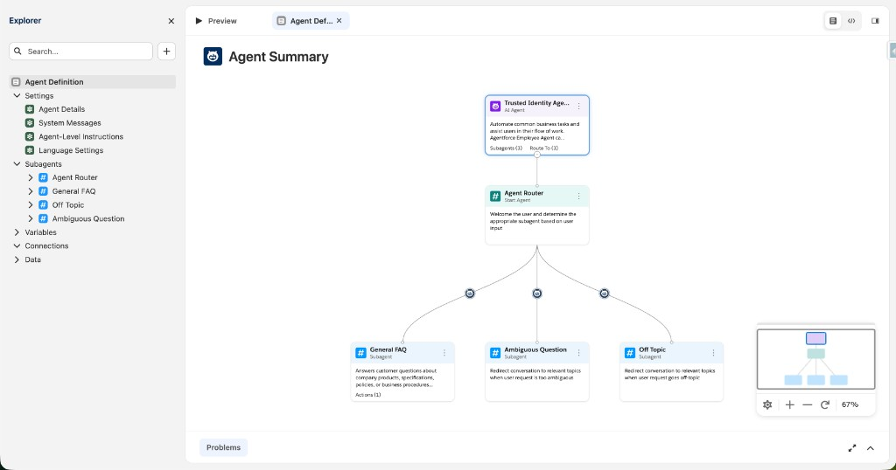

## 6. Add the "Get Current User" Action to the Agent

1. In **Agentforce Studio**, open your agent.
1. Under **Subagents**, click the **+** button to create a new subagent for
   identity questions (or select an existing one if already present).

1. In **Add Subagent**, set:
   - **Subagent Name**: `User Info`
   - **Description**: `Manage user account information`
1. Click **Create and Open**.
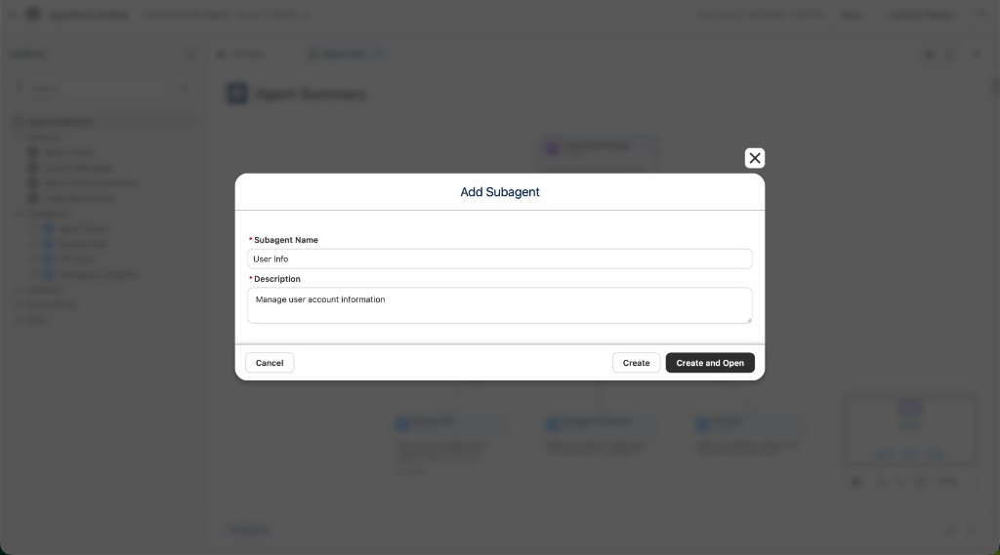

1. Confirm the new **User Info** subagent opens and is selected in the
   **Subagents** list.
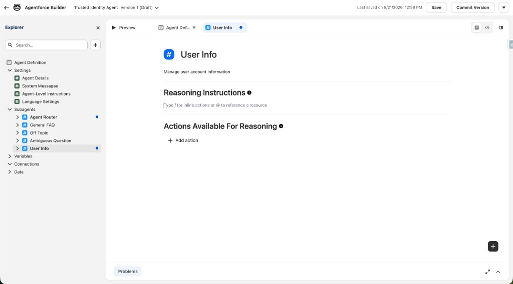

1. Click **Add Action** under **Actions Available For Reasoning**.
1. In the action picker, click **Create a custom action**.

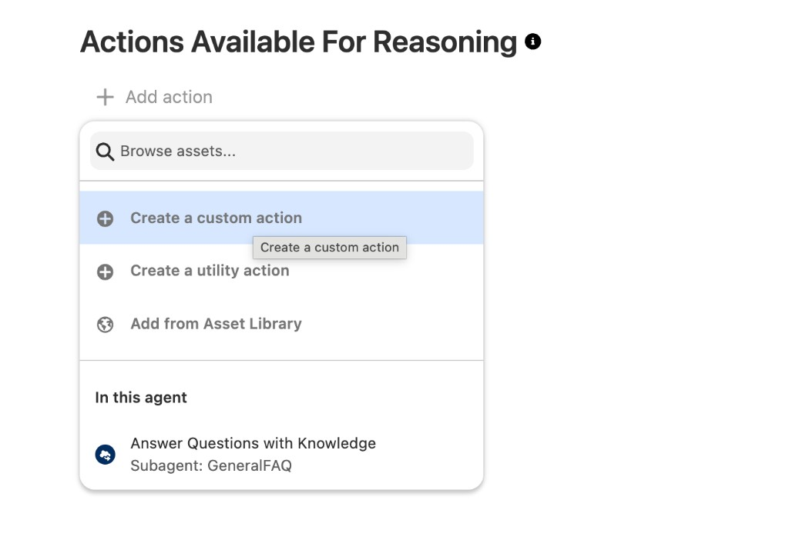

1. In **Add Action**, set:
   - **Action Name**: `Get Current User`
   - **Description**: `Get current user information`
   - **Reference Action Type**: `Flow`
   - **Reference Action**: `Get Current User` (Flow record `Get_Current_User`, status **Active**)
1. Click **Create and Open**.
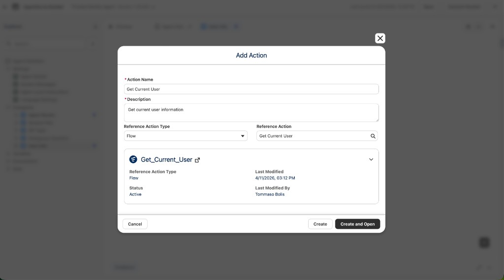
1. Confirm **Get Current User** is listed under **Actions Available For
   Reasoning** in the **User Info** subagent.

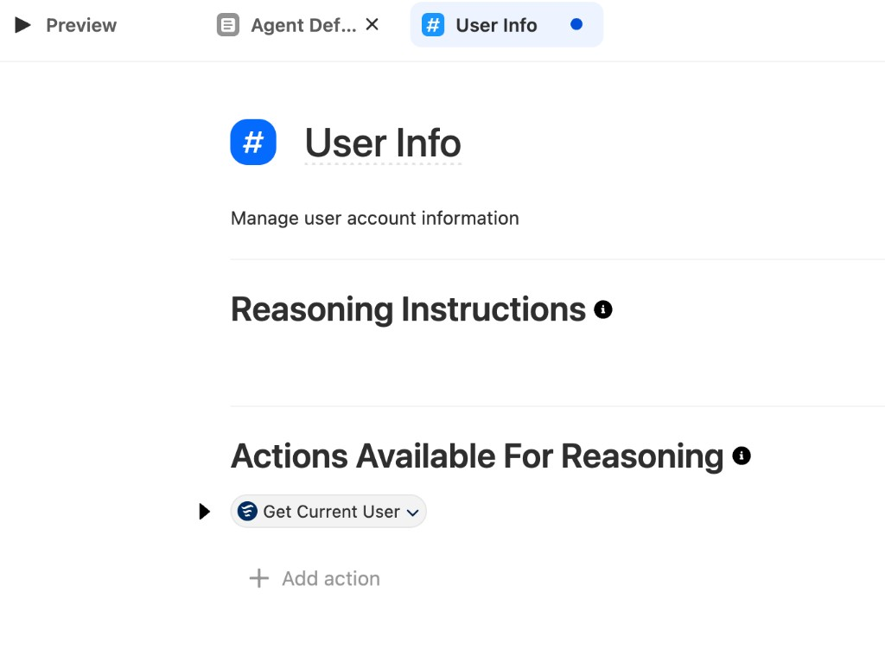

1. Go back to **Agent Summary** and confirm the new **User Info** subagent is
   already wired and available to the **Agent Router**.

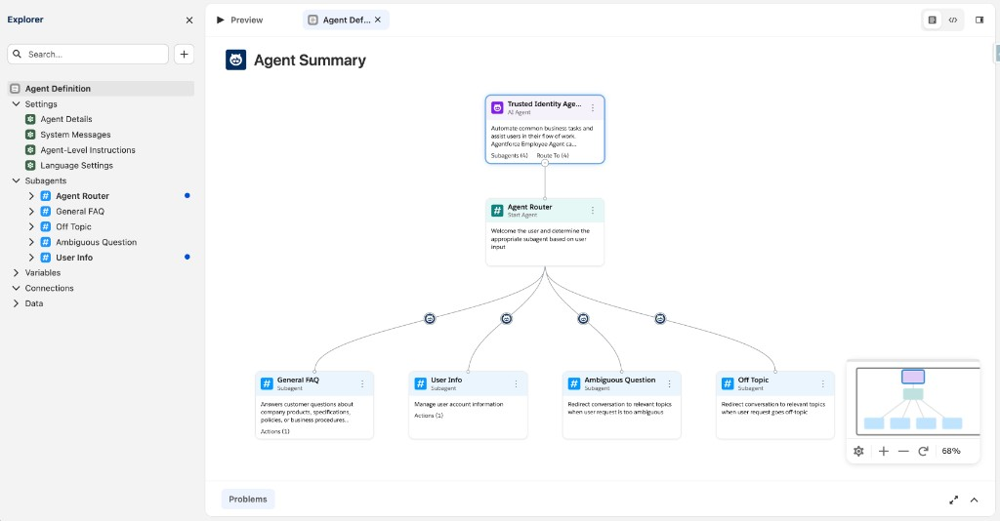

1. Click **Save** in the top-right corner to persist the agent changes.

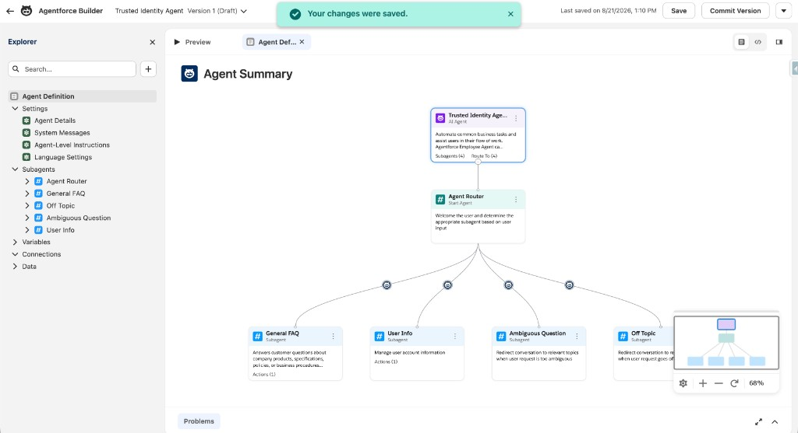

1. Configure action fields:
   - **Action Description**: Retrieves the current user's name and email
   - **Loading Text**: Looking up your identity...
1. In subagent/topic instructions, add:

> When the user asks who they are, asks for their name, or asks about their
> identity, use the "Get Current User" action to retrieve their name and email.

## 7. Test the Agent in Preview

1. Open the **Preview** tab to run a live test conversation with the agent.

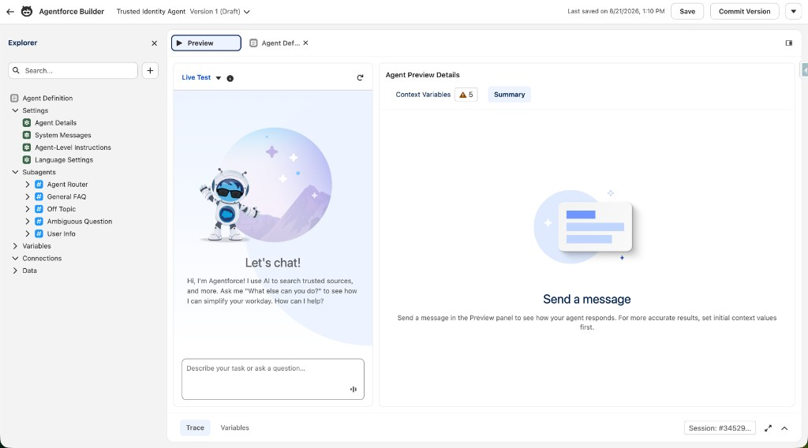

Then test prompts like:

- "What's my name?"

Expected result for "What's my name?":

- The chat reply should return the current Salesforce user's name.
- In **Agent Preview Details**, you should see evidence that the flow action ran
  (for example: transition to **User Info** and action **Get Current User**).

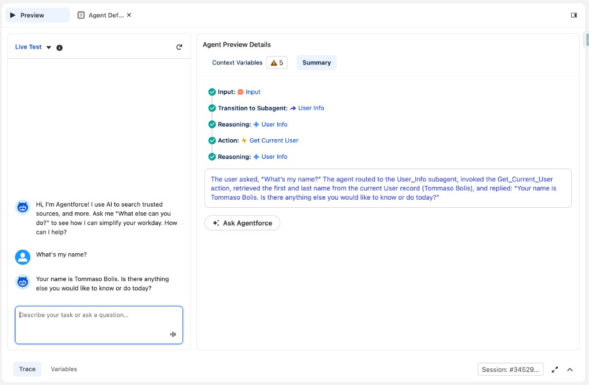

If both checks pass, continue to activation.

## 8. Activate the Agent

1. In the top-right corner, click **Commit Version**.
1. In the **Commit this version?** dialog, click **Commit**.
1. After the version is committed, click **Activate**.
1. In the **Ready to activate your agent?** dialog, click **Activate**.

Commit the draft version:
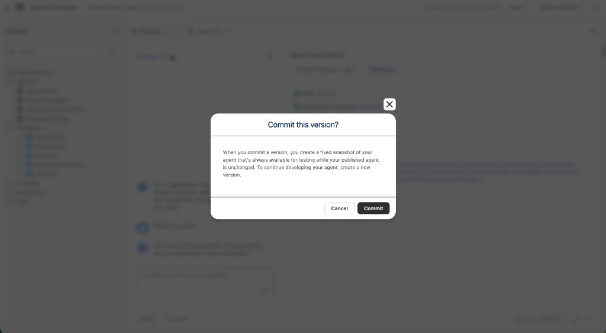

After commit completes, click **Activate** in the top-right:
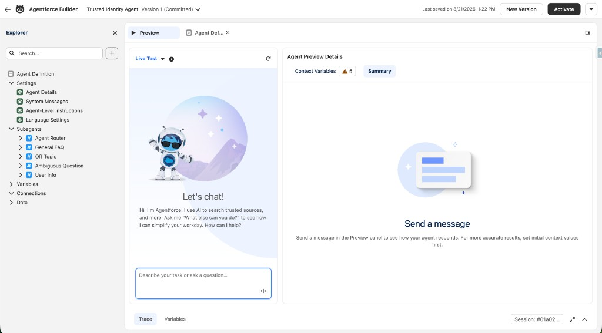

Confirm activation in the dialog:
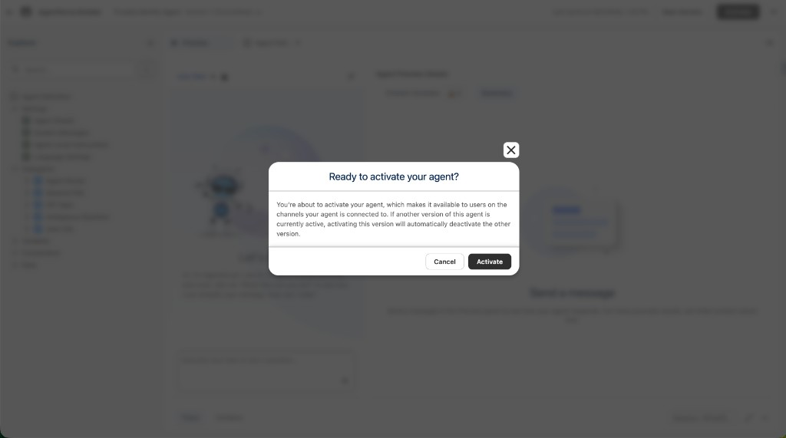

## 9. Test the Agent API

Create a session and send a test message using your token:

```bash
SESSION_ID=$(curl -s -X POST \
  "https://api.salesforce.com/einstein/ai-agent/v1/agents/YOUR_AGENT_ID/sessions" \
  -H "Authorization: Bearer $SF_TOKEN" \
  -H "Content-Type: application/json" \
  -d '{
    "externalSessionKey": "'$(uuidgen)'",
    "instanceConfig": {
      "endpoint": "https://YOUR_ORG.my.salesforce.com"
    },
    "streamingCapabilities": {
      "chunkTypes": ["Text"]
    },
    "bypassUser": false
  }' | jq -r '.sessionId')

curl -s -X POST \
  "https://api.salesforce.com/einstein/ai-agent/v1/sessions/$SESSION_ID/messages" \
  -H "Authorization: Bearer $SF_TOKEN" \
  -H "Content-Type: application/json" \
  -d '{
    "message": {
      "sequenceId": 1,
      "type": "Text",
      "text": "What is my name?"
    }
  }' | jq .
```

---

**Next:** [Phase 2 — Keycloak Identity Setup](02-keycloak-setup.md)
