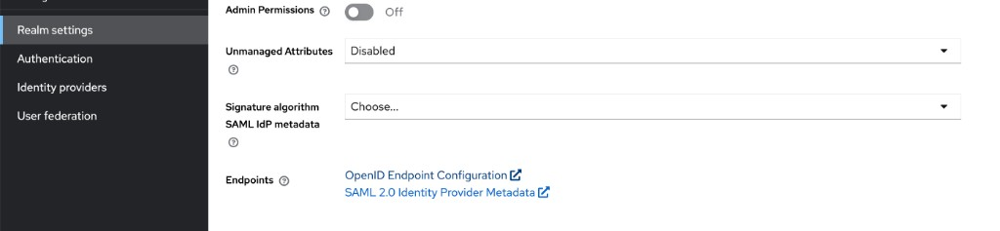
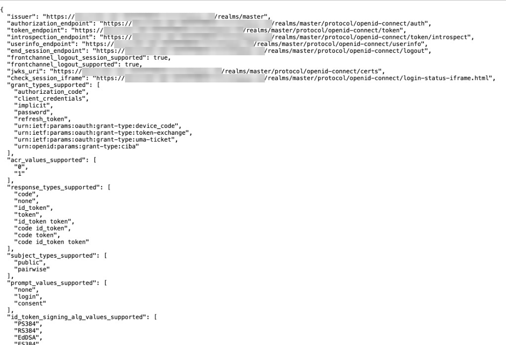
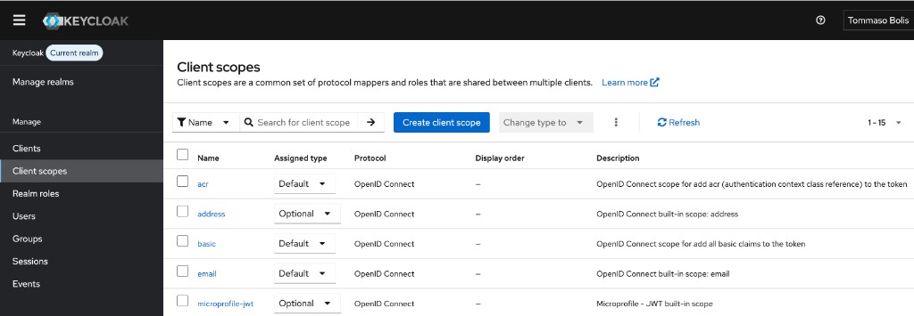
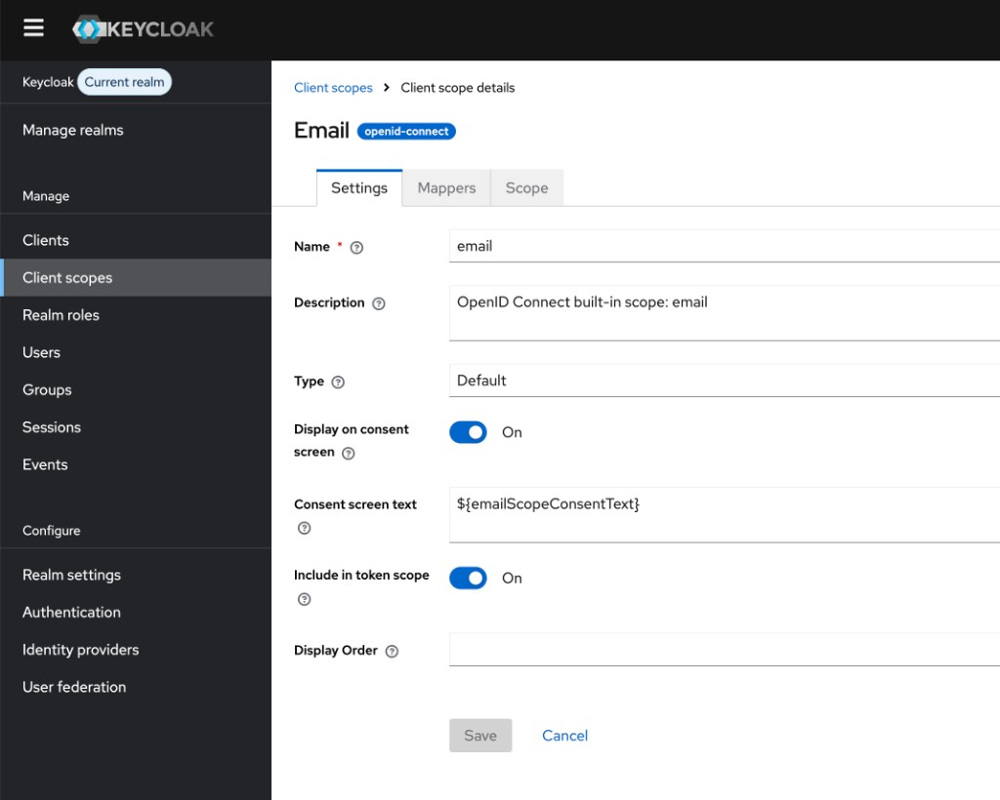
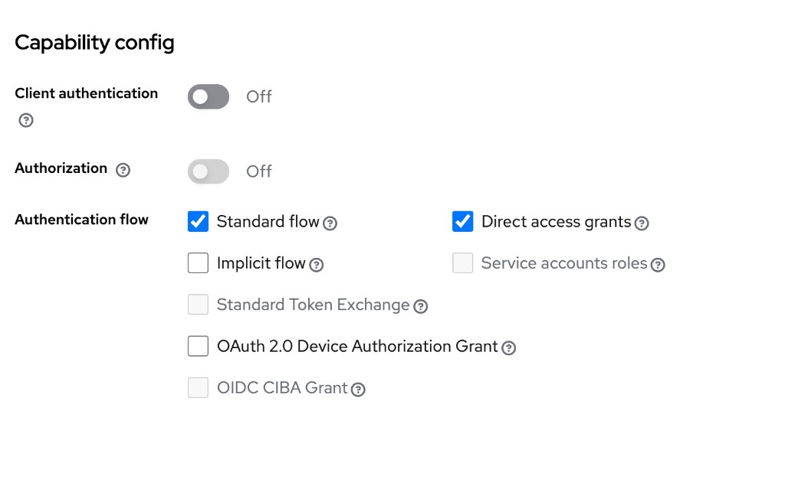
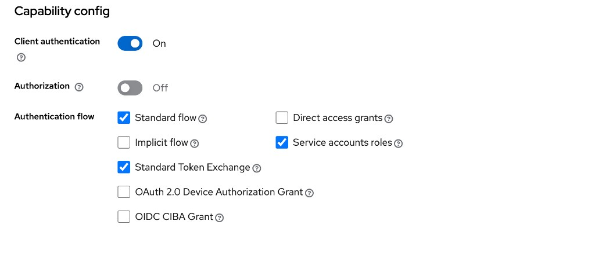
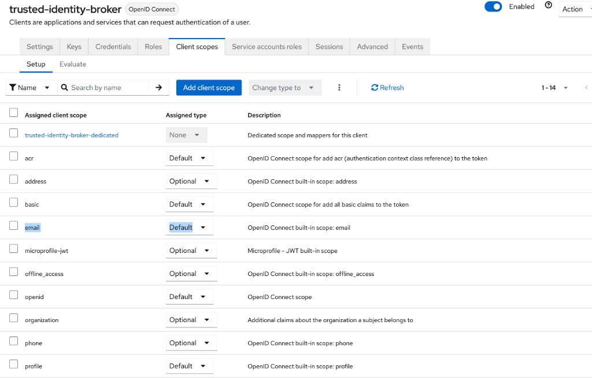
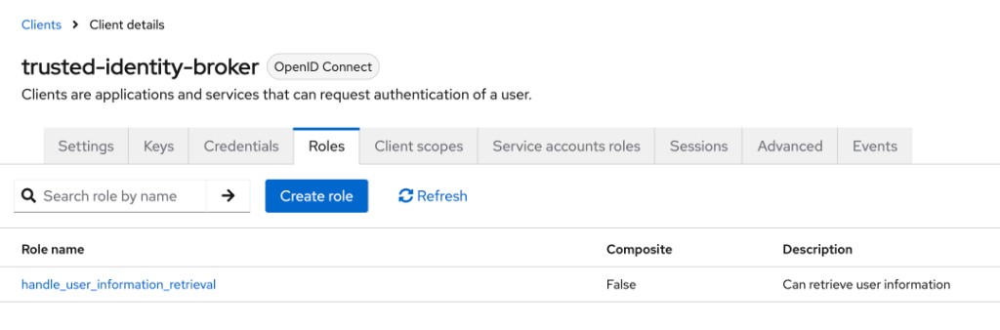
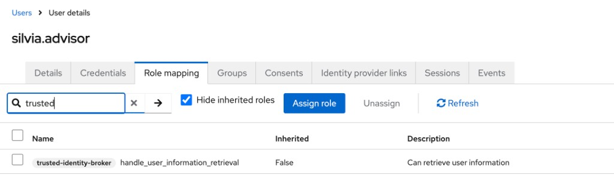

# Phase 2 — Keycloak Identity Setup

> **Work in progress:** This document is actively being updated and may change.

Configure Keycloak as the identity provider: a public client for the browser
sign-in and a confidential client for the broker, plus the user roles and JWT
claims the Salesforce token-exchange handler needs.

## Contents

- [1. Keycloak endpoint reference](#1-keycloak-endpoint-reference)
- [2. Verify access token claims](#2-verify-access-token-claims)
- [3. Public browser client](#3-public-browser-client)
- [4. Confidential broker client](#4-confidential-broker-client)
- [5. Verify with a user token](#5-verify-with-a-user-token)

## 1. Keycloak endpoint reference

Use Keycloak realm discovery values directly from the Admin Console instead of
guessing URLs.

1. In Keycloak Admin Console, open **Realm settings** for your realm.
1. In the **Endpoints** section, click **OpenID Endpoint Configuration**.
1. Copy canonical values from `.well-known/openid-configuration`:
   - `issuer`
   - `jwks_uri`
   - `authorization_endpoint`
   - `token_endpoint`
   - `userinfo_endpoint`




Typical realm-pattern endpoints:

| Endpoint | Pattern |
| --- | --- |
| Issuer | `https://KEYCLOAK_URL/realms/master` |
| JWKS | `https://KEYCLOAK_URL/realms/master/protocol/openid-connect/certs` |
| Authorize | `https://KEYCLOAK_URL/realms/master/protocol/openid-connect/auth` |
| Token | `https://KEYCLOAK_URL/realms/master/protocol/openid-connect/token` |
| Userinfo | `https://KEYCLOAK_URL/realms/master/protocol/openid-connect/userinfo` |

> If your realm name is not `master`, substitute it consistently in every URL.

## 2. Verify access token claims

The Salesforce token exchange handler expects identity claims in the **access
token** (not only in ID token).

Required/expected claims:

| Claim | Purpose | Required |
| --- | --- | --- |
| `email` | Primary Salesforce user lookup | Yes |
| `preferred_username` | Fallback user lookup | Yes |
| `given_name` | Display/user context | Recommended |
| `family_name` | Display/user context | Recommended |
| `sub` | Subject id (UUID in Keycloak) | Default |

Verify in Keycloak:

1. Open **Client scopes**.
1. Confirm `email` and `profile` scopes are present and included in token scope.
1. In mappers for those scopes, confirm **Add to access token** is enabled.




If `Add to access token` is off for needed mappers, enable it before testing.

## 3. Public browser client

Create a public OIDC client for browser login (no client secret in frontend).

Recommended settings:

| Setting | Value |
| --- | --- |
| Client authentication | Off |
| Standard flow | On |
| PKCE | S256 |



Access settings guidance:

- **Valid redirect URIs**: exact match (scheme, host, port, path).
- **Valid post logout redirect URIs**: list explicit logout destinations.
- **Web origins**: origin only (scheme + host + port, no path).

Default scopes for this public client:

- `email`
- `profile`

Your authorize request should still send:

```text
scope=openid email profile
```

## 4. Confidential broker client

Create the confidential client used by broker/server-side flows.

Typical settings:

| Setting | Value |
| --- | --- |
| Client authentication | On |
| Standard flow | On (if needed for server-side code flow) |
| Service accounts | On (if client credentials test/use is required) |
| Standard Token Exchange | On only if you use Keycloak-side token exchange |



Assigned default scopes should include:

- `openid`
- `email`
- `profile`



Quick broker-client credentials test:

```bash
curl -X POST \
  "https://KEYCLOAK_URL/realms/master/protocol/openid-connect/token" \
  -H "Content-Type: application/x-www-form-urlencoded" \
  -d "grant_type=client_credentials" \
  -d "client_id=trusted-identity-broker" \
  -d "client_secret=YOUR_CLIENT_SECRET" \
  -d "scope=openid email profile"
```

This token represents a service account, so end-user profile claims may be
absent. Use Section 5 to validate a true user token.

## 5. Verify with a user token

Assign a broker client role to a real user, then verify token contents.

### 5.1 Assign broker role to user

1. On the confidential broker client, open **Roles** and create role
   `handle_user_information_retrieval` (or your equivalent).
1. On the target user, open **Role mapping** and assign that client role.




### 5.2 Obtain a user token (recommended public client + PKCE)

Authorize URL example:

```text
https://KEYCLOAK_URL/realms/master/protocol/openid-connect/auth?client_id=YOUR_PUBLIC_CLIENT_ID&response_type=code&scope=openid%20email%20profile&redirect_uri=https%3A%2F%2Fyour-spa-host%2Fcallback&state=test1234&code_challenge=BASE64URL_SHA256_OF_VERIFIER&code_challenge_method=S256
```

Token exchange for authorization code:

```bash
curl -X POST \
  "https://KEYCLOAK_URL/realms/master/protocol/openid-connect/token" \
  -H "Content-Type: application/x-www-form-urlencoded" \
  -d "grant_type=authorization_code" \
  -d "code=PASTE_CODE_HERE" \
  -d "redirect_uri=https%3A%2F%2Fyour-spa-host%2Fcallback" \
  -d "client_id=YOUR_PUBLIC_CLIENT_ID" \
  -d "code_verifier=PASTE_CODE_VERIFIER"
```

### 5.3 Inspect token claims

```bash
echo "PASTE_ACCESS_TOKEN" | cut -d'.' -f2 \
  | tr '_-' '/+' \
  | awk '{l=length%4; if(l) printf "%s%s",$0,substr("====",1,4-l); else print}' \
  | base64 -d 2>/dev/null \
  | jq '{iss, sub, aud, scope, email, preferred_username, given_name, family_name, resource_access, exp}'
```

Confirm:

- `email` exists and matches a Salesforce user email.
- `preferred_username`, `given_name`, `family_name` are present.
- `resource_access.<broker-client-id>.roles` includes assigned broker role.
- `iss` matches your realm issuer.
- `exp` is in the future.

> Keycloak `sub` is usually a UUID. Salesforce mapping in this guide is based on
> `email`, not on `sub`.

---

**Next:** [Phase 3 — Salesforce Token Exchange](03-salesforce-token-exchange.md)
