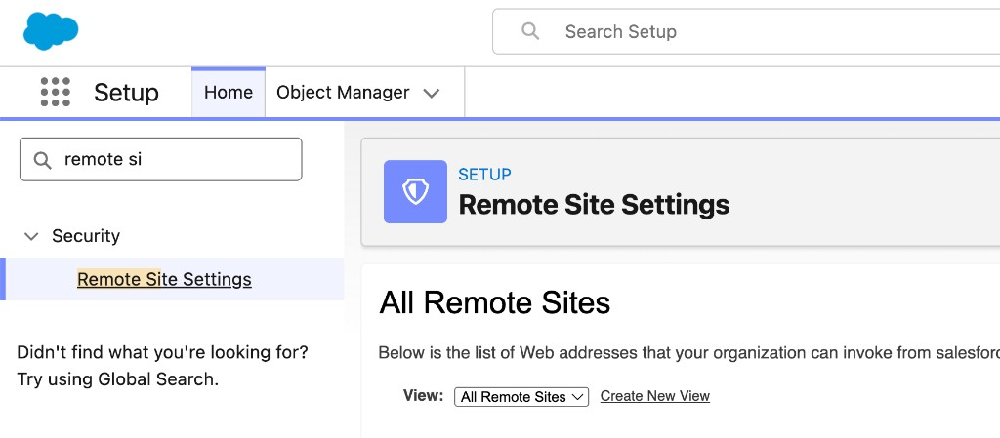
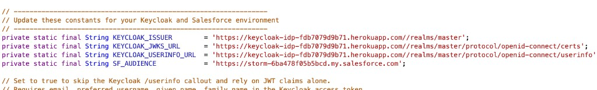
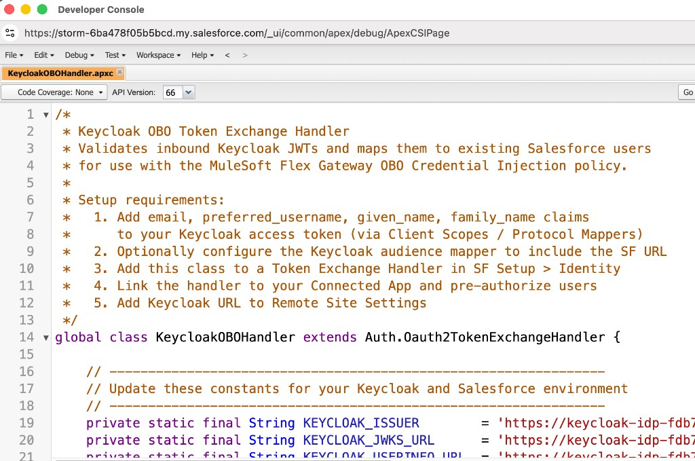
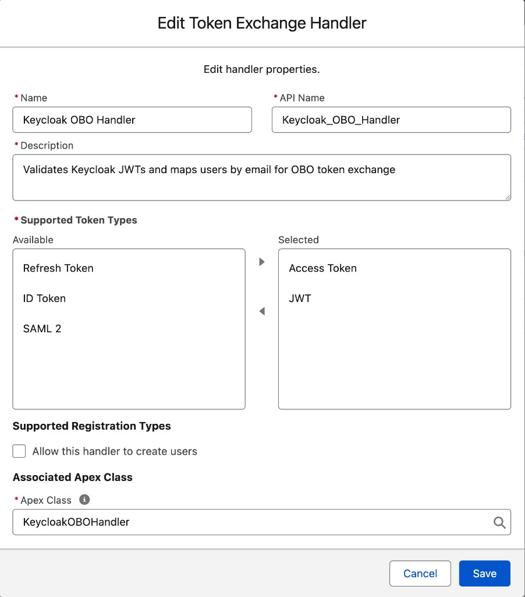
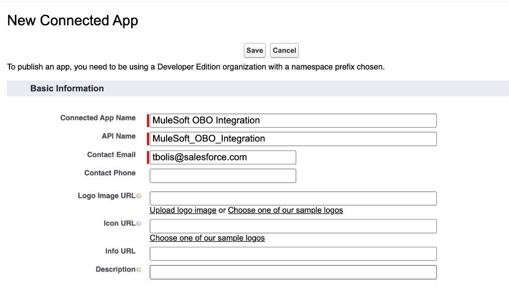
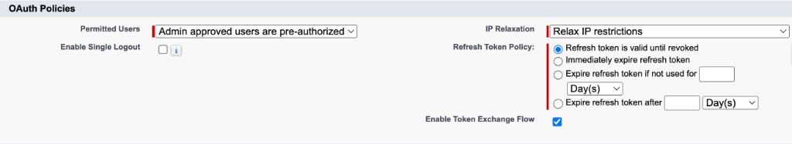
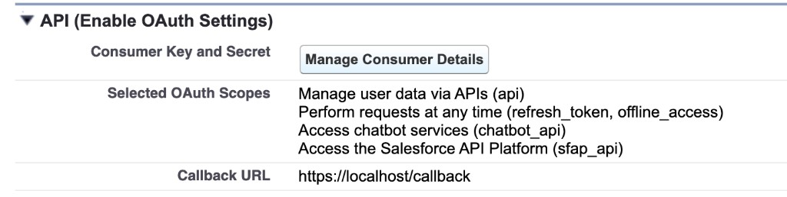
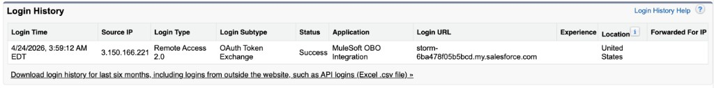

# Phase 3 — Salesforce Token Exchange

> **Work in progress:** This document is actively being updated and may change.

Set up Salesforce to accept Keycloak JWTs through OAuth 2.0 Token Exchange
(RFC 8693): allowlist Keycloak callouts, deploy and register
`KeycloakOBOHandler`, configure a dedicated Connected App, provision users, and
validate that the exchanged token represents the end user.

## Contents

- [1. Add a remote site setting](#1-add-a-remote-site-setting)
- [2. Deploy the Apex token exchange handler](#2-deploy-the-apex-token-exchange-handler)
- [3. Register the Token Exchange Handler](#3-register-the-token-exchange-handler)
- [4. Create the Connected App](#4-create-the-connected-app)
- [5. User provisioning](#5-user-provisioning)
- [6. Additional Connected App settings](#6-additional-connected-app-settings)
- [7. Validate the exchange](#7-validate-the-exchange)

## 1. Add a remote site setting

The Apex handler calls Keycloak JWKS (and optionally `/userinfo`). Salesforce
blocks outbound callouts unless the Keycloak origin is allowlisted.

1. In Salesforce **Setup**, go to **Remote Site Settings**.
1. Click **New Remote Site**.
1. Set:
   - **Remote Site Name**: `Keycloak_JWKS` (or another unique name)
   - **Remote Site URL**: Keycloak base origin, e.g.
     `https://YOUR_KEYCLOAK_HOST`
   - **Active**: enabled
1. Save.

Use scheme + host (and port, if non-default), not the full `/certs` path.



## 2. Deploy the Apex token exchange handler

Deploy `KeycloakOBOHandler` (extends `Auth.Oauth2TokenExchangeHandler`) and
update constants for your environment:

```apex
private static final String KEYCLOAK_ISSUER       = 'https://KEYCLOAK_URL/realms/master';
private static final String KEYCLOAK_JWKS_URL     = 'https://KEYCLOAK_URL/realms/master/protocol/openid-connect/certs';
private static final String KEYCLOAK_USERINFO_URL = 'https://KEYCLOAK_URL/realms/master/protocol/openid-connect/userinfo';
private static final String SF_AUDIENCE           = 'https://YOUR_SALESFORCE_DOMAIN.my.salesforce.com';
```



Implementation requirements:

- Verify issuer/audience/signature against your Keycloak realm configuration.
- Extract identity claims (`email` preferred; `preferred_username` fallback).
- Resolve an active Salesforce `User` (typically by `User.Email`).
- Return the resolved Salesforce user to complete the exchange.

The identity mapping target should be deterministic:

$$
\text{subject\_token (Keycloak JWT)} \xrightarrow{\text{validate \& map}} \text{Salesforce User} \xrightarrow{\text{issue}} \text{Salesforce access token}
$$

`SF_AUDIENCE`, Salesforce My Domain, and the Phase 4 OBO target value must
match exactly (`.my.salesforce.com`, not `.lightning.force.com`).



## 3. Register the Token Exchange Handler

Register the handler so Salesforce can invoke it during RFC 8693 exchange.

1. In **Setup**, open **Token Exchange Handlers**.
1. Click **New**.
1. Set:
   - **Name**: `Keycloak OBO Handler`
   - **API Name**: `Keycloak_OBO_Handler`
   - **Supported Token Types**: select **JWT** and **Access Token**
   - **Allow this handler to create users**: disabled
   - **Apex Class**: `KeycloakOBOHandler`
1. Click **Save and Enable** (or enable after save, based on UI).



Supporting both token types avoids subject token type mismatches:

$$
subject\_token\_type \in
\left\{
\texttt{urn:ietf:params:oauth:token-type:jwt},
\texttt{urn:ietf:params:oauth:token-type:access\_token}
\right\}
$$

## 4. Create the Connected App

Create a dedicated app used by Flex Gateway for token exchange.

1. In **Setup**, open **App Manager** and click **New Connected App**.
1. Basic settings:
   - **Connected App Name**: `MuleSoft OBO Integration`
   - **API Name**: `MuleSoft_OBO_Integration`
   - **Contact Email**: admin email
1. Enable OAuth settings.
1. OAuth scopes:
   - `api`
   - `refresh_token`, `offline_access`
   - `sfap_api`
   - `chatbot_api`
1. Set:
   - **Enable Token Exchange Flow**: Yes
   - **Require Secret for Token Exchange Flow**: Yes
   - **Issue JSON Web Token (JWT)-based access tokens for named users**: Yes
1. Save, then **Manage -> Edit Policies**:
   - **Permitted Users**: Admin approved users are pre-authorized
   - **IP Relaxation**: Relax IP restrictions
   - **Token Exchange Handler**: `Keycloak OBO Handler` (label varies by org)
1. Capture credentials from **Manage Consumer Details**:
   - Consumer Key
   - Consumer Secret





These values are required by Flex Gateway in Phase 4.

## 5. User provisioning

Token exchange succeeds only if identity can be resolved to a Salesforce user.

Provisioning checklist:

1. Ensure each test user exists in **Keycloak** and **Salesforce**.
1. Ensure the mapping claim (recommended `email`) matches exactly.
1. Ensure the Salesforce user is active and API-enabled per org policy.
1. Ensure user permissions include Agentforce and flow execution where needed.
   Recommended examples from the source guide:
   - `Access Agentforce Default Agent` (`CopilotSalesforceUser`)
   - `Platform - Flow User` (`SDO_Platform_Flow_User`)
1. Pre-authorize user profiles on the Connected App (**Manage Profiles**).

Mapping can be viewed as:

$$
\text{Keycloak } email = \text{Salesforce } User.Email
$$

No matching Salesforce user means exchange failure (typically `invalid_grant` or
handler-specific mapping errors).

## 6. Additional Connected App settings

Confirm two settings before end-to-end testing:

1. **JWT-based access tokens for named users** remains enabled.
   - Without this, Salesforce may return session-style tokens (`00D...`) which
     are insufficient for Agentforce API routes expecting JWT-style tokens.
2. Add/confirm an Agentforce connection for `MuleSoft OBO Integration` in your
   target agent's **Connections** tab.

Wait for policy propagation after changes.

This Connected App is the OAuth client used by the gateway policy to perform:

$$
grant\_type = \texttt{urn:ietf:params:oauth:grant-type:token-exchange}
$$

## 7. Validate the exchange

Validate directly before moving to gateway policy wiring.

### 7.1 Obtain a Keycloak user access token

Get a user token from the Keycloak realm/client configured in Phase 2.

### 7.2 Call Salesforce token endpoint with token-exchange grant

Use Connected App credentials and the Keycloak token as the subject token:

```bash
SF_DOMAIN="https://YOUR_ORG.my.salesforce.com"
SF_CLIENT_ID="YOUR_CONNECTED_APP_CONSUMER_KEY"
SF_CLIENT_SECRET="YOUR_CONNECTED_APP_CONSUMER_SECRET"
KEYCLOAK_USER_TOKEN="PASTE_KEYCLOAK_ACCESS_TOKEN"

curl -sS "$SF_DOMAIN/services/oauth2/token" \
  -H "Content-Type: application/x-www-form-urlencoded" \
  --data-urlencode "grant_type=urn:ietf:params:oauth:grant-type:token-exchange" \
  --data-urlencode "client_id=$SF_CLIENT_ID" \
  --data-urlencode "client_secret=$SF_CLIENT_SECRET" \
  --data-urlencode "subject_token_type=urn:ietf:params:oauth:token-type:access_token" \
  --data-urlencode "subject_token=$KEYCLOAK_USER_TOKEN" \
  --data-urlencode "requested_token_type=urn:ietf:params:oauth:token-type:access_token"
```

Success should return an `access_token` starting with `eyJ` (JWT format).

### 7.3 Verify identity resolution

Call a simple Salesforce endpoint with the exchanged token to confirm it runs as
the mapped user:

```bash
SF_TOKEN="PASTE_EXCHANGED_SALESFORCE_TOKEN"

curl -sS "$SF_DOMAIN/services/oauth2/userinfo" \
  -H "Authorization: Bearer $SF_TOKEN"
```

The returned identity should match the expected Salesforce user mapped from the
Keycloak claim.

### 7.4 Optional deep check: decode exchanged JWT

```bash
SF_TOKEN="PASTE_EXCHANGED_SALESFORCE_TOKEN"
echo "$SF_TOKEN" | cut -d. -f2 | tr '_-' '/+' | base64 -d 2>/dev/null | python3 -m json.tool
```

Check at minimum:

- `sub` maps to expected Salesforce user
- `iss` equals your Salesforce My Domain
- `aud` includes My Domain and `https://api.salesforce.com`
- `client_id` matches `MuleSoft OBO Integration` Consumer Key

Optional UI confirmation:

- In **Setup -> Login History**, confirm an entry with **OAuth Token Exchange**
  and status **Success**.



### 7.5 Common failures

| Error | Cause | Fix |
| --- | --- | --- |
| `invalid_grant` | User mapping failed | Check email claim and active Salesforce user |
| `invalid_client` | Wrong client credentials | Recopy Consumer Key/Secret |
| `user hasn't approved this consumer` | Missing pre-authorization | Add user profile under Connected App Manage Profiles |
| `unauthorized_client` | Policy/handler not enabled | Re-enable token exchange flow and handler linkage |
| `Unauthorized endpoint` in Apex | Missing Remote Site Settings | Add Keycloak host origin as active remote site |

---

**Next:** [Phase 4 — Flex Gateway OBO Policy](04-flex-gateway-obo-policy.md)
