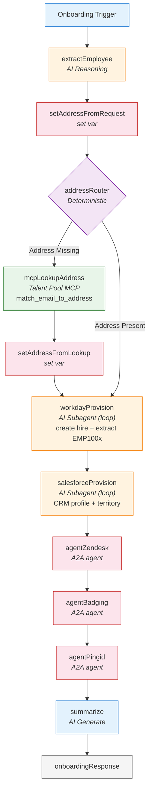

# Employee Onboarding Broker

## What It Does

Takes a new-hire request (name, work email, phone, and optionally a home address) and registers
the employee end-to-end across five corporate systems, returning a single plain-text summary of
everything that was done:

| System | Action | Result |
|--------|--------|--------|
| **Talent Pool (MCP)** | Looks up the home address by email — **only when it is missing** from the request | Postal address |
| **Workday** | Creates the new-hire HR record | Workday Employee ID (`EMP100x`) |
| **Salesforce** | Creates the CRM profile and assigns a sales territory | CRM profile + territory |
| **Zendesk** | Submits the laptop delivery service request | Service request ID (`SRV100x`) |
| **Badging** | Initiates the badge request (photo outreach) | Badge request ID (`BADGE100x`), status `photo_requested` |
| **PingID** | Provisions the MFA / identity account | PingID account (`PINGID-EMP100x`) |

---

## Why Hybrid Determinism

The onboarding order is fixed — every new hire flows through the same five systems in the same
sequence — so the flow is modeled as a **deterministic pipeline**. The broker separates
**what requires judgment** from **what must be predictable**:

- **AI decides** only the things that can't be expressed as rules: extracting the structured
  new-hire fields from free-form request text (`extractEmployee`), driving the two agents whose
  A2A contract can require a follow-up exchange (`workdayProvision`, `salesforceProvision` — see
  below), and writing the final human-readable summary (`summarize`).
- **Deterministic routing and execution decide** everything else. One `router` (`addressRouter`)
  reproduces the "enrich the address from the Talent Pool **only if it wasn't provided**" rule as
  structural branching — no LLM guessing at the routing layer — and the executor nodes are named by
  the action they perform: `set*` nodes only set a workflow variable, `mcp*` nodes call an MCP tool,
  and `agent*` nodes call exactly one A2A agent with fully composed arguments.

### Why two subagents (and not just executors)

An `executor` that calls an agent is **fire-once**: it sends one message and transitions on
whatever comes back. A `subagent` is an **agent loop** — it can inspect the response, react, and
call the agent again until it has a finished result. Two agents in this network have a contract
that can return something other than a completed result on the first call, so they are modeled as
subagents rather than executors:

| Node | Agent | Why a loop is needed |
|------|-------|----------------------|
| `workdayProvision` | Workday `create_new_hire` | May answer **`input-required`** when the home address is missing; the loop re-sends the address and exits only on `completed`. It also folds in the old `parseWorkday` step, emitting the Employee ID (`EMP100x`) as structured output. |
| `salesforceProvision` | Salesforce `create_crm_profile` | May answer **`input-required`** offering territory options (`DC - NW Prime` / `DC - SW Prime`); the loop picks and confirms one, emitting the assigned territory as structured output. Choosing from offered options is a judgment call — exactly what a subagent is for. |

The remaining three agents (Zendesk, Badging, PingID) always return a finished result, so they stay
deterministic `agent*` executors.

> **Note:** a2d does not support `input-required` mock scenarios yet, so today both mocks return a
> `completed` result on the first call and each loop resolves in a single pass. The subagent
> instructions are written so the follow-up negotiation works unchanged once that mock capability
> lands.

The AI reasons *within* nodes; the flow *between* nodes is guaranteed.

---

## Graph



---

## Components

### Agents (A2A)

All five agents are mocked in the [a2d.ai](https://www.a2d-ai.com) mocking service (protocol
`0.3.0`). URLs are supplied via `exchange.json` variables.

All agents accept **plain-text** requests (`text/plain`) — the broker composes a natural-language
instruction per agent rather than a JSON payload.

| Agent | Skill | Input (plain text) | Output |
|-------|-------|--------------------|--------|
| Workday Agent | `create_new_hire` | name, email, phone, address | new-hire record + `EMP100x` |
| Salesforce Agent | `create_crm_profile` | employee ID, email | CRM profile + territory |
| Zendesk Agent | `request_laptop_delivery` | employee ID, address | `SRV100x` |
| Badging Agent | `initiate_badge_request` | employee ID, email | `BADGE100x`, `photo_requested` |
| PingID Agent | `provision_pingid` | employee ID, email | `PINGID-EMP100x` |

### MCP

**Talent Pool MCP** (`streamableHttp`) exposes **two** tools, of which the broker binds exactly one:

| Tool | Bound in graph? | Purpose |
|------|-----------------|---------|
| `match_email_to_address` | ✅ (`enrich_address` action) | Resolves the home address from the employee's email |
| `lookup_employee_department` | ❌ | Present in the tool listing but never called — demonstrates that the graph selects a specific `tool_name` out of several |

### LLM

Azure OpenAI (`platform: AzureOpenai`), model `gpt-5.6-sol`, authenticated with an API key
(`authentication.kind: apiKey`).

---

## Configuration

Copy `exchange.json.example` to `exchange.json` and fill in the Azure OpenAI URL and API key
(the a2d mock URLs are pre-populated and non-secret):

| Variable | Secret | Description |
|----------|--------|-------------|
| `workdayAgent.url` | no | Workday agent a2d mock URL |
| `salesforceAgent.url` | no | Salesforce agent a2d mock URL |
| `zendeskAgent.url` | no | Zendesk agent a2d mock URL |
| `badgingAgent.url` | no | Badging agent a2d mock URL |
| `pingidAgent.url` | no | PingID agent a2d mock URL |
| `talentPoolMcp.url` | no | Talent Pool MCP a2d mock URL |
| `azureOpenAI.url` | no | Azure OpenAI endpoint |
| `azureOpenAI.apiKey` | **yes** | Azure OpenAI API key |

---

## Build

```bash
sh scripts/build.sh
```

Produces the agentic-network bundle under `target/`, plus one per-asset package for each
registry entry (5 agents, 1 MCP, 1 LLM) and the broker.

---

## Try It

Send a plain-text onboarding request to the broker, e.g.:

```
Onboard Alex Smith, alex.smith@example.com, phone 555-0100.
```

Because no address was provided, `addressRouter` routes through the Talent Pool MCP to enrich it,
then the pipeline registers Alex across all five systems and returns a summary naming `EMP1001`,
the assigned territory, the laptop request (`SRV1001`), the badge (`BADGE1001`), and the PingID
account (`PINGID-EMP1001`).
