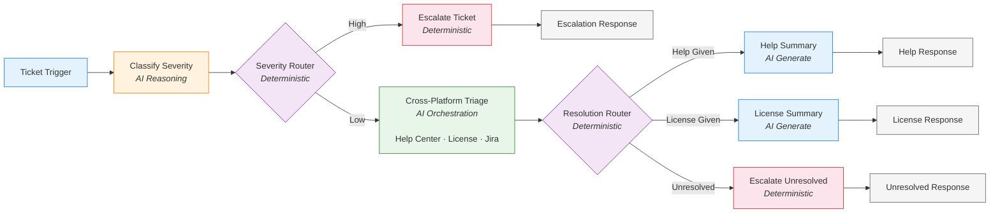

# IT Help Desk Investigation Broker

## What It Does

Takes an IT support ticket (issue description + Jira ticket ID) and produces one of four outcomes:

| Outcome | When | What Happens |
|---------|------|-------------|
| **Escalation** | High-severity ticket (outage, security incident, multi-user blocker) | Ticket escalated to on-call team, user notified |
| **Help Given** | Low-severity, answer found in knowledge base | Jira updated with resolution, user gets summary |
| **License Provisioned** | Low-severity, licensing issue resolved | License provisioned, Jira updated, user gets summary |
| **Unresolved** | Low-severity, no automated solution found | Ticket escalated to human agent, user notified |

If a ticket is too vague to classify confidently, the agent defaults to **Low** severity and proceeds with investigation.

---

## Why Hybrid Determinism

This broker separates **what requires judgment** from **what must be predictable**:

- **AI decides** things humans can't write rules for — "is this ticket high severity?" and "which agents should I consult to resolve this?" These are open-ended, context-dependent decisions.
- **Deterministic routing decides** everything else — once severity is classified, the path is fixed. Once resolution type is determined, the response path is fixed. No AI guessing at the routing layer.

This means: the AI reasons *within* nodes, but the flow *between* nodes is guaranteed. You get LLM intelligence where it matters, and rule-based predictability everywhere else.

---

## Graph



---

## Project Structure

```
it-help-investigation-agent-network/
  agent-network.yaml
  exchange.json
  brokers/
    it-help-investigation.agent
```

---

# Vibes Guided Experience

The walkthrough below shows how this agent was built using the Vibes guided experience.

## Phase 1: User Functional Requirements

**User:** I want an AI agent that handles IT help desk tickets. When a user submits a ticket, the agent should read the description, determine severity, and take the right action. High-severity tickets should be escalated immediately. Low-severity tickets should be investigated -- we have a Help Center agent and a License Procurement agent that can help. Sometimes the ticket doesn't have enough info and we need to ask the user for more details.

**Vibes Thinking:** This is a classic triage-and-route pattern. I need to separate the severity classification (LLM reasoning) from the routing logic (deterministic router). The low-severity path involves multi-agent orchestration. I need to clarify the specific paths and outputs.

**Vibes:** I need to nail down the specifics:
1. **Trigger:** What starts this? How does the ticket arrive?
2. **Severity Logic:** How do you classify severity, and what happens for each level?
3. **Hard Constraints:** What is strictly forbidden?
4. **Determinism vs. Open-endedness:** Which steps are fixed rules vs. where should the AI reason?

**User:**
- **Trigger:** User submits a ticket via a workflow. It arrives as an A2A message containing the issue description and the Jira ticket ID.
- **Severity Classification:** The agent reads the ticket description and determines severity: High or Low. This is an LLM judgment call -- not a rule-based check. If the ticket is too vague, the subagent asks the user for clarification before classifying. The subagent also extracts the Jira ticket ID from the input for use by downstream nodes.
- **High severity:** Escalate immediately using an Escalation MCP tool, then respond to the user confirming the escalation.
- **Low severity:** Investigate using a Help Center agent (Agentforce) and a License Procurement agent (Scanned). The agent looks for answers in the Help Center and determines if it's a licensing issue. It can also update a Jira ticket. After investigation, the outcome is either "Help Given" (found an answer), "License Given" (resolved a licensing issue), or "Unresolved" (could not find a solution).
  - **Help Given:** Generate a summary of the resolution and respond to the user.
  - **License Given:** Generate a summary of the license action and respond to the user.
  - **Unresolved:** Escalate to a human agent and respond to the user.
- **Determinism:** Severity routing (High/Low) must be deterministic after the LLM classifies it. The classification itself is open-ended. Cross-platform investigation is open-ended. Resolution routing is deterministic.

---

## Phase 2: Initial Asset Registration

**Vibes Thinking:** I need two A2A agents for investigation (Help Center and License Procurement) and two MCP tools (Escalation for high severity, Jira for ticket updates). The severity classification is done by a generator node, not an external tool.

**Vibes:** I've searched the Private and Public Exchanges. Here's my selection:

| Asset | Type | Purpose |
|-------|------|---------|
| Help Center Agent (Agentforce) | A2A Agent | Search knowledge base for answers to common IT issues |
| License Procurement Agent (Scanned) | A2A Agent | Check and provision software licenses |
| Escalation MCP Server | MCP Tool | Escalate high-severity tickets to the on-call team |
| Jira MCP Server | MCP Tool | Update ticket status and add investigation notes |

Do these look correct?

**User:** Yes, those work.

**Vibes:** Now let's register the LLM. Here is my recommendation:

| LLM | Model | Recommended For |
|-----|-------|-----------------|
| Azure OpenAI | gpt-5.6-sol | All LLM-powered nodes -- severity classification, cross-platform triage, and summaries (default LLM) |

Would you like to use this, or a different selection?

**User:** Use that.

---

## Phase 3: Technical Graph Definition (Agent Script)

**Vibes Thinking:** The graph spine is: trigger -> generator (classify severity) -> router (route by severity) -> two paths. The classification happens in a generator node that emits structured output (severity + reason + ticket ID) so the router downstream can branch deterministically.

**Vibes:** Here is the graph scaffolding:
- **Trigger (ticketTrigger):** A2A trigger receiving the submitted ticket (issue description + Jira ticket ID).
- **Generator (classifySeverity):** Reads the ticket description and classifies severity as High or Low. Extracts the Jira ticket ID from the input (defaulting to `MULE-0001` if none is provided). If the ticket is too vague to classify confidently, it defaults to Low severity. Produces structured output with severity level, reason, and ticket ID.
- **Router (severityRouter):** Deterministic routing based on the classification output.
  - **High path:** Executor node calls Escalation MCP, then echo confirms escalation.
  - **Low path:** Orchestrator node coordinates Help Center A2A, License Procurement A2A, and Jira MCP to investigate and take action. Produces structured output with resolution type (help_given, license_given, or unresolved).
    - **Router (resolutionRouter):** Routes based on orchestration outcome.
      - **Help Given path:** Generator node summarizes the resolution, then echo responds.
      - **License Given path:** Generator node summarizes the license action, then echo responds.
      - **Unresolved path:** Executor node escalates to a human agent, then echo responds.

I have generated the agent-network.yaml, it-help-investigation.agent, and exchange.json files.

---

## Phase 4: Asset Assignment to Graph

**Vibes Thinking:** I must verify the Rule of 4 and Principle of Least Privilege.

**Vibes:** Here is the asset-to-node mapping:

| Node | Type | Assets | Total | Notes |
|------|------|--------|-------|-------|
| classifySeverity | generator | (none) | 0 | Pure LLM classification into structured output. No actions needed. |
| escalateTicket | executor | Escalation MCP | 1 | Deterministic action call. No LLM. |
| crossPlatformTriage | orchestrator | Help Center A2A, License Procurement A2A, Jira MCP | 3 | Coordinates investigation across agents and updates ticket. |
| escalateUnresolved | executor | Escalation MCP | 1 | Deterministic escalation for unresolved tickets. No LLM. |

Least Privilege is enforced:
- classifySeverity has no actions -- it only reads the ticket and classifies. Vague tickets default to Low severity.
- escalateTicket can only escalate, not investigate or resolve.
- crossPlatformTriage can investigate and update tickets, but cannot escalate.
- escalateUnresolved can only escalate unresolved tickets after investigation has been exhausted.

Now, which LLM for each node?

| Node | Type | LLM | Rationale |
|------|------|-----|-----------|
| classifySeverity | generator | Azure OpenAI (default) | Classifies severity and extracts the ticket ID into structured output |
| crossPlatformTriage | orchestrator | Azure OpenAI | Coordinates multiple agents for investigation |
| helpSummary | generator | Azure OpenAI (default) | One-shot summary generation |
| licenseSummary | generator | Azure OpenAI (default) | One-shot summary generation |
| escalateTicket | executor | -- | No LLM (deterministic action call) |
| escalateUnresolved | executor | -- | No LLM (deterministic action call) |
| All echo nodes | echo | -- | No LLM -- deterministic response formatting |

**User:** Looks good. Use those.

---

## Phase 5: Instruction Refinement

**Vibes:** Here are the draft instructions for each LLM-powered node:

**classifySeverity (generator):**
> "Classify the severity of the support ticket. High = system outage, security incident, or blocking issue affecting multiple users. Low = general IT question, software request, or single-user issue. If the ticket is too vague to classify confidently, default to Low severity. Extract the Jira ticket ID from the input; if none is provided, default to `MULE-0001`."

**crossPlatformTriage (orchestrator):**
> "Investigate the low-severity ticket. First, search the Help Center for relevant articles or known solutions. If the issue involves software licensing, check with the License Procurement agent. Update the Jira ticket with your findings. Determine the resolution: help_given if you found an answer, license_given if you resolved a licensing issue, unresolved if you could not find a solution or the issue requires human intervention."

Can you provide "Success Criteria" to refine these?

**User:**
- For classifySeverity: If the ticket says "VPN is down for the entire office" -> High. If it says "how do I reset my password" -> Low. If it says "something is wrong" with no details -> default to Low severity and proceed.
- For crossPlatformTriage: If Help Center returns an article about password resets, provide that answer -> help_given. If the user needs a Figma license and License Procurement provisions it -> license_given. If neither agent can help -> unresolved. Always update Jira with the resolution notes.

**Vibes Thinking:**
- Writing V2 instructions with the few-shot examples.
- Running Contradiction Test...
  - classifySeverity vs graph: Pass. Classification only, no action taken. Vague tickets default to Low.
  - crossPlatformTriage vs graph: Pass. Investigation and resolution only, no escalation.
  - Generator nodes vs graph: Pass. Summary only, no actions.
  - Cross-node check: Pass. No instruction overrides the deterministic severity or resolution routing.

**Vibes:** All V2 instructions updated. Contradiction Test passed across all nodes.

---

## Phase 6: Final Topology Review

**Vibes:** Final topology validated:
- **Severity classification** uses LLM reasoning in a generator node that emits structured output, then routes deterministically via severityRouter.
- **Vague tickets** default to Low severity within the classifySeverity generator -- no separate "Needs More Info" branch.
- **Two severity paths** are fully separated: High (escalate), Low (investigate).
- **Resolution routing** after orchestration is deterministic via resolutionRouter with three outcomes: help_given, license_given, and unresolved.
- **Unresolved tickets** are escalated to a human agent via the escalateUnresolved executor, ensuring no ticket is left unhandled.
- **All paths terminate** at echo response nodes.
- **LLM:** A single Azure OpenAI provider (model `gpt-5.6-sol`) is the default LLM and powers all LLM nodes -- classification, orchestration, and summaries.
- **Ticket ID flow:** The Jira ticket ID is extracted from the input by classifySeverity (defaulting to `MULE-0001` if none is provided) and passed downstream via `@generator.classifySeverity.output.ticket_id` to all nodes that need it.
- **Identity propagation:** The orchestrator propagates the caller's Authorization header to Jira via `http_headers`.

Your IT Help Desk Investigation Agent is ready for deployment.

---
