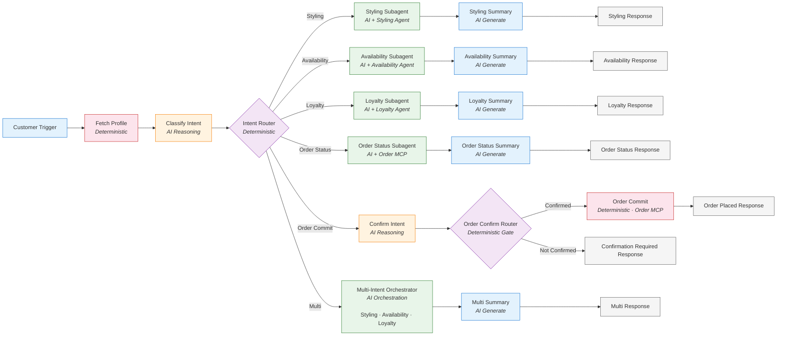

# Vogue Premiere Styling Concierge Broker

## What It Does

Takes a customer message (styling, shopping, loyalty, or order request) and routes it to the right specialist, producing one of six outcomes:

| Outcome | When | What Happens |
|---------|------|-------------|
| **Styling** | Customer wants outfit or styling advice | Styling Agent recommends a complete outfit, reply is personalized |
| **Availability** | Customer asks about stock or sizing | Availability Agent checks Product 360 / OMS, reply summarizes availability |
| **Loyalty** | Customer asks about points, rewards, or tier | Loyalty Agent applies tier-specific perks, reply summarizes them |
| **Order Status** | Customer asks about an existing order | Order MCP returns shipping status, reply summarizes it |
| **Order Commit** | Customer wants to place/confirm an order | Order is placed **only** after explicit confirmation, otherwise the customer is asked to confirm |
| **Multi-Intent** | Message spans two or more of the above | Multi-intent orchestrator coordinates the relevant agents and returns a unified reply |

Every interaction begins by fetching the customer profile, and every reply is written to feel exclusive, warm, and personalized.

---

## Why Hybrid Determinism

This broker separates **what requires judgment** from **what must be predictable**:

- **AI decides** things humans can't write rules for — "what is this customer actually asking for?" and "which agents should I coordinate for a multi-intent request?" These are open-ended, context-dependent decisions.
- **Deterministic routing decides** everything else — once intent is classified, the path is fixed. Order placement is gated behind an explicit-confirmation router, so an irreversible action can never fire on an ambiguous message.

This means: the AI reasons *within* nodes, but the flow *between* nodes is guaranteed. You get LLM intelligence where it matters, and rule-based predictability everywhere else — most importantly, at the checkout gate.

---

## Graph



---

## Project Structure

```
vogue-premiere-network/
  agent-network.yaml
  exchange.json
  brokers/
    vogue-premiere.agent
  a2d-specs/
```

---

# Vibes Guided Experience

The walkthrough below shows how this agent was built using the Vibes guided experience.

## Phase 1: User Functional Requirements

**User:** I want a luxury fashion concierge agent for Vogue Premiere. When a customer messages in, it should figure out what they want — styling advice, product availability, loyalty perks, order status, or placing an order — and hand off to the right specialist. Some messages cover several of those at once. And placing an order must never happen unless the customer clearly confirms it.

**Vibes Thinking:** This is a classify-and-route pattern with a mix of single-intent and multi-intent paths, plus one irreversible action (placing an order) that needs a hard guardrail. I need to separate intent classification (LLM reasoning) from routing (deterministic router), and gate the order-placement action behind an explicit confirmation check.

**Vibes:** I need to nail down the specifics:
1. **Trigger:** How does a customer message arrive?
2. **Intents:** What are the exact intents, and what specialist handles each?
3. **Hard Constraints:** What is strictly forbidden?
4. **Determinism vs. Open-endedness:** Which steps are fixed rules vs. where should the AI reason?

**User:**
- **Trigger:** The customer messages the concierge via an A2A message.
- **First step:** Always fetch the customer profile before doing anything else.
- **Intents:** styling, availability, loyalty, order_status, order_commit, or multi (spans two or more). An LLM classifies the primary intent — always pick one, never interrogate the customer.
  - **Styling:** delegate to the Styling Agent, then summarize.
  - **Availability:** delegate to the Availability Agent, then summarize.
  - **Loyalty:** delegate to the Loyalty Agent, then summarize.
  - **Order Status:** look up the order via the Order MCP, then summarize.
  - **Order Commit:** this places an order — it must be gated. Only proceed if the message contains an explicit confirmation phrase. Otherwise, ask the customer to confirm.
  - **Multi:** coordinate the styling, availability, and loyalty agents and return one unified reply.
- **Determinism:** Intent classification is open-ended. Routing by intent is deterministic. The order-placement gate is strictly deterministic — no LLM decides whether to place an order.

---

## Phase 2: Initial Asset Registration

**Vibes Thinking:** I need three A2A agents (Styling, Availability, Loyalty) and two MCP servers (Customer for the profile lookup, Order for status and placement). Intent classification and the confirmation check are generator nodes, not external tools.

**Vibes:** I've searched the Private and Public Exchanges. Here's my selection:

| Asset | Type | Purpose |
|-------|------|---------|
| Styling Agent | A2A Agent | Recommends complete outfits for an occasion |
| Availability Agent | A2A Agent | Verifies stock and sizes across Product 360 and the OMS |
| Loyalty Agent | A2A Agent | Applies tier-specific loyalty perks |
| Customer MCP Server | MCP Tool | Fetch the customer profile |
| Order MCP Server | MCP Tool | Get shipping status and place orders |

Do these look correct?

**User:** Yes, those work.

**Vibes:** Now let's register the LLM. Here is my recommendation:

| LLM | Model | Recommended For |
|-----|-------|-----------------|
| Azure OpenAI | gpt-5.6-sol | All LLM-powered nodes — intent classification, confirmation check, subagents, orchestration, and summaries (default LLM) |

Would you like to use this, or a different selection?

**User:** Use that.

---

## Phase 3: Technical Graph Definition (Agent Script)

**Vibes Thinking:** The graph spine is: trigger -> executor (fetch profile) -> generator (classify intent) -> router (route by intent) -> six paths. The order_commit path gets its own generator + router so placement is gated deterministically.

**Vibes:** Here is the graph scaffolding:
- **Trigger (customerTrigger):** A2A trigger receiving the customer message.
- **Executor (fetchProfile):** Calls the Customer MCP to load the customer profile (the mock returns Alex Chen).
- **Generator (classifyIntent):** Reads the message and emits exactly one intent: styling, availability, loyalty, order_status, order_commit, or multi.
- **Router (intentRouter):** Deterministic routing based on the classified intent.
  - **Styling / Availability / Loyalty / Order Status paths:** a subagent delegates to the matching agent (or Order MCP), a generator summarizes, an echo responds.
  - **Order Commit path:** a generator (confirmIntent) checks for an explicit confirmation phrase, then a router (orderConfirmRouter) either runs the order-placement executor or asks the customer to confirm.
  - **Multi path (otherwise):** an orchestrator coordinates the styling, availability, and loyalty agents, a generator summarizes, an echo responds.

I have generated the agent-network.yaml, vogue-premiere.agent, and exchange.json files.

---

## Phase 4: Asset Assignment to Graph

**Vibes Thinking:** I must verify the Rule of 4 and Principle of Least Privilege.

**Vibes:** Here is the asset-to-node mapping:

| Node | Type | Assets | Total | Notes |
|------|------|--------|-------|-------|
| fetchProfile | executor | Customer MCP | 1 | Deterministic profile lookup. No LLM. |
| stylingSubagent | subagent | Styling Agent | 1 | Delegates outfit recommendations. |
| availabilitySubagent | subagent | Availability Agent | 1 | Delegates stock and sizing checks. |
| loyaltySubagent | subagent | Loyalty Agent | 1 | Delegates loyalty perks. |
| orderSubagent | subagent | Order MCP | 1 | Reads order status only. |
| multiOrchestrator | orchestrator | Styling, Availability, Loyalty Agents | 3 | Coordinates multi-intent requests. |
| orderCommitExecutor | executor | Order MCP | 1 | Places the order. Irreversible — gated. |

Least Privilege is enforced:
- classifyIntent and confirmIntent have no actions — they only read and classify.
- Each single-intent subagent can talk to exactly one specialist, nothing else.
- orderSubagent can read order status but cannot place an order.
- Only orderCommitExecutor can place an order, and only after orderConfirmRouter confirms explicit intent.

Now, which LLM for each node?

| Node | Type | LLM | Rationale |
|------|------|-----|-----------|
| classifyIntent | generator | Azure OpenAI (default) | Classifies the primary intent into structured output |
| confirmIntent | generator | Azure OpenAI (default) | Detects an explicit confirmation phrase into structured output |
| stylingSubagent / availabilitySubagent / loyaltySubagent / orderSubagent | subagent | Azure OpenAI | Coordinates a single specialist |
| multiOrchestrator | orchestrator | Azure OpenAI | Coordinates multiple agents |
| All summary generators | generator | Azure OpenAI (default) | One-shot personalized reply generation |
| fetchProfile / orderCommitExecutor | executor | -- | No LLM (deterministic action calls) |
| All echo nodes | echo | -- | No LLM — deterministic response formatting |

**User:** Looks good. Use those.

---

## Phase 5: Instruction Refinement

**Vibes:** Here are the draft instructions for the two gating nodes:

**classifyIntent (generator):**
> "Pick the customer's primary intent and emit it as structured output — one of styling, availability, loyalty, order_status, order_commit, or multi. Always pick one label, even for short or vague messages. Never ask the customer questions; the structured output is the entire response."

**confirmIntent (generator):**
> "Set has_explicit_confirmation to 'true' ONLY if the message contains an explicit confirmation phrase such as 'place the order', 'confirm my order', or 'yes, order it'. Otherwise set it to 'false'. Never ask questions; emit one value and stop."

Can you provide "Success Criteria" to refine these?

**User:**
- For classifyIntent: "I have a dinner in Napa, what should I wear?" -> styling. "Are those available in my size?" -> availability. "Show me my perks" -> loyalty. "Where's my order?" -> order_status. "Place the order" -> order_commit. "Recommend an outfit, check sizes, and show my perks" -> multi.
- For confirmIntent: "Place the order for the whole outfit" -> true. "I like it, maybe I'll buy it later" -> false. Anything short of an explicit confirmation must be false so we never charge a customer by mistake.

**Vibes Thinking:**
- Writing V2 instructions with the few-shot examples.
- Running Contradiction Test...
  - classifyIntent vs graph: Pass. Classification only, no action taken.
  - confirmIntent vs graph: Pass. Detection only; the router owns the decision.
  - orderConfirmRouter vs constraint: Pass. Order placement is unreachable without an explicit confirmation.
  - Subagents vs graph: Pass. Each talks to exactly one specialist.
  - Cross-node check: Pass. No instruction overrides deterministic intent routing or the confirmation gate.

**Vibes:** All V2 instructions updated. Contradiction Test passed across all nodes.

---

## Phase 6: Final Topology Review

**Vibes:** Final topology validated:
- **Profile-first:** every request begins with a deterministic Customer MCP profile fetch.
- **Intent classification** uses LLM reasoning in a generator node that emits structured output, then routes deterministically via intentRouter.
- **Five single-intent paths** each delegate to exactly one specialist and terminate at a personalized echo response.
- **Order placement** is gated: confirmIntent detects explicit confirmation, orderConfirmRouter enforces it, and only then does orderCommitExecutor place the order via the Order MCP. Unconfirmed requests return a polite confirmation prompt.
- **Multi-intent requests** are handled by an orchestrator coordinating the styling, availability, and loyalty agents into one unified reply.
- **All paths terminate** at echo response nodes.
- **LLM:** A single Azure OpenAI provider (model `gpt-5.6-sol`) is the default LLM and powers all LLM nodes — classification, confirmation, subagents, orchestration, and summaries.

Your Vogue Premiere Styling Concierge Agent is ready for deployment.

---
